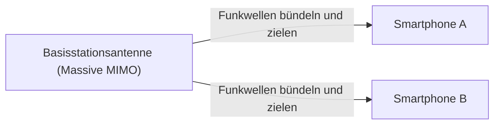

## 1. Die „3 Merkmale“, die 5G verspricht

„**5G (Mobilfunkstandard der 5. Generation)**“ ist die nächste Version des Kommunikationsstandards (4G/LTE), den wir normalerweise auf unseren Smartphones verwenden.
5G bedeutet jedoch nicht einfach nur, dass „Videos auf dem Smartphone schneller heruntergeladen werden können“. Als Infrastruktur, die alle Dinge in der Gesellschaft mit dem Internet verbindet, weist es die folgenden drei Hauptmerkmale auf:

1. **Ultrahohe Geschwindigkeit und große Kapazität (eMBB)**: Etwa 20-mal schneller als 4G. Eine Geschwindigkeit, mit der ein zweistündiger Film in wenigen Sekunden heruntergeladen werden kann.
2. **Extrem niedrige Latenz (URLLC)**: Die Kommunikationsverzögerung beträgt ein Zehntel von 4G (etwa 1 Millisekunde). Ermöglicht die Echtzeitsteuerung von Robotern an entfernten Standorten.
3. **Massive gleichzeitige Verbindungen (mMTC)**: Gleichzeitige Verbindung von einer Million Geräten pro Quadratkilometer. Beseitigt Verkehrsstaus bei der Kommunikation in überfüllten Zügen oder Stadien.

## 2. Kerntechnologien zur Realisierung von 5G

Diese magisch anmutenden Merkmale werden durch eine Kombination aus den physikalischen Eigenschaften von Funkwellen und neuen Netzwerktechnologien erreicht.

### ① Hochfrequenzbänder „Millimeterwellen“ und „Sub6“
Um die Kommunikationsgeschwindigkeit zu erhöhen, muss die Straße (Frequenzbandbreite) verbreitert werden. Bei 4G wurden niedrigere Frequenzen (wie das Platinband) verwendet, die aber bereits belegt sind. Daher nutzt 5G sehr hohe Frequenzen (**Millimeterwellen**: z. B. das 28-GHz-Band), die bisher nicht verwendet wurden.
Da Millimeterwellen jedoch die Schwäche haben, dass ihre „Geradlinigkeit zu hoch ist und sie anfällig für Hindernisse sind (sie können Wände nicht durchdringen)“, werden sie zum Aufbau von Versorgungsbereichen mit dem ausgewogenen „**Sub6** (unter 6 GHz)“ kombiniert.

### ② Beamforming und Massive MIMO
Die Technologie, die die Schwächen der Millimeterwellen („anfällig für Hindernisse“ und „fliegen nicht weit“) überwindet, ist das „**Beamforming**“.

Herkömmliche Basisstationen haben Funkwellen wie aus einer Dusche in alle Richtungen verstreut, wodurch hochfrequente Funkwellen jedoch gedämpft werden. Daher werden viele Antennen (Massive MIMO) gesteuert, um die Funkwellen zu einem schmalen Strahl zu bündeln und **gezielt auf die kommunizierenden Smartphones zu richten**. Dadurch wird der Verlust von Funkwellen auf ein Minimum reduziert.

### ③ Edge Computing (MEC)
Dies ist eine Technologie zur Realisierung einer „extrem niedrigen Latenz“.
Normalerweise legen die Daten vom Smartphone einen langen Weg hin und her zurück: „Basisstation → Internet → weit entfernter Cloud-Server“, was zwangsläufig zu Zeitverzögerungen (Latenz) führt.
Bei 5G werden **Server (Edge) in unmittelbarer Nähe der Basisstationen**, also näher am Nutzer, platziert, und durch die dortige Datenverarbeitung wird die Kommunikationsstrecke physisch verkürzt, wodurch eine extrem niedrige Latenz von 1 Millisekunde erreicht wird.

## 3. Zukünftige Anwendungsfälle, die durch 5G verändert werden

Die wahren Vorteile von 5G kommen nicht den Smartphones zugute, sondern der „Industrie“.

- **Autonomes Fahren**: Durch ständige Kommunikation mit anderen Autos und Ampeln (V2X) und den sofortigen Austausch von Informationen über Fußgänger, die aus dem toten Winkel auftauchen, können Unfälle verhindert werden.
- **Telemedizin**: Die extrem niedrige Latenz und hochauflösende Videokommunikation ermöglichen es einem erfahrenen Chirurgen in der Stadt, mithilfe eines Roboterarms an einem abgelegenen Ort aus der Ferne zu operieren.
- **Smart Factory**: Zehntausende von Sensoren in einer Fabrik sind drahtlos verbunden, und eine KI optimiert die Produktionslinie und erkennt Anomalien in Echtzeit (lokales 5G).

## 4. Fazit

Wenn die Entwicklung bis 4G dazu diente, „Menschen mit Menschen und Menschen mit dem Internet zu verbinden“, dann ist 5G das Nervennetzwerk, um „**alle Dinge (IoT) in Echtzeit zu verbinden**“.
Derzeit befindet sich die Einführung noch im Gange und die Bereiche für Millimeterwellen sind noch begrenzt. Wenn die Infrastruktur jedoch vollständig ausgebaut ist, wird unsere Gesellschaft über den Rahmen von Smartphones hinausgehen und in eine neue Phase eintreten, in der Cyberspace und reale Welt vollständig miteinander verschmelzen.
