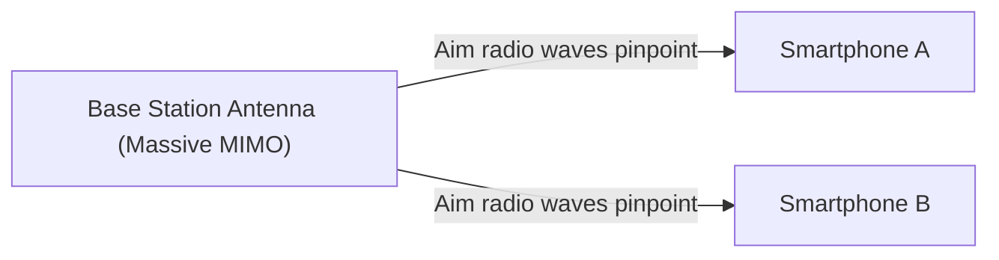

## 1. The "3 Features" Promised by 5G

"**5G (5th Generation Mobile Communication System)**" is the next-generation version of the communication standard (4G/LTE) we use on our smartphones every day.
However, 5G is not simply about "downloading videos on smartphones faster." As an infrastructure that connects everything in society to the Internet, it has the following three major features.

1. **Ultra-High Speed and High Capacity (eMBB)**: Approximately 20 times faster than 4G. The speed to download a 2-hour movie in a few seconds.
2. **Ultra-Low Latency (URLLC)**: The communication time lag is one-tenth of 4G (about 1 millisecond). Makes it possible to control remote robots in real-time.
3. **Massive Connectivity (mMTC)**: Connects 1 million devices per square kilometer simultaneously. Resolves communication traffic congestion in crowded trains and stadiums.

## 2. Core Technologies That Realize 5G

These magical features are realized by combining the physical characteristics of radio waves with new network technologies.

### ① High Frequency Bands "Millimeter Wave" and "Sub6"

To increase communication speed, we need to widen the road (frequency bandwidth). 4G used lower frequencies (such as the platinum band), but they are already full. Therefore, 5G uses very high frequencies that have not been used before (**millimeter wave**: 28GHz band, etc.).
However, because millimeter waves have the weakness of being "too straight and vulnerable to obstacles (cannot pass through walls)," they are combined with the balanced "**Sub6** (under 6GHz)" to build coverage areas.

### ② Beamforming and Massive MIMO

The technology that overcomes the millimeter wave's weaknesses of being "vulnerable to obstacles" and "not reaching far" is "**beamforming**".

Conventional base stations used to scatter radio waves in all directions like a shower, but this causes high-frequency radio waves to attenuate. Therefore, by controlling a large number of antennas (Massive MIMO), the radio waves are bundled into a narrow beam to **pinpoint the smartphone being communicated with**. This minimizes radio wave loss.

### ③ Edge Computing (MEC)

This is the technology to achieve "ultra-low latency."
Normally, data from a smartphone travels a long distance back and forth: "Base station -> Internet -> Distant cloud server," which inevitably causes a time lag (latency).
In 5G, **servers (edges) are placed right next to base stations** close to the user, and data processing is performed there. By physically shortening the communication distance, an ultra-low latency of 1 millisecond is achieved.

## 3. Future Use Cases Transformed by 5G

The true benefits of 5G will be brought to "industries," not smartphones.

- **Autonomous Driving**: Constant communication between cars and traffic lights (V2X) allows instantaneous sharing of information about pedestrians jumping out of blind spots, preventing accidents before they occur.
- **Remote Medicine**: Ultra-low latency and high-definition video communication will enable skilled surgeons in urban areas to perform surgeries by remotely controlling robot arms in depopulated areas.
- **Smart Factory**: Connecting tens of thousands of sensors wirelessly in a factory, AI optimizes the production line and detects anomalies in real-time (Local 5G).

## 4. Conclusion

If the evolution up to 4G was about "connecting people to people, and people to the Internet," then 5G is the neural network for "**connecting all things (IoT) in real-time**."
Currently, it is still in the process of being adopted, with millimeter-wave coverage areas remaining limited. However, when the infrastructure is completely established, our society will transcend the framework of smartphones and enter a new phase where cyberspace and physical space are fully integrated.
