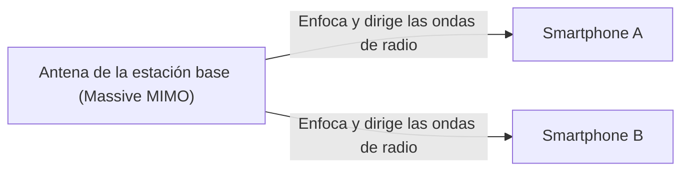

## 1. Las «tres características» que promete el 5G

El «**5G (sistema de comunicación móvil de 5ª generación)**» es la versión de próxima generación del estándar de comunicación de los smartphones que usamos habitualmente (4G/LTE).
Sin embargo, el 5G no consiste simplemente en «poder descargar vídeos más rápido en el smartphone». Como infraestructura para conectar todas las cosas de la sociedad a Internet, posee las siguientes tres grandes características.

1. **Ultravelocidad y gran capacidad (eMBB)**: Aproximadamente 20 veces más rápido que el 4G. Velocidad que permite descargar una película de 2 horas en pocos segundos.
2. **Latencia ultrabaja (URLLC)**: El tiempo de retraso de la comunicación es una décima parte del 4G (aproximadamente 1 milisegundo). Permite operar robots a distancia en tiempo real.
3. **Conexiones múltiples simultáneas (mMTC)**: Conexión simultánea de un millón de dispositivos por kilómetro cuadrado. Elimina la congestión del tráfico de comunicaciones en trenes abarrotados y estadios.

## 2. Tecnologías clave que hacen posible el 5G

Estas características, que parecen mágicas, se logran mediante la combinación de las propiedades físicas de las ondas de radio y nuevas tecnologías de red.

### ① Bandas de alta frecuencia «Ondas milimétricas» y «Sub6»
Para aumentar la velocidad de comunicación, es necesario ampliar las carreteras (ancho de banda de frecuencia). En el 4G se utilizaban frecuencias bajas (como la banda platino), pero ya no hay espacio disponible. Por eso, en el 5G se emplean frecuencias extremadamente altas (**ondas milimétricas**: banda de 28 GHz, etc.) que no se habían utilizado hasta ahora.
Sin embargo, dado que las ondas milimétricas tienen la debilidad de «ser demasiado direccionales y vulnerables a los obstáculos (no pueden atravesar paredes)», se construyen áreas combinándolas con la equilibrada «**Sub6** (menos de 6 GHz)».

### ② Beamforming y Massive MIMO
La tecnología que supera las debilidades de las ondas milimétricas de ser «vulnerables a los obstáculos» y «no llegar lejos» es el «**beamforming**».

Las estaciones base convencionales esparcían las ondas de radio en todas direcciones como una ducha, pero de este modo las ondas de radio de alta frecuencia se atenúan. Por lo tanto, se controla un gran número de antenas (Massive MIMO) para agrupar las ondas de radio en forma de haz estrecho y **apuntar de manera precisa al smartphone que se está comunicando**. Con esto, la pérdida de ondas de radio se reduce al mínimo.

### ③ Edge Computing (MEC)
Es la tecnología para lograr la «latencia ultrabaja».
Normalmente, los datos del smartphone viajan una larga distancia de ida y vuelta: «estación base → Internet → servidor en la nube lejano», por lo que inevitablemente se produce un tiempo de retraso (latencia).
En el 5G, al **colocar servidores (edge) muy cerca de la estación base**, próximos al usuario, y realizar allí el procesamiento de datos, se acorta físicamente la distancia de comunicación, logrando una latencia ultrabaja de 1 milisegundo.

## 3. Casos de uso futuros que el 5G cambiará

El verdadero beneficio del 5G no se aporta a los smartphones, sino a la «industria».

- **Conducción autónoma**: Se comunican constantemente entre vehículos y semáforos (V2X), compartiendo instantáneamente información sobre peatones que salen de puntos ciegos para prevenir accidentes.
- **Telemedicina**: Gracias a la latencia ultrabaja y la comunicación de vídeo de alta definición, los cirujanos expertos que se encuentran en zonas urbanas pueden operar brazos robóticos a distancia en zonas despobladas para realizar cirugías.
- **Fábricas inteligentes**: Se conectan de forma inalámbrica decenas de miles de sensores dentro de una fábrica, y la IA optimiza la línea de producción y detecta anomalías en tiempo real (5G local).

## 4. Resumen

Si la evolución hasta el 4G consistió en «conectar personas con personas, y personas con Internet», el 5G es la red neuronal para «**conectar todas las cosas (IoT) en tiempo real**».
En la actualidad, todavía está en proceso de popularización, y las áreas de ondas milimétricas son limitadas, pero cuando la infraestructura esté completamente preparada, nuestra sociedad trascenderá el marco de los smartphones y entrará en una nueva fase en la que el ciberespacio y el espacio físico se fusionarán por completo.
