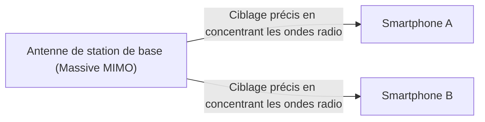

## 1. Les « 3 caractéristiques » promises par la 5G

La **5G (Système de communication mobile de 5ème génération)** est la version de nouvelle génération de la norme de communication (4G/LTE) de nos smartphones actuels.
Cependant, la 5G ne se limite pas à « télécharger des vidéos plus rapidement sur son smartphone ». En tant qu'infrastructure connectant toutes les choses de la société à Internet, elle possède les trois grandes caractéristiques suivantes :

1. **Ultra haut débit et grande capacité (eMBB)** : Environ 20 fois plus rapide que la 4G. Une vitesse permettant de télécharger un film de 2 heures en quelques secondes.
2. **Ultra faible latence (URLLC)** : Un délai de communication d'un dixième de celui de la 4G (environ 1 milliseconde). Permet le contrôle en temps réel de robots à distance.
3. **Connexions multiples simultanées (mMTC)** : Un million d'appareils connectés simultanément par kilomètre carré. Élimine la congestion du trafic de données dans les trains bondés et les stades.

## 2. Les technologies clés qui rendent la 5G possible

Ces caractéristiques, qui semblent magiques, sont réalisées grâce à la combinaison des propriétés physiques des ondes radio et de nouvelles technologies de réseau.

### ① Bandes de hautes fréquences « ondes millimétriques » et « Sub6 »

Pour augmenter la vitesse de communication, il est nécessaire d'élargir la route (bande passante de fréquences). La 4G utilisait des fréquences plus basses (telles que les bandes platine), mais elles sont déjà saturées. C'est pourquoi la 5G utilise des fréquences très élevées (les **ondes millimétriques** : bande des 28 GHz, etc.) qui n'étaient pas utilisées auparavant.
Cependant, les ondes millimétriques ont pour point faible d'être « trop directrices et vulnérables aux obstacles (ne peuvent pas traverser les murs) ». Elles sont donc combinées avec le **Sub6** (moins de 6 GHz), plus équilibré, pour construire la couverture réseau.

### ② Beamforming et Massive MIMO

Le **beamforming** est la technologie qui surmonte les faiblesses des ondes millimétriques, à savoir « la vulnérabilité aux obstacles » et « la courte portée ».

Les stations de base traditionnelles diffusaient les ondes radio dans toutes les directions, comme une douche, mais avec cette méthode, les ondes radio à haute fréquence s'atténuent. Par conséquent, en contrôlant un grand nombre d'antennes (Massive MIMO), les ondes radio sont regroupées en un faisceau étroit pour **cibler précisément le smartphone en cours de communication**. Cela minimise la perte d'ondes radio.

### ③ Edge computing (MEC)

C'est la technologie pour réaliser l'« ultra faible latence ».
Normalement, les données d'un smartphone parcourent une longue distance aller-retour : « station de base → Internet → serveur cloud distant », ce qui entraîne inévitablement un décalage temporel (latence).
Avec la 5G, en **plaçant des serveurs (edge) juste à côté des stations de base** proches de l'utilisateur et en y traitant les données, la distance de communication est physiquement raccourcie, permettant d'atteindre une latence ultra faible de 1 milliseconde.

## 3. Les cas d'utilisation futurs transformés par la 5G

Les véritables avantages de la 5G ne profiteront pas tant aux smartphones, mais plutôt à l'« industrie ».

- **Conduite autonome** : Communique constamment avec les autres voitures et les feux de circulation (V2X), et partage instantanément des informations sur les piétons surgissant des angles morts pour prévenir les accidents.
- **Télémédecine** : Grâce à une latence ultra faible et à une communication vidéo haute définition, un chirurgien expérimenté situé dans une zone urbaine pourra réaliser une opération en contrôlant à distance un bras robotique dans une zone rurale.
- **Usine intelligente** : Connecte sans fil des dizaines de milliers de capteurs dans une usine, permettant à l'IA d'optimiser la ligne de production et de détecter les anomalies en temps réel (5G locale).

## 4. Conclusion

Si l'évolution jusqu'à la 4G visait à « connecter les personnes entre elles, et les personnes à Internet », la 5G est le réseau neuronal permettant de « **connecter toutes les choses (IoT) en temps réel** ».
Actuellement, elle est encore en cours de déploiement, avec des zones d'ondes millimétriques limitées, mais une fois l'infrastructure entièrement en place, notre société dépassera le cadre des smartphones pour entrer dans une nouvelle phase où le cyberespace et le monde réel fusionneront complètement.
