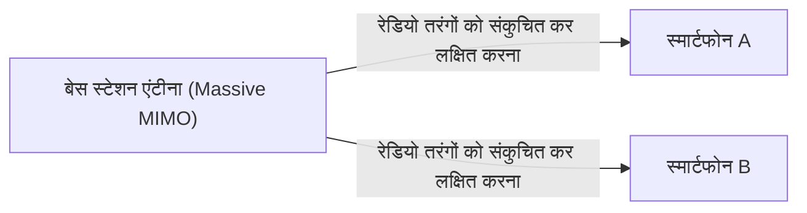

## 1. 5G द्वारा वादा की गई "3 विशेषताएँ"

" **5G (5वीं पीढ़ी का मोबाइल संचार प्रणाली)** " हमारे द्वारा आमतौर पर उपयोग किए जाने वाले स्मार्टफोन संचार मानक (4G/LTE) का अगली पीढ़ी का संस्करण है।
हालाँकि, 5G केवल "स्मार्टफोन पर वीडियो तेज़ी से डाउनलोड करने" के बारे में नहीं है। समाज में हर चीज़ को इंटरनेट से जोड़ने वाले बुनियादी ढाँचे के रूप में, इसकी निम्नलिखित 3 प्रमुख विशेषताएँ हैं:

1. **अल्ट्रा-हाई स्पीड और बड़ी क्षमता (eMBB)** : 4G से लगभग 20 गुना तेज़। ऐसी गति जिससे आप 2 घंटे की फिल्म को कुछ ही सेकंड में डाउनलोड कर सकते हैं।
2. **अल्ट्रा-लो लेटेंसी (URLLC)** : संचार का समय अंतराल 4G का 1/10 (लगभग 1 मिलीसेकंड) है। यह दूरस्थ स्थानों में रोबोटों का वास्तविक समय (real-time) में संचालन संभव बनाता है।
3. **बड़े पैमाने पर एक साथ कनेक्शन (mMTC)** : 1 वर्ग किलोमीटर में 10 लाख उपकरणों को एक साथ कनेक्ट किया जा सकता है। यह भीड़भाड़ वाली ट्रेनों और स्टेडियमों में नेटवर्क ट्रैफ़िक जाम को दूर करता है।

## 2. 5G को साकार करने वाली मुख्य तकनीकें

ये जादुई विशेषताएँ भौतिक रेडियो तरंग (radio wave) की विशेषताओं और नई नेटवर्क तकनीकों के संयोजन से प्राप्त की जाती हैं।

### ① उच्च आवृत्ति बैंड "मिलीमीटर वेव (Millimeter Wave)" और "Sub6"
संचार गति बढ़ाने के लिए, सड़क (फ़्रीक्वेंसी बैंडविड्थ) को चौड़ा करना आवश्यक है। 4G में, कम आवृत्तियों (जैसे प्लैटिनम बैंड) का उपयोग किया जाता था, लेकिन अब कोई जगह खाली नहीं है। इसलिए, 5G में बहुत उच्च आवृत्तियों ( **मिलीमीटर वेव** : 28GHz बैंड आदि) का उपयोग किया जाता है, जो पहले कभी इस्तेमाल नहीं की गई थीं।
हालाँकि, मिलीमीटर वेव की एक कमजोरी है कि "यह बहुत अधिक सीधी यात्रा करती है और बाधाओं के प्रति संवेदनशील होती है (दीवारों को पार नहीं कर सकती)"। इसलिए, एक संतुलित क्षेत्र बनाने के लिए इसे " **Sub6** (6GHz से कम)" के साथ जोड़ा जाता है।

### ② बीमफॉर्मिंग (Beamforming) और Massive MIMO
मिलीमीटर वेव की कमजोरियों को दूर करने की तकनीक, जैसे "बाधाओं के प्रति संवेदनशील होना" और "दूर तक न पहुंच पाना", " **बीमफॉर्मिंग** " कहलाती है।

पारंपरिक बेस स्टेशन रेडियो तरंगों को शावर की तरह सभी दिशाओं में बिखेरते थे, लेकिन इससे उच्च आवृत्ति वाली रेडियो तरंगें कमजोर हो जाती हैं। इसलिए, कई एंटेना (Massive MIMO) को नियंत्रित करके, रेडियो तरंगों को एक पतली बीम में बंडल किया जाता है, और **संचार करने वाले स्मार्टफोन को सटीक रूप से लक्षित किया जाता है** । इससे रेडियो तरंगों का नुकसान कम से कम हो जाता है।

### ③ एज कंप्यूटिंग (MEC)
यह "अल्ट्रा-लो लेटेंसी" प्राप्त करने की तकनीक है।
आमतौर पर, स्मार्टफोन से डेटा को एक लंबी दूरी तय करनी पड़ती है: "बेस स्टेशन → इंटरनेट → दूर स्थित क्लाउड सर्वर", जिससे अनिवार्य रूप से टाइम लैग (लेटेंसी) होता है।
5G में, **सर्वर (एज) को उपयोगकर्ताओं के करीब बेस स्टेशन के ठीक बगल में रखा जाता है** , और वहां डेटा प्रोसेसिंग करने से संचार की भौतिक दूरी कम हो जाती है, जिससे 1 मिलीसेकंड की अल्ट्रा-लो लेटेंसी प्राप्त होती है।

## 3. भविष्य के उपयोग के मामले जिन्हें 5G बदल देगा

5G का वास्तविक लाभ स्मार्टफोन को नहीं, बल्कि "उद्योगों" को मिलेगा।

- **स्वायत्त ड्राइविंग** : वाहनों और ट्रैफिक लाइटों (V2X) के साथ लगातार संचार करके और ब्लाइंड स्पॉट से अचानक आने वाले पैदल चलने वालों की जानकारी को तुरंत साझा करके दुर्घटनाओं को होने से पहले रोका जा सकता है।
- **टेलीमेडिसिन** : अल्ट्रा-लो लेटेंसी और हाई-डेफिनिशन वीडियो संचार के माध्यम से, शहरी क्षेत्रों में अनुभवी सर्जन दूरदराज के क्षेत्रों में रोबोटिक आर्म्स को दूर से नियंत्रित करके सर्जरी कर सकेंगे।
- **स्मार्ट फैक्ट्री** : एक कारखाने के भीतर हजारों सेंसर को वायरलेस तरीके से जोड़ा जाएगा, और AI वास्तविक समय में उत्पादन लाइनों को अनुकूलित करेगा और विसंगतियों का पता लगाएगा (लोकल 5G)।

## 4. निष्कर्ष

यदि 4G तक का विकास "लोगों को लोगों से और लोगों को इंटरनेट से जोड़ने" के बारे में था, तो 5G " **हर चीज़ (IoT) को वास्तविक समय में जोड़ने** " के लिए एक तंत्रिका नेटवर्क (neural network) है।
वर्तमान में, यह अभी भी प्रसार के चरण में है, जैसे कि मिलीमीटर वेव क्षेत्र का सीमित होना, लेकिन जब बुनियादी ढांचा पूरी तरह से स्थापित हो जाएगा, तो हमारा समाज स्मार्टफोन के ढांचे से आगे निकल जाएगा और एक ऐसे नए चरण में प्रवेश करेगा जहां साइबरस्पेस और वास्तविक दुनिया पूरी तरह से मिल जाएंगे。
