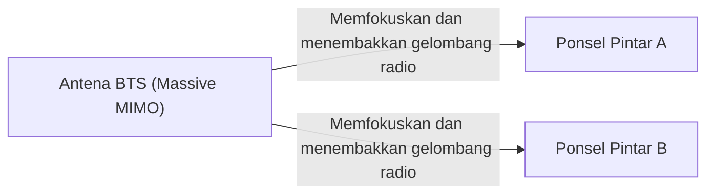

## 1. 3 Fitur yang Dijanjikan oleh 5G

"**5G (Sistem Komunikasi Seluler Generasi ke-5)**" adalah versi generasi berikutnya dari standar komunikasi ponsel pintar (4G/LTE) yang biasa kita gunakan.
Namun, 5G bukan sekadar "mengunduh video di ponsel pintar dengan lebih cepat". Sebagai infrastruktur yang menghubungkan semua hal dalam masyarakat ke internet, 5G memiliki tiga fitur utama berikut:

1. **Kecepatan Sangat Tinggi dan Kapasitas Besar (eMBB)**: Sekitar 20 kali lipat dari 4G. Kecepatan yang dapat mengunduh film berdurasi 2 jam dalam beberapa detik.
2. **Latensi Sangat Rendah (URLLC)**: Jeda waktu komunikasi sepersepuluh dari 4G (sekitar 1 milidetik). Memungkinkan pengoperasian robot di lokasi terpencil secara real-time.
3. **Koneksi Simultan Masif (mMTC)**: Menghubungkan 1 juta perangkat secara bersamaan per 1 kilometer persegi. Mengatasi kemacetan lalu lintas komunikasi di kereta yang penuh sesak atau stadion.

## 2. Teknologi Inti yang Mewujudkan 5G

Fitur-fitur ajaib ini diwujudkan melalui kombinasi karakteristik fisik gelombang radio dan teknologi jaringan baru.

### ① Pita Frekuensi Tinggi "Gelombang Milimeter" dan "Sub6"
Untuk meningkatkan kecepatan komunikasi, jalan (lebar pita frekuensi) perlu diperlebar. 4G menggunakan frekuensi rendah (seperti *platinum band*), tetapi ruang tersebut sudah tidak tersedia lagi. Oleh karena itu, 5G menggunakan frekuensi yang sangat tinggi ("**Gelombang Milimeter**": pita 28GHz, dll.) yang belum pernah digunakan sebelumnya.
Namun, gelombang milimeter memiliki kelemahan "karena rambatannya yang terlalu lurus, ia rentan terhadap rintangan (tidak dapat menembus dinding)". Oleh karena itu, gelombang ini dikombinasikan dengan "**Sub6**" (di bawah 6GHz) yang lebih seimbang untuk membangun area jangkauan.

### ② Beamforming dan Massive MIMO
Teknologi yang mengatasi kelemahan gelombang milimeter yaitu "rentan terhadap rintangan" dan "tidak dapat menjangkau jarak jauh" adalah "**Beamforming**".

BTS konvensional memancarkan gelombang radio ke segala arah seperti pancuran air, namun hal ini menyebabkan gelombang radio berfrekuensi tinggi mudah melemah. Oleh karena itu, dengan mengendalikan sejumlah besar antena (Massive MIMO), gelombang radio digabungkan ke dalam bentuk sinar yang tipis, dan **membidik secara akurat ponsel pintar yang sedang berkomunikasi**. Hal ini meminimalkan hilangnya sinyal gelombang radio.

### ③ Edge Computing (MEC)
Ini adalah teknologi untuk mewujudkan "latensi sangat rendah".
Biasanya, data dari ponsel pintar menempuh jarak yang jauh secara bolak-balik: "BTS → Internet → Server cloud yang jauh", sehingga jeda waktu (latensi) tidak dapat dihindari.
Di 5G, **server (edge) ditempatkan di dekat BTS** yang berada di dekat pengguna, dan memproses data di sana. Dengan secara fisik memperpendek jarak komunikasi, latensi sangat rendah sebesar 1 milidetik dapat terwujud.

## 3. Contoh Kasus Penggunaan Masa Depan yang Diubah oleh 5G

Manfaat nyata 5G bukan pada ponsel pintar, melainkan pada "industri".

- **Mengemudi Otonom**: Mobil berkomunikasi secara terus-menerus dengan mobil lain dan lampu lalu lintas (V2X), berbagi informasi tentang pejalan kaki yang muncul dari titik buta secara instan, sehingga dapat mencegah kecelakaan.
- **Telemedis (Perawatan Medis Jarak Jauh)**: Latensi yang sangat rendah dan komunikasi video definisi tinggi memungkinkan ahli bedah terampil di daerah perkotaan untuk melakukan operasi dengan mengendalikan lengan robot dari jarak jauh di daerah terpencil.
- **Pabrik Pintar (Smart Factory)**: Menghubungkan puluhan ribu sensor secara nirkabel di dalam pabrik, di mana AI mengoptimalkan lini produksi dan mendeteksi anomali secara real-time (Local 5G).

## 4. Kesimpulan

Jika evolusi hingga 4G adalah untuk "menghubungkan manusia dengan manusia, dan manusia dengan internet", maka 5G adalah jaringan saraf untuk "**menghubungkan segala sesuatu (IoT) secara real-time**".
Meskipun saat ini masih dalam tahap penyebaran di mana area gelombang milimeter masih terbatas, ketika infrastrukturnya sudah sepenuhnya siap, masyarakat kita akan melampaui kerangka kerja ponsel pintar dan memasuki fase baru di mana ruang siber dan ruang fisik sepenuhnya menyatu.
