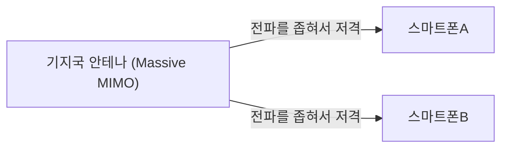

## 1. 5G가 약속하는 '3가지 특징'

'**5G(제5세대 이동통신 시스템)**'은 우리가 평소 사용하는 스마트폰의 통신 규격(4G/LTE)의 차세대 버전입니다.
하지만 5G는 단순히 '스마트폰 동영상을 빨리 다운로드할 수 있는' 것만이 아닙니다. 사회의 모든 사물을 인터넷에 연결하는 인프라로서 다음의 3가지 큰 특징을 가지고 있습니다.

1. **초고속·대용량 (eMBB)**: 4G의 약 20배. 2시간짜리 영화를 몇 초 만에 다운로드할 수 있는 속도.
2. **초저지연 (URLLC)**: 통신의 타임래그가 4G의 10분의 1(약 1밀리초). 원격지의 로봇을 실시간으로 조작 가능하게.
3. **다수 동시 접속 (mMTC)**: 1제곱킬로미터당 100만 대의 디바이스를 동시 접속. 만원 전철이나 스타디움에서의 통신 트래픽 체증을 해소.

## 2. 5G를 실현하는 핵심 기술

이러한 마법 같은 특징은 물리적인 전파의 특성과 새로운 네트워크 기술의 조합을 통해 실현되고 있습니다.

### ① 고주파수 대역 '밀리미터파'와 'Sub6'
통신 속도를 높이려면 도로(주파수의 대역폭)를 넓힐 필요가 있습니다. 4G에서는 낮은 주파수(플래티넘 밴드 등)를 사용했지만, 이미 빈 공간이 없습니다. 그래서 5G에서는 지금까지 사용되지 않았던 매우 높은 주파수(**밀리미터파**: 28GHz 대역 등)를 이용합니다.
다만, 밀리미터파는 '직진성이 너무 강해서 장애물에 약하다(벽을 통과할 수 없다)'라는 약점이 있기 때문에 밸런스가 잡힌 '**Sub6**(6GHz 미만)'와 조합하여 에리어를 구축하고 있습니다.

### ② 빔포밍과 Massive MIMO
밀리미터파의 '장애물에 약하다', '멀리까지 날아가지 않는다'라는 약점을 극복하는 기술이 '**빔포밍**'입니다.

기존의 기지국은 전파를 샤워기처럼 전방위로 뿌렸지만, 이러면 높은 주파수의 전파는 감쇠해 버립니다. 그래서 다수의 안테나(Massive MIMO)를 제어하여 전파를 얇은 빔 형태로 묶어 **통신하고 있는 스마트폰을 핀포인트로 저격** 하는 것입니다. 이를 통해 전파의 손실을 최소한으로 억제할 수 있습니다.

### ③ 에지 컴퓨팅 (MEC)
'초저지연'을 실현하기 위한 기술입니다.
통상 스마트폰에서 나온 데이터는 '기지국 → 인터넷 → 멀리 있는 클라우드 서버'로 긴 거리를 왕복하기 때문에 어쩔 수 없이 타임래그(지연)가 발생합니다.
5G에서는 사용자와 가까운 **기지국 바로 옆에 서버(에지)를 배치** 하고 거기서 데이터 처리를 해버림으로써 통신 거리를 물리적으로 단축하고, 1밀리초라는 초저지연을 실현하고 있습니다.

## 3. 5G가 바꾸는 미래의 유스케이스

5G의 진정한 혜택은 스마트폰이 아니라 '산업'에 가져다집니다.

- **자율주행**: 차끼리나 신호등과 상시 통신하며(V2X), 사각지대에서 튀어나오는 보행자의 정보를 순식간에 서로 공유함으로써 사고를 미연에 방지합니다.
- **원격의료**: 초저지연과 고정밀 영상 통신을 통해 도시 지역에 있는 숙련된 외과의가 과소지역의 로봇 암을 원격 조작하여 수술을 실시하는 것이 가능해집니다.
- **스마트 팩토리**: 공장 내의 수만 개의 센서를 무선으로 연결하고, AI가 실시간으로 생산 라인을 최적화·이상 감지를 실시합니다(로컬 5G).

## 4. 정리

4G까지의 진화가 '사람과 사람, 사람과 인터넷을 연결하는' 것이었다고 한다면, 5G는 '**모든 사물(IoT)을 실시간으로 연결하는**' 것을 위한 신경망입니다.
현재는 아직 밀리미터파의 에리어가 한정적인 등 보급되는 도중에 있지만, 인프라가 완전히 갖춰졌을 때 우리 사회는 스마트폰이라는 틀을 넘어 사이버 공간과 현실 공간이 완전히 융합된 새로운 단계로 돌입할 것입니다.
