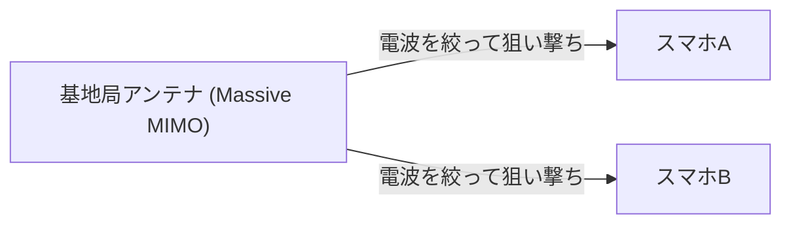

## 1. 5Gが約束する「3つの特徴」

「**5G（第5世代移動通信システム）**」は、私たちが普段使っているスマートフォンの通信規格（4G/LTE）の次世代バージョンです。
しかし、5Gは単に「スマホの動画が早くダウンロードできる」だけのものではありません。社会のあらゆるモノをインターネットに繋ぐインフラとして、以下の3つの大きな特徴を持っています。

1. **超高速・大容量 (eMBB)**: 4Gの約20倍。2時間の映画を数秒でダウンロードできるスピード。
2. **超低遅延 (URLLC)**: 通信のタイムラグが4Gの10分の1（約1ミリ秒）。遠隔地のロボットをリアルタイムで操作可能に。
3. **多数同時接続 (mMTC)**: 1平方キロメートルあたり100万台のデバイスを同時接続。満員電車やスタジアムでの通信トラフィック渋滞を解消。

## 2. 5Gを実現するコア技術

これらの魔法のような特徴は、物理的な電波の特性と新しいネットワーク技術の組み合わせによって実現されています。

### ① 高周波数帯「ミリ波」と「Sub6」
通信速度を上げるには、道路（周波数の帯域幅）を広くする必要があります。4Gでは低い周波数（プラチナバンドなど）を使っていましたが、すでに空きがありません。そこで5Gでは、今まで使われていなかった非常に高い周波数（**ミリ波**: 28GHz帯など）を利用します。
ただし、ミリ波は「直進性が高すぎて障害物に弱い（壁をすり抜けられない）」という弱点があるため、バランスの取れた「**Sub6**（6GHz未満）」と組み合わせてエリアを構築しています。

### ② ビームフォーミングとMassive MIMO
ミリ波の「障害物に弱い」「遠くまで飛ばない」という弱点を克服する技術が「**ビームフォーミング**」です。

従来の基地局は、電波をシャワーのように全方位にばら撒いていましたが、これでは高い周波数の電波は減衰してしまいます。そこで、多数のアンテナ（Massive MIMO）を制御し、電波を細いビーム状に束ねて、**通信しているスマホをピンポイントで狙い撃ちする**のです。これにより、電波のロスを最小限に抑えられます。

### ③ エッジコンピューティング (MEC)
「超低遅延」を実現するための技術です。
通常、スマホからのデータは「基地局 → インターネット → 遠くのクラウドサーバー」と長い距離を往復するため、どうしてもタイムラグ（遅延）が発生します。
5Gでは、ユーザーに近い**基地局のすぐそばにサーバー（エッジ）を配置**し、そこでデータ処理を行ってしまうことで、通信距離を物理的に短縮し、1ミリ秒という超低遅延を実現しています。

## 3. 5Gが変える未来のユースケース

5Gの本当の恩恵は、スマートフォンではなく「産業」にもたらされます。

- **自動運転**: 車同士や信号機と常時通信し（V2X）、死角から飛び出してくる歩行者の情報を瞬時に共有し合うことで、事故を未然に防ぎます。
- **遠隔医療**: 超低遅延と高精細な映像通信により、都市部にいる熟練の外科医が、過疎地のロボットアームを遠隔操作して手術を行うことが可能になります。
- **スマートファクトリー**: 工場内の数万個のセンサーをワイヤレスで接続し、AIがリアルタイムで生産ラインを最適化・異常検知を行います（ローカル5G）。

## 4. まとめ

4Gまでの進化が「人と人、人とインターネットを繋ぐ」ものだったとすれば、5Gは「**あらゆるモノ（IoT）をリアルタイムに繋ぐ**」ための神経網です。
現在はまだミリ波のエリアが限定的であるなど普及の途上にありますが、インフラが完全に整ったとき、私たちの社会はスマートフォンという枠組みを超えて、サイバー空間と現実空間が完全に融合した新しいフェーズへと突入するでしょう。
