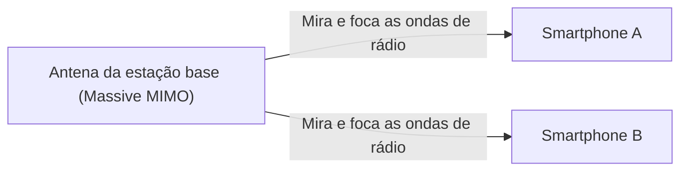

## 1. As "3 Características" Prometidas pelo 5G

O "**5G (Sistema de Comunicações Móveis de 5ª Geração)**" é a versão de próxima geração do padrão de comunicação (4G/LTE) que usamos normalmente em nossos smartphones.
No entanto, o 5G não serve apenas para "baixar vídeos no smartphone mais rapidamente". Como infraestrutura que conecta todas as coisas da sociedade à Internet, ele possui as três grandes características a seguir:

1. **Velocidade ultra-alta e grande capacidade (eMBB)**: Cerca de 20 vezes mais rápido que o 4G. Velocidade capaz de baixar um filme de 2 horas em poucos segundos.
2. **Latência ultra-baixa (URLLC)**: O atraso (time lag) de comunicação é 1/10 do 4G (cerca de 1 milissegundo). Torna possível operar robôs remotamente em tempo real.
3. **Múltiplas conexões simultâneas (mMTC)**: Conecta 1 milhão de dispositivos simultaneamente por quilômetro quadrado. Elimina o congestionamento de tráfego de comunicação em trens lotados e estádios.

## 2. Tecnologias Essenciais que Viabilizam o 5G

Essas características, que parecem mágicas, são realizadas por uma combinação das propriedades físicas das ondas de rádio e novas tecnologias de rede.

### ① Faixa de alta frequência "Ondas Milimétricas" e "Sub6"
Para aumentar a velocidade de comunicação, é necessário alargar a estrada (largura de banda da frequência). No 4G, eram usadas frequências baixas (como a banda de platina), mas elas já não têm espaço livre. Portanto, o 5G utiliza frequências muito altas (**ondas milimétricas**: faixa de 28GHz, etc.) que não eram usadas até então.
No entanto, como as ondas milimétricas têm o ponto fraco de serem "altamente direcionais e fracas contra obstáculos (não conseguem atravessar paredes)", elas são combinadas com o "**Sub6** (abaixo de 6GHz)", que é mais equilibrado, para construir a área de cobertura.

### ② Beamforming e Massive MIMO
A tecnologia que supera os pontos fracos das ondas milimétricas de "fracas contra obstáculos" e "não chegarem longe" é o "**beamforming**".

As estações base convencionais espalhavam ondas de rádio em todas as direções como um chuveiro, mas isso faz com que ondas de alta frequência percam intensidade. Por isso, controlam um grande número de antenas (Massive MIMO) para agrupar as ondas de rádio em feixes finos, **mirando com precisão nos smartphones que estão se comunicando**. Isso minimiza a perda das ondas de rádio.

### ③ Edge Computing (MEC)
Esta é a tecnologia para alcançar a "latência ultra-baixa".
Normalmente, os dados do smartphone viajam uma longa distância de ida e volta: "Estação base → Internet → Servidor em nuvem distante", de modo que atrasos (latência) ocorrem inevitavelmente.
No 5G, um **servidor (edge) é colocado muito próximo à estação base**, mais perto do usuário, e ao processar os dados lá, a distância de comunicação é fisicamente encurtada, realizando uma latência ultra-baixa de 1 milissegundo.

## 3. Casos de Uso do Futuro Transformados pelo 5G

Os verdadeiros benefícios do 5G serão trazidos não para os smartphones, mas para a "indústria".

- **Condução Autônoma**: Os veículos se comunicam constantemente entre si e com semáforos (V2X), compartilhando instantaneamente informações sobre pedestres saindo de pontos cegos para evitar acidentes antes que ocorram.
- **Telemedicina**: A latência ultra-baixa e a comunicação de vídeo de alta definição permitirão que cirurgiões especialistas em áreas urbanas realizem cirurgias operando remotamente braços robóticos em áreas rurais isoladas.
- **Fábricas Inteligentes (Smart Factory)**: Dezenas de milhares de sensores em uma fábrica são conectados sem fio, e a IA otimiza as linhas de produção e detecta anomalias em tempo real (5G local).

## 4. Conclusão

Se a evolução até o 4G era para "conectar pessoas com pessoas, e pessoas à Internet", o 5G é a rede neural para "**conectar todas as coisas (IoT) em tempo real**".
Atualmente, a área de cobertura das ondas milimétricas ainda é limitada e a adoção está em andamento, mas quando a infraestrutura estiver totalmente preparada, nossa sociedade irá além do escopo dos smartphones e entrará em uma nova fase onde o ciberespaço e o espaço físico estarão completamente fundidos.
