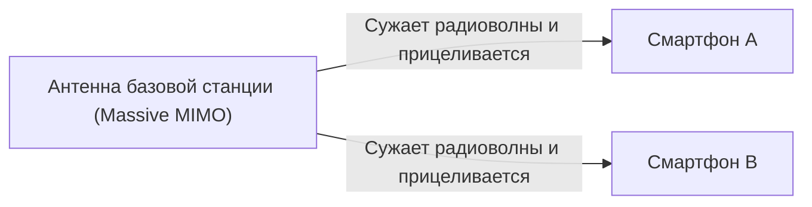

## 1. «Три особенности», которые обещает 5G

«**5G (система мобильной связи пятого поколения)**» — это следующая версия стандарта связи (4G/LTE), который мы обычно используем в наших смартфонах.
Однако 5G — это не просто «более быстрая загрузка видео на смартфон». В качестве инфраструктуры, соединяющей все вещи в обществе с интернетом, она обладает следующими тремя основными характеристиками:

1. **Сверхвысокая скорость и большая емкость (eMBB)**: Примерно в 20 раз быстрее 4G. Скорость, позволяющая загрузить 2-часовой фильм за несколько секунд.
2. **Сверхнизкая задержка (URLLC)**: Временная задержка связи составляет одну десятую от 4G (около 1 миллисекунды). Это позволяет управлять роботами в удаленных местах в режиме реального времени.
3. **Множественное одновременное подключение (mMTC)**: Одновременное подключение 1 миллиона устройств на квадратный километр. Устраняет проблемы с перегрузкой связи в переполненных поездах и на стадионах.

## 2. Базовые технологии, реализующие 5G

Эти волшебные характеристики достигаются за счет сочетания физических свойств радиоволн и новых сетевых технологий.

### ① Высокочастотные диапазоны «Миллиметровые волны» и «Sub6»
Чтобы увеличить скорость связи, необходимо расширить «дорогу» (полосу частот). В 4G использовались низкие частоты (например, платиновый диапазон), но там уже нет свободного места. Поэтому в 5G используются очень высокие частоты, которые ранее не применялись (**миллиметровые волны**: диапазон 28 ГГц и т. д.).
Однако миллиметровые волны имеют недостаток: они «слишком прямолинейны и уязвимы перед препятствиями (не могут проходить сквозь стены)», поэтому зоны покрытия создаются в сочетании со сбалансированным диапазоном «**Sub6** (менее 6 ГГц)».

### ② Формирование луча (Beamforming) и Massive MIMO
Технология, которая преодолевает такие недостатки миллиметровых волн, как «уязвимость к препятствиям» и «неспособность распространяться на большие расстояния», называется «**формированием луча**».

Обычные базовые станции рассеивали радиоволны во всех направлениях, как душ, но из-за этого высокочастотные радиоволны затухали. Поэтому они управляют большим количеством антенн (Massive MIMO), объединяют радиоволны в узкий луч и **целенаправленно направляют его на смартфон, с которым осуществляется связь**. Это сводит потерю радиоволн к минимуму.

### ③ Периферийные вычисления (MEC)
Технология для достижения «сверхнизкой задержки».
Обычно данные со смартфона проходят большое расстояние по маршруту «Базовая станция → Интернет → Удаленный облачный сервер» и обратно, поэтому неизбежно возникает задержка времени.
В 5G **серверы (периферийные/edge) размещаются рядом с базовыми станциями**, ближе к пользователю, и данные обрабатываются там, что физически сокращает расстояние связи и обеспечивает сверхнизкую задержку в 1 миллисекунду.

## 3. Будущие варианты использования, которые изменит 5G

Настоящая польза от 5G будет принесена «промышленности», а не смартфонам.

- **Автономное вождение**: Постоянная связь между автомобилями и светофорами (V2X), мгновенный обмен информацией о пешеходах, выскакивающих из слепых зон, позволит предотвращать аварии до их возникновения.
- **Телемедицина**: Сверхнизкая задержка и передача видео высокой четкости позволят квалифицированным хирургам в городских районах удаленно управлять роботизированными манипуляторами для проведения операций в малонаселенных пунктах.
- **Умные фабрики**: Беспроводное подключение десятков тысяч датчиков на заводах, а ИИ будет в режиме реального времени оптимизировать производственные линии и обнаруживать аномалии (локальные сети 5G).

## 4. Заключение

Если эволюция до 4G заключалась в «соединении людей с людьми и людей с интернетом», то 5G — это нервная сеть для «**соединения всех вещей (IoT) в реальном времени**».
В настоящее время она все еще находится на стадии распространения, например, зона покрытия миллиметровых волн ограничена, но когда инфраструктура будет полностью подготовлена, наше общество выйдет за рамки смартфонов и вступит в новую фазу, где киберпространство и реальное пространство полностью сольются.
