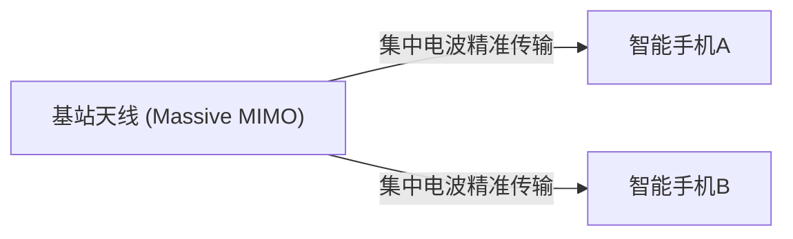

## 1. 5G承诺的“三大特征”

“ **5G（第五代移动通信系统）** ”是我们平时使用的智能手机通信标准（4G/LTE）的下一代版本。
然而，5G不仅仅是“能更快地下载手机视频”。作为将社会万物连接到互联网的基础设施，它具有以下三个主要特征：

1. **超高速、大容量 (eMBB)**: 约是4G的20倍。能够在几秒钟内下载一部2小时电影的速度。
2. **超低延迟 (URLLC)**: 通信的延迟时间是4G的十分之一（约1毫秒）。可以实时操作偏远地区的机器人。
3. **海量连接 (mMTC)**: 每平方公里可同时连接100万台设备。消除拥挤的火车和体育场内的通信流量拥堵。

## 2. 实现5G的核心技术

这些如魔法般的特征，是通过物理电波的特性与全新网络技术的结合来实现的。

### ① 高频段“毫米波”与“Sub6”

为了提高通信速度，需要拓宽道路（频率带宽）。4G使用了较低的频率（黄金频段等），但已经没有空闲了。因此，在5G中，使用了迄今为止未曾使用过的极高频率（ **毫米波** ：28GHz频段等）。
但是，由于毫米波具有“直射性太强，容易受到障碍物影响（无法穿透墙壁）”的弱点，因此将其与相对平衡的“ **Sub6** （6GHz以下）”结合起来构建覆盖区域。

### ② 波束赋形与Massive MIMO

克服毫米波“容易受障碍物影响”和“传输距离短”弱点的技术就是“ **波束赋形** ”。

传统的基站像淋浴一样向四面八方发射电波，但这会使高频电波发生衰减。因此，通过控制大量天线（Massive MIMO），将电波聚集成细波束， **精准锁定正在通信的智能手机进行传输** 。这样一来，就能将电波损耗降至最低。

### ③ 边缘计算 (MEC)

这是为了实现“超低延迟”的技术。

通常，来自智能手机的数据会在“基站 → 互联网 → 远处的云服务器”之间长距离往返，因此不可避免地会产生延迟。
在5G中，通过在距离用户较近的 **基站附近部署服务器（边缘节点）** ，并在那里进行数据处理，从而在物理上缩短了通信距离，实现了1毫秒的超低延迟。

## 3. 5G改变未来的应用场景

5G真正的恩惠并非体现在智能手机上，而是为“产业”带来的改变。

- **自动驾驶**: 车辆之间以及与交通信号灯进行实时通信（V2X），瞬间共享从盲区突然出现的行人信息，从而防患于未然。
- **远程医疗**: 凭借超低延迟和高清视频通信，身处城市的熟练外科医生可以远程操作偏远地区的机械臂进行手术。
- **智能工厂**: 将工厂内的数万个传感器进行无线连接，AI实时进行生产线优化和异常检测（专网5G）。

## 4. 总结

如果说截至4G的演进是“连接人与人、人与互联网”，那么5G就是为了“ **实时连接万物（IoT）** ”的神经网络。
目前虽然仍处于普及阶段，例如毫米波的覆盖区域仍然有限，但当基础设施完全完善时，我们的社会将超越智能手机的框架，迈入网络空间与现实空间完全融合的新阶段。
