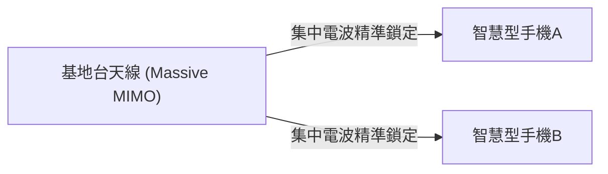

## 1. 5G 所承諾的「3大特色」

「 **5G（第5代行動通訊系統）** 」是我們平常使用的智慧型手機通訊標準（4G/LTE）的次世代版本。
然而，5G 不僅僅是「能更快下載手機影片」而已。作為將社會上所有事物連接至網際網路的基礎設施，它具備以下三個主要特色：

1. **超高速・大容量 (eMBB)** ：約為 4G 的 20 倍。幾秒鐘內即可下載完一部 2 小時的電影。
2. **超低延遲 (URLLC)** ：通訊延遲時間為 4G 的 10 分之 1（約 1 毫秒）。可實現遠端機器人的即時操作。
3. **大量大連結 (mMTC)** ：每平方公里可同時連接 100 萬台裝置。解決滿載列車或體育場內的通訊流量壅塞問題。

## 2. 實現 5G 的核心技術

這些宛如魔法般的特色，是透過物理電波特性與全新網路技術的結合來實現的。

### ① 高頻段「毫米波」與「Sub6」
為了提升通訊速度，必須拓寬道路（頻寬）。4G 使用的是較低頻率（如黃金頻段），但這些頻段已無空隙。因此在 5G 中，利用了過去未曾使用的極高頻率（ **毫米波** ：如 28GHz 頻段等）。
不過，毫米波有一個弱點，就是「直線傳播性太強，容易受障礙物影響（無法穿透牆壁）」，因此需要與平衡性較佳的「 **Sub6** （低於 6GHz）」結合來建構通訊涵蓋範圍。

### ② 波束成形與 Massive MIMO
用來克服毫米波「易受障礙物影響」、「傳輸距離短」等弱點的技術，就是「 **波束成形** 」。

傳統的基地台是將電波像淋浴一樣向四面八方發散，但這種方式會導致高頻電波衰減。因此，透過控制大量天線（Massive MIMO），將電波匯聚成細長波束， **精準鎖定正在通訊的智慧型手機** 。這樣就能將電波的損耗降至最低。

### ③ 邊緣運算 (MEC)
這是為了實現「超低延遲」的技術。
通常，來自智慧型手機的資料會經過「基地台 → 網際網路 → 遠端的雲端伺服器」進行長距離往返，因此不可避免地會產生時間差（延遲）。
5G 則在靠近使用者的 **基地台旁部署伺服器（邊緣）** ，並在當地處理資料，藉由物理上縮短通訊距離，實現 1 毫秒的超低延遲。

## 3. 5G 改變未來的應用場景

5G 真正的恩惠並非在於智慧型手機，而是將帶給「產業」。

- **自動駕駛** ：車輛之間以及與紅綠燈保持常時通訊（V2X），瞬間共享從死角竄出的行人資訊，以防範事故於未然。
- **遠距醫療** ：透過超低延遲與高畫質影像通訊，位在都會區的熟練外科醫生將能遠端操作偏鄉的機器手臂進行手術。
- **智慧工廠** ：將廠內數萬個感測器透過無線連接，由 AI 即時進行生產線最佳化與異常偵測（企業專網 5G）。

## 4. 總結

如果說 4G 以前的演進是「連接人與人、人與網際網路」，那麼 5G 就是為了「 **即時連接所有事物（IoT）** 」的神經網路。
目前雖然還處於普及階段，例如毫米波的涵蓋範圍依然有限，但當基礎設施完全到位時，我們的社會將超越智慧型手機的框架，邁入網路空間與現實空間完全融合的嶄新階段。
