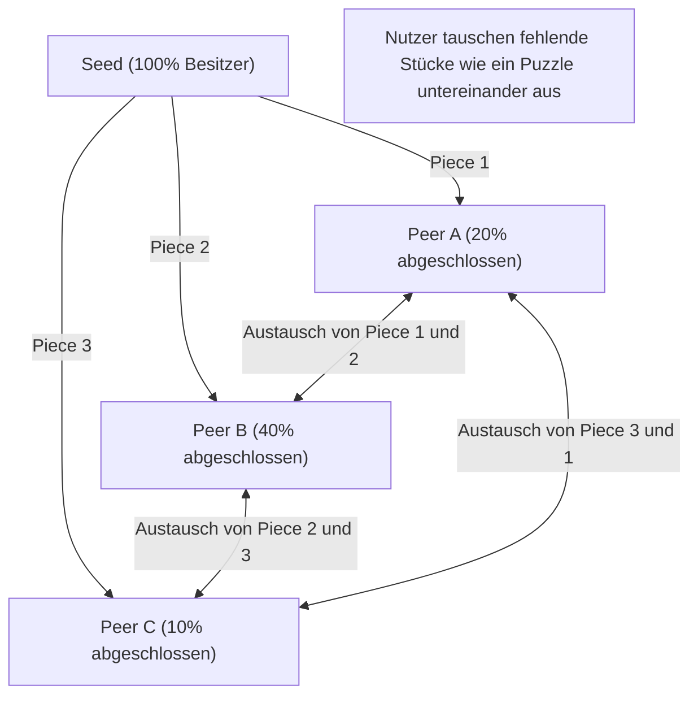

## 1. Ein Protokoll, das den Download revolutioniert

Was passiert, wenn zehntausende Menschen gleichzeitig versuchen, mehrere Gigabyte an Daten wie ein Linux-Installationsimage oder eine riesige Spieleaktualisierung herunterzuladen? Bei einem normalen Webserver (HTTP-Download) würde die Bandbreite der Verbindung überschritten und der Server würde zusammenbrechen.

Um dieses Problem zu lösen, hat Bram Cohen im Jahr 2001 **BitTorrent** entwickelt. Anstatt dass „Unternehmen viel Geld für mehrere extrem leistungsstarke Server ausgeben (CDN)“, basiert es auf der bahnbrechenden Methode: „**Die Leistung der PCs der herunterladenden Nutzer selbst wird genutzt, sodass sie sich gegenseitig beim Download helfen.**“

BitTorrent ist nicht einfach nur ein Werkzeug für illegale Downloads. Auch heute noch macht es einen beträchtlichen Teil des weltweiten Internet-Traffics aus und wird von großen IT-Unternehmen genutzt, um riesige Datenmengen schnell auf ihre internen Serverfarmen zu verteilen. Es ist eines der größten Meisterwerke unter den „verteilten Verteilungsalgorithmen“ in der Informatik.

## 2. Die Kraft der Stücke (Pieces) und des Schwarms (Swarm)

Die größte Erfindung von BitTorrent besteht darin, eine einzige riesige Datei in sogenannte „**Pieces**“ (normalerweise kleine Blöcke von 256 KB bis zu mehreren MB) zu zerlegen.

Bei herkömmlichen Downloads empfängt man die Datei sequenziell vom Anfang bis zum Ende vom Server.
Bei BitTorrent jedoch teilen die Teilnehmer des Downloads (der sogenannte Schwarm oder Swarm) kontinuierlich Informationen darüber, „wer welches Piece besitzt“.

Während man die Pieces, die einem noch fehlen, von anderen Nutzern (Peers) erhält, lädt man gleichzeitig **die bereits vollständig heruntergeladenen Pieces hoch und gibt sie an andere Nutzer weiter, die sie noch nicht haben**.

Durch diesen Mechanismus muss der ursprüngliche Server (Seed) die Datei nicht mehr vollständig an alle Teilnehmer senden. Es reicht, wenn jedes Piece an nur eine Person übergeben wird. Danach tauschen die Teilnehmer die Puzzlestücke untereinander aus, sodass sie sich vervielfältigen. Dadurch entsteht das geradezu magische Phänomen: **„Je mehr Teilnehmer es gibt, desto schneller wird die Download-Geschwindigkeit des gesamten Netzwerks.“**

## 3. Der Rarest First Algorithmus

Einer der Gründe, warum BitTorrent so effizient funktioniert, ist der clevere Algorithmus namens „**Rarest First**“ (das Seltenste zuerst), der die Reihenfolge bestimmt, in der die Pieces heruntergeladen werden.

Wenn alle Teilnehmer nacheinander mit dem „ersten Piece der Datei“ beginnen würden, bestünde der Schwarm bald nur noch aus „Leuten, die die vorderen Pieces besitzen“, und es gäbe extrem wenige, die die hinteren haben. Wenn der ursprüngliche Seed dann verschwinden würde, könnte niemand mehr die Datei zu 100 % fertigstellen.

Daher überblickt BitTorrent den gesamten Schwarm und zwingt jedem Peer die Regel auf: „**Lade priorisiert das seltenste Piece herunter, das derzeit am wenigsten verfügbar ist.**“
Dadurch werden alle Pieces gleichmäßig im Netzwerk verteilt. Selbst wenn der ursprüngliche Seed verschwindet, können die verbleibenden Nutzer die Datei allein durch den Austausch untereinander vervollständigen.

## 4. Tit-for-Tat-Strategie: Ausschluss von Trittbrettfahrern

Das größte Problem in P2P-Netzwerken ist die Existenz eigennütziger Nutzer (Trittbrettfahrer oder Free Rider), die Daten nur empfangen und anderen absolut nichts hochladen (bereitstellen). Wenn es nur solche Nutzer gäbe, würde das System zusammenbrechen.

BitTorrent hat zur Lösung dieses Problems eine starke Gegenmaßnahme auf Protokollebene integriert, die auf der Spieltheorie basiert: „**Tit-for-Tat**“ (Wie du mir, so ich dir).

Die BitTorrent-Client-Software misst bei jedem verbundenen Peer ständig, „mit welcher Geschwindigkeit er Daten an uns hochlädt“. Daraufhin führt sie automatisch folgende Aktion aus: **„Nur an diejenigen, die uns viele Daten geben, werden als Gegenleistung bevorzugt die eigenen Daten gesendet (Choke/Unchoke).“**

Das bedeutet, dass ein Nutzer, der den Upload einschränkt und „nur nimmt“, von allen anderen Nutzern blockiert wird, da diese entscheiden: „Dieser Typ gibt uns keine Daten, also geben wir ihm auch nichts.“ In der Folge wird die eigene Download-Geschwindigkeit dieses Nutzers extrem langsam.
Es ist ein erstaunlicher Algorithmus, der so konzipiert ist, dass altruistisches Verhalten (das Freigeben des Uploads) die optimale Lösung ist, um egoistische Ziele (die Beschleunigung des eigenen Downloads) zu erreichen.

## 5. Evolution vom Tracker zu DHT (Der Gipfel der Dezentralisierung)

Im frühen BitTorrent war ein zentraler Server namens „**Tracker**“ erforderlich, um ein Verzeichnis darüber zu führen, „welche IP-Adresse diese Datei besitzt“. Das System hatte die Schwäche, dass Nutzer sich nicht mehr finden konnten, wenn der Tracker ausfiel.

Das heutige BitTorrent kommt jedoch ohne Tracker-Server aus (trackerless), da die **DHT**-Technologie (Distributed Hash Table, verteilte Hash-Tabelle) integriert wurde.
Indem die PCs von Millionen teilnehmenden Nutzern im Netzwerk kooperieren und ein gigantisches „dezentrales Verzeichnis“ erstellen, hat es sich zu einem ultimativen dezentralen System entwickelt. Nun ist es möglich, auch ohne zentralen Server jemanden zu finden, der eine bestimmte Datei hat, und den Download zu starten.

## 6. Zusammenfassung

BitTorrent ist eine Technologie, die die Philosophie des Internet – die autonome Dezentralisierung – perfekt verkörpert. Es verwirft den Ansatz des 20. Jahrhunderts, bei dem „ein riesiger zentraler Server an alle verteilt“, und setzt stattdessen darauf, „die Kraft der Individuen, die einen Schwarm bilden, zu bündeln“.

Die zugrundeliegende Logik – „Dateien in kleine Teile zerlegen“, „seltene Teile sammeln“ und „Kooperation belohnen“ – übt bis heute einen enormen Einfluss auf das Design von [Blockchain](/de/p/blockchain-technology-smart-contract-distributed-ledger/)-Technologien und dezentralen Cloud-Speichern aus.
