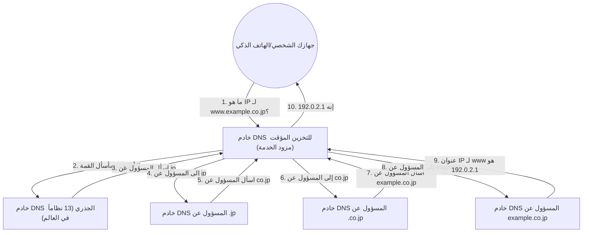

## 1. حاجز اللغة بين البشر وأجهزة الكمبيوتر

في عالم الإنترنت، يتم تحديد موقع كل جهاز كمبيوتر أو خادم من خلال سلسلة من الأرقام تسمى **عنوان IP** (مثل: 142.250.196.110).
ومع ذلك، من المستحيل على البشر حفظ جميع عناوين IP لمواقع الويب التي يصلون إليها يوميًا. وذلك لأنه من الأسهل بكثير على البشر تذكر **أسماء النطاقات** (سلاسل نصية ذات معنى) مثل "google.com" أو "apple.com".

هذا النظام الضخم الذي يترجم ويربط تلقائيًا بين "أسماء النطاقات التي يستخدمها البشر" و "عناوين IP التي تستخدمها أجهزة الكمبيوتر" هو **DNS (نظام أسماء النطاقات)**.
غالبًا ما يُشبه DNS بـ "دليل هاتف الإنترنت". تمامًا كما تبحث عن "يامادا" في دليل الهاتف إذا كنت تريد معرفة رقم هاتف السيد يامادا، يقوم المتصفح بالاستعلام من خادم DNS في الخلفية لمعرفة عنوان IP الخاص بـ "google.com".

## 2. الحاجة إلى قاعدة بيانات موزعة ضخمة

ماذا سيحدث إذا حاولنا إدارة جدول تطابق جميع أسماء النطاقات وعناوين IP في العالم على "خادم عملاق واحد"؟
ستتدفق مئات الملايين من الاستعلامات في الثانية من جميع أنحاء العالم، مما سيؤدي إلى تعطل الخادم على الفور، وإذا تعطل هذا الخادم، فلن يتمكن أي شخص في العالم من استخدام الإنترنت.

لذلك، تم تصميم DNS كـ **قاعدة بيانات موزعة هرمية** حيث تتعاون مئات الآلاف من الخوادم حول العالم لإدارة البيانات بشكل موزع. يُقال إن هذا هو النظام الموزع الأكثر نجاحًا والأكبر حجمًا في تاريخ علوم الحاسوب.

## 3. الهيكل الهرمي لأسماء النطاقات (بنية الشجرة)

لفهم كيفية عمل DNS، يجب أن تعرف "هيكل" أسماء النطاقات.
في الواقع، أسماء النطاقات لها تسلسل هرمي (بنية شجرية) من اليمين إلى اليسار.

على سبيل المثال، إذا قمنا بتحليل نطاق مثل `www.example.co.jp.` من اليمين، فسيكون على النحو التالي:

1. **`.` (الجذر)**: قمة جميع النطاقات. في الواقع، هناك نقطة مخفية "." في نهاية كل نطاق.
2. **`jp` (نطاق المستوى الأعلى / TLD)**: التسلسل الهرمي الذي يمثل دولة اليابان. هناك أيضًا نطاقات أخرى مثل `.com` و `.net`.
3. **`co` (نطاق المستوى الثاني)**: التسلسل الهرمي الذي يمثل شركة (company).
4. **`example` (نطاق المستوى الثالث)**: اسم الشركة أو المؤسسة.
5. **`www` (اسم المضيف)**: اسم خادم معين (مثل خادم ويب) داخل تلك المؤسسة.

في عالم DNS، يتم وضع "خادم DNS مسؤول (خادم DNS الموثوق)" لكل مستوى، وهو يعرف فقط معلومات الاتصال (عنوان IP) للمسؤولين في المستوى الذي يليه مباشرة.

## 4. عملية تحليل الأسماء: رحلة تناقل المسؤولية

عندما تكتب `https://www.example.co.jp` في متصفحك، تجري عملية "تحليل الاسم" (البحث عن عنوان IP من الاسم) الضخمة التالية في الخلفية في لحظة (عشرات الميلي ثانية).

1. **الطلب من خادم DNS للتخزين المؤقت**: يطلب جهاز الكمبيوتر الخاص بك أولاً من "خادم DNS للتخزين المؤقت" الخاص بمزود الخدمة المتعاقد معه (مثل NTT أو KDDI) للبحث نيابة عنه.
2. **الاستعلام لخادم الجذر**: إذا كان خادم مزود الخدمة لا يعرف الإجابة، فإنه يسأل "خادم DNS الجذري (لا يوجد سوى 13 نظامًا في العالم)" الذي يتربع على قمة العالم. يرد خادم الجذر: "أنا لا أعرف، لكنني سأعطيك عنوان IP للمسؤول عن `.jp`، فاسأله هناك".
3. **تتابع تناقل المسؤولية**: يسأل خادم مزود الخدمة خادم `.jp` المسؤول الذي أُخبر به، ثم يسأل خادم `.co.jp` المسؤول... وهكذا يتم تناقل المسؤولية (التفويض) واحدًا تلو الآخر أثناء النزول في التسلسل الهرمي.
4. **الإجابة النهائية**: أخيرًا، يصل إلى خادم DNS للشركة التي تدير `example.co.jp` ويحصل على الإجابة النهائية "عنوان IP لـ `www` هو هذا".

هذا التتابع المعقد يحدث في جميع أنحاء العالم في كل مرة ننقر فيها على رابط.

## 5. تسريع باستخدام قوة التخزين المؤقت

إذا كنا سنقوم بهذا التتابع في كل مرة، فسيصبح الإنترنت بالكامل بطيئًا، وستنهار خوادم DNS الجذرية في القمة.

لمنع ذلك، توجد آلية **التخزين المؤقت (الحفظ المؤقت)**.
يتذكر خادم DNS للتخزين المؤقت الخاص بمزود الخدمة "عنوان IP لـ google.com" الذي تم البحث عنه مرة واحدة في الذاكرة لفترة زمنية معينة (TTL: وقت البقاء).
في المرة القادمة التي تسأل فيها أنت أو أحد جيرانك "ما هو عنوان IP لـ google.com؟"، فلن يضطر للذهاب وسؤال العالم بأسره، بل سيتمكن من الإجابة على الفور (في غضون بضعة ميلي ثانية) بـ "لقد بحثت عنه للتو، لذا فهو هذا".

تتم معالجة أكثر من 99% من استعلامات DNS في العالم على الفور بفضل هذا التخزين المؤقت، وهذا ما يدعم السرعة المريحة للإنترنت.

## 6. الخلاصة

نظام DNS هو "البطل المجهول" الذي لا ندركه عادة على الإطلاق.
ومع ذلك، لولا هذا النظام الموزع الهرمي الذي صممه بول موكابتريس وآخرون في الثمانينيات، لما أمكن وجود الإنترنت الضخم الحالي على الإطلاق.

تتحمل مئات الآلاف من خوادم DNS المنتشرة في جميع أنحاء العالم مسؤولية مناطق عملها، وتتعاون مع بعضها البعض في تتابع. يعد DNS البنية التحتية التي تجسد فلسفة "التوزيع المستقل" للإنترنت بأجمل شكل.
