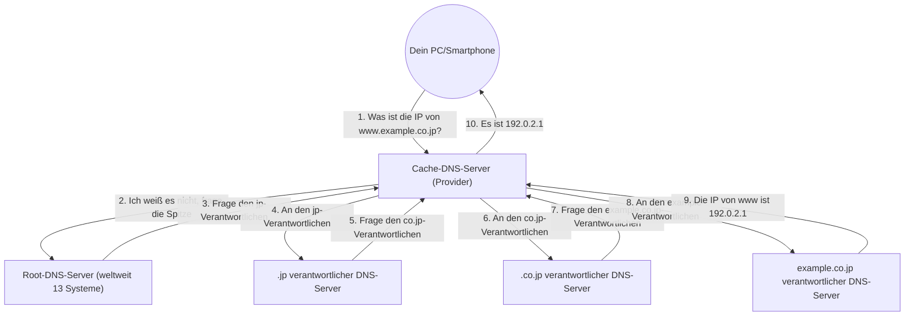

## 1. Die „Sprachbarriere“ zwischen Mensch und Computer

In der Welt des Internets werden alle Computer und Server durch eine Zahlenfolge namens „**IP-Adresse** (z. B. 142.250.196.110)“ lokalisiert.
Es ist jedoch unmöglich für Menschen, sich alle IP-Adressen der Websites, auf die sie täglich zugreifen, zu merken. Für Menschen sind „**Domainnamen** (bedeutungsvolle Zeichenfolgen)“ wie „google.com“ oder „apple.com“ viel leichter zu merken.

Das riesige System, das diesen „von Menschen verwendeten Domainnamen“ und die „von Computern verwendete IP-Adresse“ automatisch übersetzt und miteinander verknüpft, ist das „**DNS (Domain Name System)**“.
DNS wird oft mit dem „Telefonbuch des Internets“ verglichen. So wie Sie im Telefonbuch nach „Yamada“ suchen würden, um die Telefonnummer von Herrn Yamada zu erfahren, fragt der Browser im Hintergrund einen DNS-Server ab, um die IP-Adresse von „google.com“ herauszufinden.

## 2. Die Notwendigkeit einer riesigen verteilten Datenbank

Was würde passieren, wenn wir versuchen würden, die Zuordnungstabelle aller Domainnamen und IP-Adressen auf der ganzen Welt auf „einem einzigen riesigen Server“ zu verwalten?
Anfragen würden mit hunderten Millionen Malen pro Sekunde aus der ganzen Welt eintreffen, was dazu führen würde, dass der Server sofort abstürzt. Wenn dieser Server kaputtgehen würde, könnte niemand mehr auf der Welt das Internet nutzen.

Daher wurde DNS als eine „**hierarchische, verteilte Datenbank**“ konzipiert, bei der Hunderttausende von Servern weltweit zusammenarbeiten, um Daten dezentral zu verwalten. Es wird als das erfolgreichste und am größten skalierte funktionierende verteilte System in der Geschichte der Informatik bezeichnet.

## 3. Die hierarchische Struktur von Domainnamen (Baumstruktur)

Um zu verstehen, wie DNS funktioniert, müssen wir die „Struktur“ von Domainnamen kennen.
Tatsächlich sind Domainnamen von rechts nach links hierarchisch (in einer Baumstruktur) aufgebaut.

Wenn wir beispielsweise die Domain `www.example.co.jp.` von rechts her zerlegen, sieht es wie folgt aus:

1. **`.` (Root)**: Die Spitze aller Domains. Tatsächlich verbirgt sich am Ende jeder Domain ein unsichtbarer „.“.
2. **`jp` (Top-Level-Domain / TLD)**: Die Hierarchie, die das Land Japan repräsentiert. Es gibt auch andere wie `.com` und `.net`.
3. **`co` (Second-Level-Domain)**: Die Hierarchie, die ein Unternehmen (company) repräsentiert.
4. **`example` (Third-Level-Domain)**: Der Name des Unternehmens oder der Organisation.
5. **`www` (Hostname)**: Der Name eines bestimmten Servers (z. B. eines Webservers) innerhalb dieser Organisation.

In der Welt des DNS ist für jede Hierarchieebene ein „verantwortlicher DNS-Server (autoritativer DNS-Server)“ platziert, und dieser kennt nur die Kontaktinformationen (IP-Adresse) der Verantwortlichen in der Ebene direkt darunter.

## 4. Der Prozess der Namensauflösung: Eine Eimerketten-Reise

Wenn Sie `https://www.example.co.jp` in Ihren Browser eingeben, findet im Hintergrund der folgende epische Prozess der „Namensauflösung (das Finden der IP-Adresse aus einem Namen)“ im Bruchteil einer Sekunde (in zig Millisekunden) statt.

1. **Anfrage an den Cache-DNS-Server**: Ihr PC bittet zunächst den „Cache-DNS-Server“ Ihres vertraglichen Providers (wie NTT oder KDDI), für Sie nachzusehen.
2. **Anfrage an den Root-Server**: Wenn der Server des Providers die Antwort nicht kennt, fragt er den „Root-DNS-Server“ (von dem es weltweit nur 13 Systeme gibt), der an der Spitze der Welt steht. Der Root-Server antwortet: „Ich weiß es nicht, aber ich gebe dir die IP-Adresse des `.jp`-Verantwortlichen, also frag dort nach.“
3. **Die Weiterleitungs-Stafette**: Der Server des Providers fragt den angegebenen `.jp`-verantwortlichen Server, dann den `.co.jp`-verantwortlichen Server... und so weiter, während er die Hierarchie hinabsteigt und nacheinander weitergeleitet (delegiert) wird.
4. **Die finale Antwort**: Schließlich erreicht er den DNS-Server des Unternehmens, das `example.co.jp` verwaltet, und erhält die endgültige Antwort: „Dies ist die IP-Adresse von `www`.“

Diese komplexe Eimerkette wird weltweit jedes Mal ausgeführt, wenn wir auf einen Link klicken.

## 5. Geschwindigkeitssteigerung durch die Kraft des Caches

Wenn jedes Mal eine solche Eimerkette durchgeführt würde, würde das gesamte Internet langsamer werden, und die obersten Root-DNS-Server würden überlastet.

Der Mechanismus, der dies verhindert, ist der „**Cache (temporäre Speicherung)**“.
Der Cache-DNS-Server des Providers speichert die einmal nachgeschlagene „IP-Adresse von google.com“ für einen bestimmten Zeitraum (TTL: Time To Live) im Speicher.
Wenn Sie oder Ihre Nachbarn das nächste Mal fragen: „Was ist die IP-Adresse von google.com?“, kann er sofort (in wenigen Millisekunden) antworten: „Das ist sie, ich habe sie gerade eben nachgeschlagen“, ohne die ganze Welt befragen zu müssen.

Über 99 % der DNS-Anfragen weltweit werden durch diesen Cache sofort verarbeitet, was die komfortable Geschwindigkeit des Internets aufrechterhält.

## 6. Zusammenfassung

DNS ist ein „stiller Held im Hintergrund“, der uns normalerweise überhaupt nicht bewusst ist.
Jedoch wäre das heutige riesige Internet ohne dieses hierarchische verteilte System, das in den 1980er Jahren von Paul Mockapetris und anderen entworfen wurde, absolut unmöglich gewesen.

Hunderttausende von DNS-Servern, die über die ganze Welt verstreut sind, übernehmen jeweils die Verantwortung für ihren eigenen Bereich und kooperieren in einer Eimerkette. DNS ist die Infrastruktur, die die Philosophie der „autonomen Dezentralisierung“ des Internets auf schönste Weise verkörpert.
