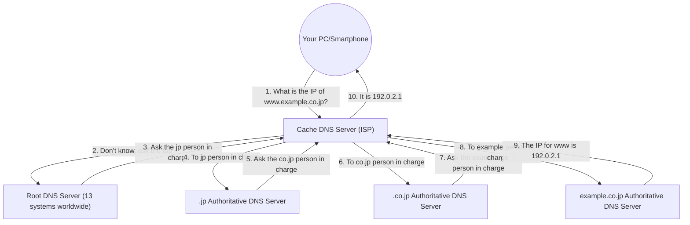

## 1. The "Language Barrier" Between Humans and Computers

In the world of the Internet, all computers and servers are located using a sequence of numbers called an "**IP address**" (e.g., 142.250.196.110).
However, it is impossible to memorize all the IP addresses of the websites humans access every day. For humans, "**domain names**" (meaningful strings) like "google.com" and "apple.com" are overwhelmingly easier to remember.

The massive system that automatically translates and connects this "human-used domain name" with the "computer-used IP address" is the "**DNS (Domain Name System)**".
DNS is often compared to the "Internet's phone book". Just as you would look up "Yamada" in a phone book if you wanted to know Mr. Yamada's phone number, a browser queries a DNS server behind the scenes to find out the IP address of "google.com".

## 2. The Need for a Massive Distributed Database

What would happen if we tried to manage the correspondence table of all domain names and IP addresses in the world on a "single massive server"?
Hundreds of millions of queries per second from all over the world would flood the server, causing it to go down immediately, and if that server were to break, no one in the world would be able to use the Internet.

Therefore, DNS was designed as a "**hierarchical distributed database**" where hundreds of thousands of servers around the world cooperate to manage data in a distributed manner. This is said to be the most successful and largest-scale distributed system operating in the history of computer science.

## 3. Hierarchical Structure of Domain Names (Tree Structure)

To understand how DNS works, you need to know the "structure" of domain names.
Actually, domain names have a hierarchical (tree) structure from right to left.

For example, breaking down a domain like `www.example.co.jp.` from the right looks like this:

1. **`.` (Root)**: The apex of all domains. Actually, there is an invisible "." hidden at the very end of all domains.
2. **`jp` (Top-Level Domain / TLD)**: The tier representing the country of Japan. There are others like `.com` and `.net`.
3. **`co` (Second-Level Domain)**: The tier representing a company.
4. **`example` (Third-Level Domain)**: The company name or organization name.
5. **`www` (Hostname)**: The name of a specific server (like a Web server) within that organization.

In the DNS world, "responsible DNS servers (authoritative DNS servers)" are placed for each hierarchy, and they only know the contact information (IP address) of the person in charge of the hierarchy immediately below them.

## 4. The Name Resolution Process: A Journey of Passing the Baton

When you enter `https://www.example.co.jp` into your browser, an epic "name resolution" (looking up an IP address from a name) process like the following occurs behind the scenes in an instant (tens of milliseconds).

1. **Requesting the Cache DNS Server**: Your PC first asks the "cache DNS server" of the provider you contract with (like NTT or KDDI) to look it up on your behalf.
2. **Querying the Root Server**: If the provider's server does not know the answer, it asks the "root DNS servers" (only 13 systems worldwide) that reign at the top of the world. The root server replies, "I don't know, but I'll give you the IP address of the `.jp` person in charge, so ask them."
3. **The Relay of Passing Around**: The provider's server asks the taught `.jp` authoritative server, then asks the `.co.jp` authoritative server... and so on, being passed around (delegation) one after another while going down the hierarchy.
4. **Final Answer**: Finally, it reaches the DNS server of the company managing `example.co.jp` and gets the ultimate answer, "This is the IP address of `www`".

This complex relay is performed all over the world every time we click a link.

## 5. Acceleration by the Power of Cache

If this relay were to happen every time, the entire Internet would slow down, and the root DNS servers at the top would be overwhelmed.

What prevents this is the "**cache (temporary storage)**" mechanism.
The provider's cache DNS server memorizes the "IP address of google.com" that it once looked up in memory for a certain period of time (TTL: Time To Live).
The next time you or someone in your neighborhood asks, "What's the IP address of google.com?", it doesn't bother asking around the world, but can instantly (in a few milliseconds) answer, "I just checked, so here it is."

Over 99% of DNS queries worldwide are processed instantly by this cache, and this supports the comfortable speed of the Internet.

## 6. Conclusion

DNS is an "unsung hero" that we usually don't notice at all.
However, without this hierarchical distributed system designed by Paul Mockapetris and others in the 1980s, the massive Internet of today could absolutely not exist.

Hundreds of thousands of DNS servers scattered around the world take responsibility for their own assigned areas and cooperate in a relay. DNS is an infrastructure that most beautifully embodies the philosophy of "autonomous decentralization" of the Internet.
