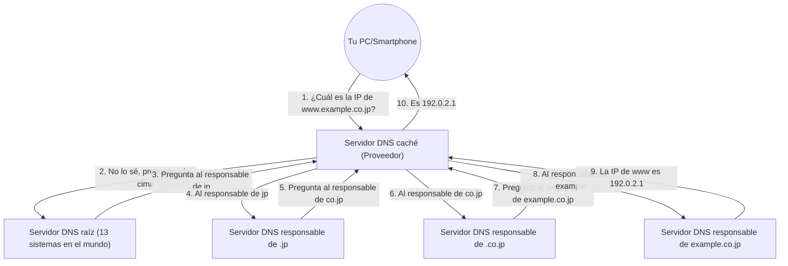

## 1. La "barrera del idioma" entre humanos y computadoras

En el mundo de Internet, todas las computadoras y servidores identifican su ubicación mediante una serie de números llamada "**dirección IP** (ej: 142.250.196.110)".
Sin embargo, para los humanos, memorizar todas las direcciones IP de los sitios web a los que acceden diariamente es imposible. Para las personas, es abrumadoramente más fácil recordar un "**nombre de dominio** (una cadena con significado)" como "google.com" o "apple.com".

El gigantesco sistema que traduce y vincula automáticamente este "nombre de dominio usado por humanos" y la "dirección IP usada por computadoras" es el "**DNS (Domain Name System)**".
A menudo, el DNS se compara con "la guía telefónica de Internet". Si quieres saber el número de teléfono del Sr. Yamada, lo buscas en la guía telefónica; de la misma manera, para conocer la dirección IP de "google.com", el navegador realiza una consulta a un servidor DNS en segundo plano.

## 2. La necesidad de una gigantesca base de datos distribuida

¿Qué pasaría si intentáramos gestionar la tabla de correspondencia de todos los nombres de dominio y direcciones IP del mundo en "un solo servidor gigantesco"?
Recibiría cientos de millones de consultas por segundo de todo el mundo y el servidor colapsaría inmediatamente. Si ese servidor se averiara, nadie en el mundo podría usar Internet.

Por lo tanto, el DNS fue diseñado como una "**base de datos distribuida jerárquica**" donde cientos de miles de servidores alrededor del mundo colaboran para gestionar los datos de manera distribuida. Se dice que este es el sistema distribuido más exitoso y que opera a mayor escala en la historia de la informática.

## 3. Estructura jerárquica (estructura de árbol) de los nombres de dominio

Para entender cómo funciona el DNS, es necesario conocer la "estructura" de los nombres de dominio.
En realidad, los nombres de dominio tienen una jerarquía (estructura de árbol) de derecha a izquierda.

Por ejemplo, si desglosamos el dominio `www.example.co.jp.` de derecha a izquierda, se ve así:

1. **`.` (Raíz)**: El vértice de todos los dominios. En realidad, hay un "." invisible oculto al final de todos los dominios.
2. **`jp` (Dominio de nivel superior / TLD)**: La jerarquía que representa el país, en este caso, Japón. También existen otros como `.com` y `.net`.
3. **`co` (Dominio de segundo nivel)**: La jerarquía que representa una empresa (company).
4. **`example` (Dominio de tercer nivel)**: El nombre de la empresa u organización.
5. **`www` (Nombre de host)**: El nombre de un servidor específico (como un servidor web) dentro de esa organización.

En el mundo del DNS, se coloca un "servidor DNS encargado (servidor DNS autoritativo)" en cada nivel jerárquico, y solo conoce la información de contacto (dirección IP) del encargado del nivel inmediatamente inferior.

## 4. El proceso de resolución de nombres: Un viaje de relevos

Cuando escribes `https://www.example.co.jp` en tu navegador, en segundo plano ocurre un proceso épico de "resolución de nombres (averiguar la dirección IP a partir del nombre)" en un instante (decenas de milisegundos), como se muestra a continuación:

1. **Solicitud al servidor DNS caché**: Tu PC primero solicita al "servidor DNS caché" de tu proveedor contratado (como NTT o KDDI) que lo busque en tu lugar.
2. **Consulta al servidor raíz**: Si el servidor del proveedor no conoce la respuesta, pregunta al "servidor DNS raíz (solo existen 13 sistemas en el mundo)" que domina en la cima del mundo. El servidor raíz responde: "No lo sé, pero te daré la dirección IP del responsable de `.jp`, así que pregúntale a él".
3. **Relevo en cadena**: El servidor del proveedor pregunta al servidor responsable de `.jp` que le fue indicado, luego al servidor responsable de `.co.jp`... y así es transferido (delegado) sucesivamente mientras desciende por la jerarquía.
4. **Respuesta final**: Finalmente, llega al servidor DNS de la empresa que administra `example.co.jp` y recibe la respuesta final: "Esta es la dirección IP de `www`".

Este complejo sistema de relevos ocurre en todo el mundo cada vez que hacemos clic en un enlace.

## 5. Aceleración mediante el poder del caché

Si hiciéramos este relevo cada vez, todo Internet se volvería lento y los servidores DNS raíz en la cima se sobrecargarían.

Para evitar esto, existe el mecanismo de "**caché (almacenamiento temporal)**".
El servidor DNS caché del proveedor almacena en memoria la "dirección IP de google.com" que ha buscado una vez durante un cierto período de tiempo (TTL: Time To Live).
La próxima vez que tú o alguien en el vecindario pregunte "¿Cuál es la dirección IP de google.com?", en lugar de ir a preguntar por todo el mundo, puede responder instantáneamente (en unos pocos milisegundos): "Lo busqué hace un momento, así que es esta".

Más del 99% de las consultas de DNS en el mundo se procesan instantáneamente gracias a este caché, lo que respalda la velocidad cómoda de Internet.

## 6. Resumen

El DNS es el "héroe anónimo" del que normalmente no somos conscientes en absoluto.
Sin embargo, sin este sistema distribuido jerárquico diseñado por Paul Mockapetris y otros en la década de 1980, el gigantesco Internet actual nunca habría sido posible.

Cientos de miles de servidores DNS dispersos por todo el mundo se responsabilizan de sus respectivas áreas y colaboran en un relevo. El DNS es la infraestructura que encarna de manera más hermosa la filosofía de "descentralización autónoma" de Internet.
