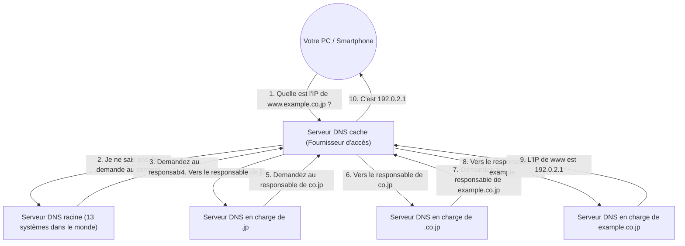

## 1. La « barrière de la langue » entre les humains et les ordinateurs

Dans le monde d'Internet, tous les ordinateurs et serveurs sont identifiés par une suite de chiffres appelée « **adresse IP** (ex. : 142.250.196.110) ».
Cependant, il est impossible pour un humain de mémoriser toutes les adresses IP des sites Web qu'il visite quotidiennement. Pour les humains, un « **nom de domaine** (une chaîne de caractères qui a du sens) » comme « google.com » ou « apple.com » est infiniment plus facile à retenir.

Le système géant qui traduit et relie automatiquement ce « nom de domaine utilisé par les humains » à l'« adresse IP utilisée par les ordinateurs » est le « **DNS (Domain Name System)** ».
Le DNS est souvent comparé à l'« annuaire d'Internet ». Tout comme vous cherchez « Yamada » dans l'annuaire si vous voulez connaître le numéro de téléphone de M. Yamada, le navigateur interroge le serveur DNS en coulisses pour connaître l'adresse IP de « google.com ».

## 2. La nécessité d'une gigantesque base de données distribuée

Que se passerait-il si l'on essayait de gérer la table de correspondance de tous les noms de domaine et adresses IP du monde sur « un seul serveur géant » ?
Des centaines de millions de requêtes par seconde afflueraient du monde entier et le serveur tomberait immédiatement en panne. Et si ce serveur tombait en panne, plus personne au monde ne pourrait utiliser Internet.

C'est pourquoi le DNS a été conçu comme une « **base de données distribuée hiérarchique** » où des centaines de milliers de serveurs dans le monde coopèrent pour gérer les données de manière distribuée. Il est considéré comme le système distribué le plus réussi et fonctionnant à la plus grande échelle de l'histoire de l'informatique.

## 3. Structure hiérarchique (arborescente) des noms de domaine

Pour comprendre le fonctionnement du DNS, il faut connaître la « structure » des noms de domaine.
En réalité, les noms de domaine ont une structure hiérarchique (structure arborescente) de droite à gauche.

Par exemple, si l'on décompose le domaine `www.example.co.jp.` en partant de la droite, on obtient ce qui suit :

1. **`.` (Racine)** : Le sommet de tous les domaines. En fait, un « . » invisible est caché à la fin de chaque domaine.
2. **`jp` (Domaine de premier niveau / TLD)** : Le niveau qui représente un pays, ici le Japon. Il en existe d'autres comme `.com` ou `.net`.
3. **`co` (Domaine de deuxième niveau)** : Le niveau qui représente les entreprises (company).
4. **`example` (Domaine de troisième niveau)** : Le nom de l'entreprise ou de l'organisation.
5. **`www` (Nom d'hôte)** : Le nom d'un serveur spécifique (comme un serveur Web) au sein de cette organisation.

Dans le monde du DNS, un « serveur DNS en charge (serveur DNS faisant autorité) » est placé pour chaque niveau, et il ne connaît que les coordonnées (adresse IP) du responsable du niveau juste en dessous de lui.

## 4. Le processus de résolution de noms : Le voyage en relais

Lorsque vous tapez `https://www.example.co.jp` dans votre navigateur, un processus épique de « résolution de noms (trouver l'adresse IP à partir du nom) » se déroule en coulisses en un instant (quelques dizaines de millisecondes) comme suit :

1. **Demande au serveur DNS cache** : Votre PC demande d'abord au « serveur DNS cache » de votre fournisseur d'accès (Orange, Free, etc.) de chercher à sa place.
2. **Requête au serveur racine** : Si le serveur du fournisseur d'accès ne connaît pas la réponse, il interroge le « serveur DNS racine (il n'y en a que 13 systèmes dans le monde) » qui règne au sommet mondial. Le serveur racine répond : « Je ne sais pas, mais je vous donne l'adresse IP du responsable de `.jp`, demandez-lui. »
3. **Le relais continu** : Le serveur du fournisseur d'accès interroge le serveur responsable de `.jp` indiqué, puis le serveur responsable de `.co.jp`... et est ainsi renvoyé de l'un à l'autre (délégation) en descendant dans la hiérarchie.
4. **Réponse finale** : Enfin, il atteint le serveur DNS de l'entreprise gérant `example.co.jp` et obtient la réponse finale : « L'adresse IP de `www` est celle-ci. »

Ce relais complexe s'effectue dans le monde entier à chaque fois que nous cliquons sur un lien.

## 5. Accélération grâce à la puissance du cache

Si ce relais devait être effectué à chaque fois, l'ensemble d'Internet serait ralenti et les serveurs DNS racines au sommet seraient saturés.

Ce qui empêche cela, c'est le mécanisme de « **cache (stockage temporaire)** ».
Le serveur DNS cache du fournisseur d'accès conserve l'« adresse IP de google.com » qu'il a cherchée une fois dans sa mémoire pendant un certain temps (TTL : Time To Live).
La prochaine fois que vous ou un voisin demanderez « Quelle est l'adresse IP de google.com ? », il n'ira pas interroger le monde entier, mais pourra répondre instantanément (en quelques millisecondes) : « Je viens de la chercher, la voici. »

Plus de 99 % des requêtes DNS dans le monde sont traitées instantanément grâce à ce cache, ce qui soutient la vitesse confortable d'Internet.

## 6. Résumé

Le DNS est un « héros de l'ombre » dont nous n'avons généralement pas conscience.
Cependant, sans ce système distribué hiérarchique conçu par Paul Mockapetris et d'autres dans les années 1980, le gigantesque Internet d'aujourd'hui n'aurait absolument pas pu exister.

Des centaines de milliers de serveurs DNS dispersés dans le monde assument chacun la responsabilité de leur domaine et coopèrent en se passant le relais. Le DNS est l'infrastructure qui incarne le plus magnifiquement la philosophie de « décentralisation autonome » d'Internet.
