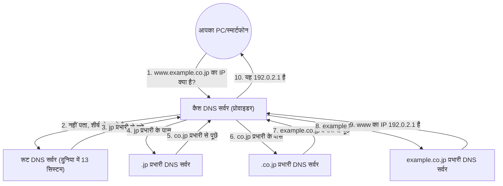

## 1. इंसान और कंप्यूटर के बीच "भाषा की दीवार"

इंटरनेट की दुनिया में, सभी कंप्यूटर और सर्वर का स्थान "**IP एड्रेस** (उदाहरण: 142.250.196.110)" नामक संख्याओं की एक श्रृंखला द्वारा पहचाना जाता है।
हालाँकि, इंसानों के लिए हर रोज़ एक्सेस की जाने वाली सभी वेबसाइटों के IP एड्रेस याद रखना असंभव है। ऐसा इसलिए है क्योंकि इंसानों के लिए "google.com" या "apple.com" जैसे "**डोमेन नाम** (अर्थपूर्ण स्ट्रिंग्स)" को याद रखना कहीं ज्यादा आसान होता है।

यह विशाल सिस्टम जो "इंसानों द्वारा उपयोग किए जाने वाले डोमेन नाम" और "कंप्यूटर द्वारा उपयोग किए जाने वाले IP एड्रेस" का स्वचालित रूप से अनुवाद करता है और उन्हें जोड़ता है, "**DNS (Domain Name System)**" कहलाता है।
DNS की तुलना अक्सर "इंटरनेट की फोनबुक" से की जाती है। जिस तरह से आप श्रीमान यामादा का फोन नंबर जानने के लिए फोनबुक में "यामादा" खोजते हैं, उसी तरह से ब्राउज़र "google.com" का IP एड्रेस जानने के लिए बैकग्राउंड में DNS सर्वर से पूछताछ करता है।

## 2. एक विशाल वितरित डेटाबेस की आवश्यकता

अगर दुनिया के सभी डोमेन नामों और IP एड्रेस की मैपिंग टेबल को "एकल विशाल सर्वर" द्वारा प्रबंधित करने का प्रयास किया जाए तो क्या होगा?
दुनिया भर से प्रति सेकंड करोड़ों पूछताछ आने से सर्वर तुरंत डाउन हो जाएगा, और अगर वह सर्वर क्रैश हो गया, तो दुनिया में कोई भी इंटरनेट का उपयोग नहीं कर पाएगा।

इसलिए, DNS को एक "**पदानुक्रमित वितरित डेटाबेस**" के रूप में डिज़ाइन किया गया था, जहाँ दुनिया भर के लाखों सर्वर डेटा को वितरित और प्रबंधित करने के लिए एक साथ काम करते हैं। इसे कंप्यूटर विज्ञान के इतिहास में सबसे सफल और बड़े पैमाने पर काम करने वाला वितरित सिस्टम कहा जाता है।

## 3. डोमेन नाम की पदानुक्रमित संरचना (ट्री संरचना)

DNS के काम करने के तरीके को समझने के लिए, आपको डोमेन नाम की "संरचना" जाननी चाहिए।
वास्तव में, डोमेन नाम दाएँ से बाएँ एक पदानुक्रम (ट्री संरचना) में होते हैं।

उदाहरण के लिए, यदि हम `www.example.co.jp.` डोमेन को दाईं ओर से तोड़ते हैं, तो यह इस प्रकार दिखेगा:

1. **`.` (रूट)**: सभी डोमेन का शीर्ष। वास्तव में, सभी डोमेन के अंत में एक अदृश्य "." छिपा होता है।
2. **`jp` (टॉप-लेवल डोमेन / TLD)**: जापान देश को दर्शाने वाला स्तर। `.com` और `.net` जैसे अन्य भी हैं।
3. **`co` (सेकेंड-लेवल डोमेन)**: कंपनियों (company) को दर्शाने वाला स्तर।
4. **`example` (थर्ड-लेवल डोमेन)**: कंपनी या संगठन का नाम।
5. **`www` (होस्टनेम)**: उस संगठन के भीतर एक विशिष्ट सर्वर (जैसे वेब सर्वर) का नाम।

DNS की दुनिया में, प्रत्येक स्तर पर एक "प्रभारी DNS सर्वर (अधिकृत DNS सर्वर)" होता है, जो केवल अपने ठीक नीचे वाले स्तर के प्रभारी का संपर्क विवरण (IP एड्रेस) जानता है।

## 4. नाम रिज़ॉल्यूशन प्रक्रिया: एक बाल्टी रिले यात्रा

जब आप अपने ब्राउज़र में `https://www.example.co.jp` टाइप करते हैं, तो बैकग्राउंड में "नाम रिज़ॉल्यूशन (नाम से IP एड्रेस खोजना)" की एक शानदार प्रक्रिया पलक झपकते (कुछ दसियों मिलीसेकंड में) ही हो जाती है।

1. **कैश DNS सर्वर से अनुरोध**: आपका PC सबसे पहले आपके अनुबंधित प्रोवाइडर (जैसे NTT या KDDI) के "कैश DNS सर्वर" से इसे आपके लिए खोजने का अनुरोध करता है।
2. **रूट सर्वर से पूछताछ**: यदि प्रोवाइडर का सर्वर उत्तर नहीं जानता है, तो वह दुनिया के शीर्ष पर बैठे "रूट DNS सर्वर (दुनिया में केवल 13 सिस्टम हैं)" से पूछता है। रूट सर्वर जवाब देता है, "मुझे नहीं पता, लेकिन मैं आपको `.jp` प्रभारी का IP एड्रेस दूँगा, इसलिए उनसे पूछें।"
3. **रिले पासिंग (Delegation)**: प्रोवाइडर का सर्वर बताए गए `.jp` प्रभारी सर्वर से पूछता है, फिर `.co.jp` प्रभारी सर्वर से पूछता है... इस प्रकार पदानुक्रम में नीचे जाते हुए बार-बार दूसरों के पास भेजा जाता है (प्रतिनिधित्व)।
4. **अंतिम उत्तर**: अंत में, यह `example.co.jp` को प्रबंधित करने वाली कंपनी के DNS सर्वर पर पहुँचता है और अंतिम उत्तर प्राप्त करता है: "`www` का IP एड्रेस यह है।"

यह जटिल बाल्टी रिले (bucket relay) दुनिया भर में हर बार तब होता है जब हम किसी लिंक पर क्लिक करते हैं।

## 5. कैश की शक्ति के माध्यम से गति बढ़ाना

यदि हर बार इस प्रकार का बाल्टी रिले किया जाता है, तो संपूर्ण इंटरनेट धीमा हो जाएगा, और शीर्ष पर मौजूद रूट DNS सर्वर ओवरलोड हो जाएगा।

इसे रोकने के लिए "**कैश (अस्थायी संग्रहण)**" का तंत्र काम आता है।
प्रोवाइडर का कैश DNS सर्वर एक बार खोजे गए "google.com के IP एड्रेस" को कुछ समय (TTL: Time To Live) के लिए अपनी मेमोरी में याद रखता है।
अगली बार जब आप या आपके आस-पड़ोस का कोई व्यक्ति "google.com का IP एड्रेस क्या है?" पूछता है, तो वह इसे दुनिया भर में खोजने के बजाय तुरंत (कुछ मिलीसेकंड में) जवाब दे सकता है, "मैंने अभी इसे देखा था, यह रहा।"

दुनिया भर में 99% से अधिक DNS पूछताछ इस कैश द्वारा तुरंत संसाधित की जाती हैं, जो इंटरनेट की आरामदायक गति का समर्थन करती है।

## 6. निष्कर्ष

DNS एक "पर्दे के पीछे का हीरो" है, जिसके बारे में हम शायद ही कभी सचेत होते हैं।
हालाँकि, 1980 के दशक में पॉल मोकापेट्रिस और अन्य लोगों द्वारा डिज़ाइन किए गए इस पदानुक्रमित वितरित सिस्टम के बिना, आज का विशाल इंटरनेट कभी मौजूद नहीं होता।

दुनिया भर में फैले लाखों DNS सर्वर अपने-अपने क्षेत्रों की जिम्मेदारी लेते हैं और बाल्टी रिले में एक साथ काम करते हैं। DNS वह बुनियादी ढाँचा है जो इंटरनेट के "स्वायत्त विकेंद्रीकरण" के दर्शन को सबसे खूबसूरती से दर्शाता है।
