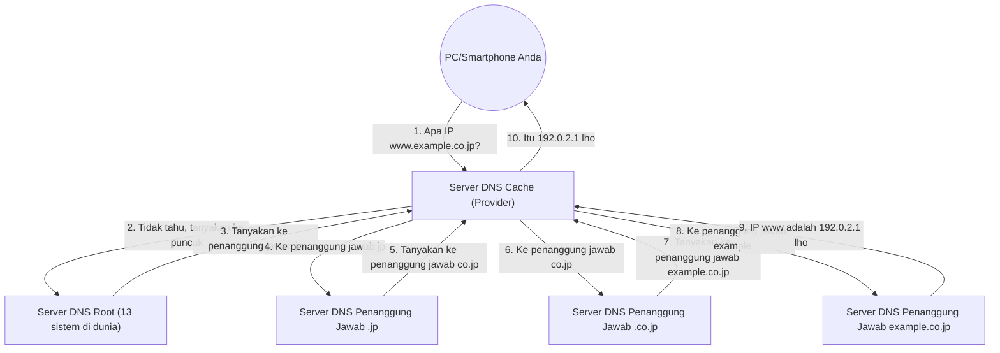

## 1. "Kendala Bahasa" antara Manusia dan Komputer

Di dunia internet, lokasi semua komputer dan server diidentifikasi oleh serangkaian angka yang disebut "**Alamat IP** (contoh: 142.250.196.110)".
Namun, tidak mungkin bagi manusia untuk menghafal semua alamat IP situs web yang diakses setiap hari. Bagi manusia, "**Nama Domain** (kumpulan karakter bermakna)" seperti "google.com" atau "apple.com" jauh lebih mudah diingat.

Sistem raksasa yang secara otomatis menerjemahkan dan menghubungkan "nama domain yang digunakan manusia" dan "alamat IP yang digunakan komputer" ini adalah "**DNS (Domain Name System)**".
DNS sering diibaratkan sebagai "buku telepon internet". Sama seperti Anda mencari "Yamada" di buku telepon untuk mengetahui nomor telepon Bapak Yamada, browser Anda melakukan kueri ke server DNS di balik layar untuk mengetahui alamat IP "google.com".

## 2. Kebutuhan akan Basis Data Terdistribusi yang Raksasa

Apa yang akan terjadi jika kita mencoba mengelola tabel korespondensi semua nama domain dan alamat IP di seluruh dunia dalam "satu server raksasa"?
Ratusan juta permintaan dari seluruh dunia akan membanjiri setiap detik dan server akan segera *down*, dan jika server itu rusak, tidak ada seorang pun di dunia yang dapat menggunakan internet.

Oleh karena itu, DNS dirancang sebagai "**basis data terdistribusi hierarkis**" di mana ratusan ribu server di seluruh dunia bekerja sama untuk mengelola data secara terdistribusi. Ini dikatakan sebagai sistem terdistribusi paling sukses dan beroperasi dalam skala terbesar dalam sejarah ilmu komputer.

## 3. Struktur Hierarki Nama Domain (Struktur Pohon)

Untuk memahami mekanisme DNS, Anda perlu mengetahui "struktur" dari nama domain.
Sebenarnya, nama domain memiliki struktur hierarki (struktur pohon) dari kanan ke kiri.

Misalnya, jika kita mengurai domain `www.example.co.jp.` dari kanan, akan menjadi seperti berikut:

1. **`.` (Root)**: Puncak dari semua domain. Sebenarnya, ada "." tak terlihat yang tersembunyi di akhir semua domain.
2. **`jp` (Top-Level Domain / TLD)**: Hierarki yang mewakili negara Jepang. Selain itu, ada juga `.com` atau `.net` dan lain-lain.
3. **`co` (Second-Level Domain)**: Hierarki yang mewakili perusahaan (company).
4. **`example` (Third-Level Domain)**: Nama perusahaan atau nama organisasi.
5. **`www` (Hostname)**: Nama server tertentu (seperti server Web) di dalam organisasi tersebut.

Di dunia DNS, terdapat "server DNS yang bertanggung jawab (Server DNS Otoritatif)" yang ditempatkan di setiap hierarki, dan ia hanya mengetahui informasi kontak (alamat IP) dari penanggung jawab pada hierarki tepat di bawahnya.

## 4. Proses Resolusi Nama: Perjalanan Estafet Ember

Saat Anda mengetikkan `https://www.example.co.jp` di browser, proses "resolusi nama (mencari alamat IP dari nama)" yang epik berikut terjadi dalam sekejap (puluhan milidetik) di balik layar.

1. **Permintaan ke Server DNS Cache**: PC Anda pertama-tama meminta "Server DNS Cache" dari provider yang Anda kontrak (seperti NTT atau KDDI) untuk mencarinya sebagai gantinya.
2. **Kueri ke Server Root**: Jika server provider tidak mengetahui jawabannya, ia akan bertanya kepada "Server DNS Root (hanya ada 13 sistem di dunia)" yang menguasai puncak di seluruh dunia. Server root menjawab, "Saya tidak tahu, tapi saya akan memberitahu alamat IP penanggung jawab `.jp`, jadi tanyakan ke sana."
3. **Estafet yang Berkeliling**: Server provider bertanya ke server penanggung jawab `.jp` yang diberitahukan, lalu bertanya ke server penanggung jawab `.co.jp`... dan terus dialihkan (didelegasikan) satu demi satu sambil menuruni hierarki.
4. **Jawaban Akhir**: Terakhir, ia mencapai server DNS perusahaan yang mengelola `example.co.jp` dan mendapatkan jawaban akhir, "Alamat IP `www` adalah ini."

Estafet ember yang rumit ini terjadi di seluruh dunia setiap kali kita mengklik sebuah tautan.

## 5. Percepatan dengan Kekuatan Cache

Jika kita melakukan estafet ember seperti ini setiap saat, seluruh internet akan melambat, dan Server DNS Root di puncak akan kelebihan beban.

Hal yang mencegah ini adalah mekanisme "**Cache (Penyimpanan Sementara)**".
Server DNS Cache dari provider menyimpan "alamat IP google.com" yang telah dicari sebelumnya ke dalam memori untuk jangka waktu tertentu (TTL: Time To Live).
Lain kali ketika Anda atau orang di sekitar Anda bertanya, "Apa alamat IP google.com?", ia tidak perlu repot-repot bertanya ke seluruh dunia, dan dapat langsung menjawab (dalam beberapa milidetik), "Ini dia, saya baru saja mencarinya."

Lebih dari 99% kueri DNS di seluruh dunia diproses secara instan oleh cache ini, dan inilah yang mendukung kecepatan internet yang nyaman.

## 6. Kesimpulan

DNS adalah "pahlawan tanpa tanda jasa" yang sama sekali tidak kita sadari dalam keseharian kita.
Namun, tanpa sistem terdistribusi hierarkis yang dirancang oleh Paul Mockapetris dan rekan-rekannya pada tahun 1980-an ini, internet raksasa saat ini tidak akan pernah ada.

Ratusan ribu server DNS yang tersebar di seluruh dunia masing-masing bertanggung jawab atas area tugasnya sendiri, bekerja sama dalam estafet ember. DNS adalah infrastruktur yang paling indah mewujudkan filosofi "otonomi terdistribusi" dari internet.
