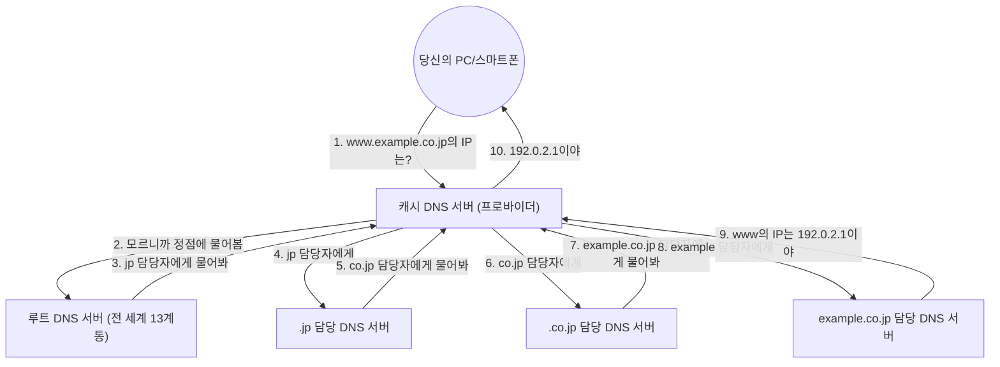

## 1. 인간과 컴퓨터의 '언어 장벽'

인터넷의 세계에서는 모든 컴퓨터나 서버는 '**IP 주소** (예: 142.250.196.110)'라는 숫자의 나열로 위치를 특정하고 있습니다.
그러나 인간이 매일 접속하는 웹 사이트의 IP 주소를 모두 암기하는 것은 불가능합니다. 인간에게는 'google.com'이나 'apple.com'과 같은 '**도메인 이름** (의미 있는 문자열)'이 압도적으로 외우기 쉽기 때문입니다.

이 '인간이 사용하는 도메인 이름'과 '컴퓨터가 사용하는 IP 주소'를 자동으로 번역하고 연결해 주는 거대한 시스템이 '**DNS (Domain Name System)**'입니다.
DNS는 종종 '인터넷의 전화번호부'에 비유됩니다. 야마다 씨의 전화번호를 알고 싶으면 전화번호부에서 '야마다'를 찾듯이, 브라우저는 'google.com'의 IP 주소를 알기 위해 이면에서 DNS 서버에 질의를 하고 있는 것입니다.

## 2. 거대한 분산형 데이터베이스의 필요성

만약 전 세계의 모든 도메인 이름과 IP 주소의 대응표를 '1대의 거대한 서버'에서 관리하려고 한다면 어떻게 될까요?
전 세계에서 초당 수억 번의 질의가 쇄도하여 서버는 금방 다운될 것이고, 만약 그 서버가 고장 난다면 전 세계의 누구도 인터넷을 사용할 수 없게 되어버립니다.

그래서 DNS는 전 세계에 있는 수십만 대의 서버가 협력하여 데이터를 분산 관리하는 '**계층형 분산 데이터베이스**'로 설계되었습니다. 이것은 컴퓨터 과학 역사상 가장 성공적이고 가장 대규모로 가동되고 있는 [분산 시스템](/ko/p/cap-theorem-distributed-systems-tradeoff/)이라고 불립니다.

## 3. 도메인 이름의 계층 구조 (트리 구조)

DNS의 작동 원리를 이해하기 위해서는 도메인 이름의 '구조'를 알 필요가 있습니다.
사실 도메인 이름은 오른쪽에서 왼쪽을 향해 계층([트리 구조](/ko/p/tree-graph-data-structures-search-dfs-bfs-dijkstra/))으로 되어 있습니다.

예를 들어 `www.example.co.jp.` 라는 도메인을 오른쪽부터 분해하면 다음과 같습니다.

1. **`.` (루트)**: 모든 도메인의 정점. 사실 모든 도메인의 마지막에는 보이지 않는 '.'이 숨겨져 있습니다.
2. **`jp` (최상위 도메인 / TLD)**: 일본이라는 국가를 나타내는 계층. 이 외에도 `.com` 이나 `.net` 등이 있습니다.
3. **`co` (2단계 도메인)**: 기업(company)을 나타내는 계층.
4. **`example` (3단계 도메인)**: 기업명이나 조직명.
5. **`www` (호스트 이름)**: 그 조직 내에 있는 특정 서버(웹 서버 등)의 이름.

DNS의 세계에서는 각 계층마다 '담당 DNS 서버(권한 있는 DNS 서버)'가 배치되어 있으며, 자신의 바로 아래 계층 담당자의 연락처(IP 주소)만을 알고 있습니다.

## 4. 이름 해석의 프로세스: 양동이 릴레이의 여정

당신이 브라우저에 `https://www.example.co.jp` 를 입력했을 때, 이면에서는 다음과 같은 장대한 '이름 해석(이름으로부터 IP 주소를 알아보는 것)'의 프로세스가 순식간(수십 밀리초)에 이루어지고 있습니다.

1. **캐시 DNS 서버로의 의뢰**: 당신의 PC는 우선 계약 중인 프로바이더(NTT나 KDDI 등)의 '캐시 DNS 서버'에 대신 알아봐 달라고 의뢰합니다.
2. **루트 서버로의 질의**: 프로바이더의 서버가 답을 모를 경우, 전 세계의 정점에 군림하는 '루트 DNS 서버(전 세계에 13계통밖에 없음)'에 묻습니다. 루트 서버는 '나는 모르지만 `.jp` 담당자의 IP 주소를 알려줄 테니 그쪽에 물어봐'라고 반환합니다.
3. **떠넘기기 릴레이**: 프로바이더의 서버는, 안내받은 `.jp` 담당 서버에 묻고, 나아가 `.co.jp` 담당 서버에 묻고……하며, 계층을 내려가면서 차례로 떠넘기기(위임)를 당합니다.
4. **최종 답변**: 마지막으로 `example.co.jp` 를 관리하고 있는 기업의 DNS 서버에 도착하여, '`www` 의 IP 주소는 이것입니다'라는 최종적인 답을 받습니다.

이 복잡한 양동이 릴레이가, 우리가 링크를 클릭할 때마다 전 세계에서 이루어지고 있는 것입니다.

## 5. 캐시의 힘에 의한 고속화

매번 이런 양동이 릴레이를 하고 있으면, 인터넷 전체가 느려지게 되고, 정점의 루트 DNS 서버가 펑크 나버릴 것입니다.

이것을 막는 것이 '**캐시 (임시 저장)**'의 메커니즘입니다.
프로바이더의 캐시 DNS 서버는 한 번 조사한 'google.com의 IP 주소'를 일정 시간(TTL: Time To Live) 메모리에 기억해 둡니다.
다음에 당신이나 이웃 사람이 'google.com의 IP 주소는?'이라고 물어왔을 때는, 일일이 전 세계에 물으러 가지 않고 '아까 조사했으니까 이거야'라고 즉각적으로(수 밀리초 만에) 대답할 수 있습니다.

전 세계 DNS 질의의 99% 이상은 이 캐시에 의해 순식간에 처리되고 있으며, 이것이 인터넷의 쾌적한 속도를 지탱하고 있습니다.

## 6. 요약

DNS는 우리가 평소 전혀 의식하지 않는 '보이지 않는 영웅(숨은 공로자)'입니다.
그러나 1980년대에 폴 모카페트리스(Paul Mockapetris) 등에 의해 설계된 이 계층형 [분산 시스템](/ko/p/cap-theorem-distributed-systems-tradeoff/)이 없었다면, 현재의 거대한 인터넷은 절대 성립될 수 없었을 것입니다.

전 세계에 흩어진 수십만 대의 DNS 서버가 서로 자신의 담당 영역에 대한 책임을 지고, 양동이 릴레이로 협력합니다. DNS는 인터넷의 '자율 분산'이라는 철학을 가장 아름답게 구현하고 있는 인프라인 것입니다.
