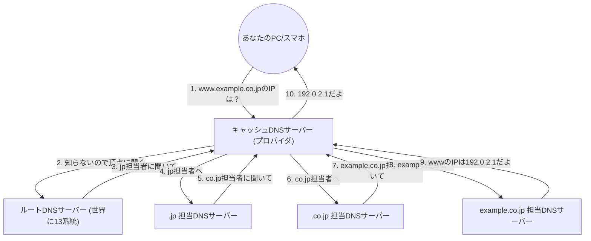

## 1. 人間とコンピュータの「言葉の壁」

インターネットの世界では、すべてのコンピュータやサーバーは「**IPアドレス**（例: 142.250.196.110）」という数字の羅列で場所を特定しています。
しかし、人間が毎日アクセスするWebサイトのIPアドレスをすべて暗記することは不可能です。人間にとっては「google.com」や「apple.com」のような「**ドメイン名**（意味のある文字列）」のほうが圧倒的に覚えやすいからです。

この「人間が使うドメイン名」と「コンピュータが使うIPアドレス」を自動的に翻訳し、結びつけてくれる巨大なシステムが「**DNS（Domain Name System）**」です。
DNSはよく「インターネットの電話帳」に例えられます。山田さんの電話番号を知りたければ、電話帳で「山田」を引くように、ブラウザは「google.com」のIPアドレスを知るために、裏側でDNSサーバーに問い合わせを行っているのです。

## 2. 巨大な分散型データベースの必要性

もし、世界中のすべてのドメイン名とIPアドレスの対応表を「1台の巨大なサーバー」で管理しようとしたらどうなるでしょうか。
世界中から毎秒何億回も問い合わせが殺到してサーバーはすぐにダウンし、もしそのサーバーが壊れたら、世界中の誰もインターネットを使えなくなってしまいます。

そこでDNSは、世界中にある何十万台ものサーバーが協力してデータを分散管理する「**階層型の分散データベース**」として設計されました。これは、コンピュータサイエンス史上、最も成功し、最も大規模に稼働している[分散システム](/p/cap-theorem-distributed-systems-tradeoff/)と言われています。

## 3. ドメイン名の階層構造（木構造）

DNSの仕組みを理解するためには、ドメイン名の「構造」を知る必要があります。
実はドメイン名は、右から左に向かって階層（ツリー構造）になっています。

例えば `www.example.co.jp.` というドメインを右から分解すると以下のようになります。

1. **`.`（ルート）**: すべてのドメインの頂点。実はすべてのドメインの最後には見えない「.」が隠れています。
2. **`jp`（トップレベルドメイン / TLD）**: 日本という国を表す階層。他にも `.com` や `.net` などがあります。
3. **`co`（第2レベルドメイン）**: 企業（company）を表す階層。
4. **`example`（第3レベルドメイン）**: 企業名や組織名。
5. **`www`（ホスト名）**: その組織の中にある特定のサーバー（Webサーバーなど）の名前。

DNSの世界では、それぞれの階層ごとに「担当のDNSサーバー（権威DNSサーバー）」が配置されており、自分のすぐ下の階層の担当者の連絡先（IPアドレス）だけを知っています。

## 4. 名前解決のプロセス：バケツリレーの旅

あなたがブラウザに `https://www.example.co.jp` と入力したとき、裏側では次のような壮大な「名前解決（名前からIPアドレスを調べること）」のプロセスが一瞬（数十ミリ秒）で行われています。

1. **キャッシュDNSサーバーへの依頼**: あなたのPCは、まず契約しているプロバイダ（NTTやKDDIなど）の「キャッシュDNSサーバー」に代わりに調べてもらうよう依頼します。
2. **ルートサーバーへの問い合わせ**: プロバイダのサーバーが答えを知らない場合、世界中の頂点に君臨する「ルートDNSサーバー（世界に13系統しかない）」に尋ねます。ルートサーバーは「私は知らないけど、`.jp`の担当者のIPアドレスを教えるからそっちに聞いて」と返します。
3. **たらい回しのリレー**: プロバイダのサーバーは、教えられた`.jp`担当サーバーに聞き、さらに`.co.jp`担当サーバーに聞き……と、階層を下りながら次々とたらい回し（委譲）にされます。
4. **最終回答**: 最後に `example.co.jp` を管理している企業のDNSサーバーにたどり着き、「`www`のIPアドレスはこれです」という最終的な答えをもらいます。

この複雑なバケツリレーが、私たちがリンクをクリックするたびに世界中で行われているのです。

## 5. キャッシュの力による高速化

毎回こんなバケツリレーをしていては、インターネット全体が遅くなってしまいますし、頂点のルートDNSサーバーがパンクしてしまいます。

これを防ぐのが「**キャッシュ（一時保存）**」の仕組みです。
プロバイダのキャッシュDNSサーバーは、一度調べた「google.comのIPアドレス」を一定時間（TTL：Time To Live）メモリに記憶しておきます。
次にあなたや近所の人が「google.comのIPアドレスは？」と聞いてきた時は、いちいち世界中に聞きに行かず、「さっき調べたからこれだよ」と即座に（数ミリ秒で）答えることができます。

世界中のDNS問い合わせの99%以上は、このキャッシュによって瞬時に処理されており、これがインターネットの快適な速度を支えています。

## 6. まとめ

DNSは、私たちが普段全く意識することのない「縁の下の力持ち」です。
しかし、1980年代にポール・モカペトリスらによって設計されたこの階層型[分散システム](/p/cap-theorem-distributed-systems-tradeoff/)がなければ、現在の巨大なインターネットは絶対に成り立ちませんでした。

世界中に散らばる何十万台ものDNSサーバーが、互いに自分の担当領域の責任を持ち、バケツリレーで協力し合う。DNSは、インターネットの「自律分散」という哲学を最も美しく体現しているインフラなのです。
