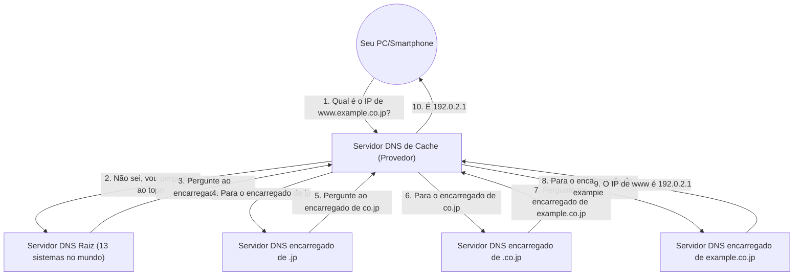

## 1. A "Barreira do Idioma" Entre Humanos e Computadores

No mundo da Internet, todos os computadores e servidores especificam sua localização usando uma sequência de números chamada "**Endereço IP** (ex: 142.250.196.110)".
No entanto, é impossível para nós memorizarmos os endereços IP de todos os sites que acessamos diariamente. Isso ocorre porque os "**Nomes de domínio** (strings com significado)", como "google.com" ou "apple.com", são esmagadoramente mais fáceis de lembrar para os seres humanos.

O enorme sistema que traduz automaticamente e vincula esse "nome de domínio usado por humanos" e o "endereço IP usado por computadores" é o "**DNS (Domain Name System)**".
O DNS é frequentemente comparado à "lista telefônica da Internet". Se você deseja saber o número de telefone do Sr. Yamada, procura "Yamada" na lista telefônica; da mesma forma, o navegador faz consultas aos servidores DNS nos bastidores para descobrir o endereço IP de "google.com".

## 2. A Necessidade de um Enorme Banco de Dados Distribuído

O que aconteceria se tentássemos gerenciar a tabela de correspondência de todos os nomes de domínio e endereços IP do mundo em "um único servidor gigante"?
Centenas de milhões de consultas por segundo do mundo inteiro inundariam o servidor, fazendo-o cair imediatamente, e se esse servidor quebrasse, ninguém no mundo conseguiria usar a Internet.

Portanto, o DNS foi projetado como um "**banco de dados distribuído hierárquico**", onde centenas de milhares de servidores em todo o mundo colaboram para gerenciar os dados de forma distribuída. Diz-se que este é o sistema distribuído de maior sucesso e operação em larga escala na história da ciência da computação.

## 3. Estrutura Hierárquica de Nomes de Domínio (Estrutura de Árvore)

Para entender o funcionamento do DNS, precisamos conhecer a "estrutura" dos nomes de domínio.
Na verdade, os nomes de domínio possuem uma hierarquia (estrutura de árvore) da direita para a esquerda.

Por exemplo, se decompormos o domínio `www.example.co.jp.` da direita para a esquerda, teremos o seguinte:

1. **`.` (Raiz)**: O topo de todos os domínios. Na verdade, há um "." invisível escondido no final de todos os domínios.
2. **`jp` (Domínio de Nível Superior / TLD)**: Uma hierarquia que representa um país, no caso, o Japão. Também existem outros como `.com` e `.net`.
3. **`co` (Domínio de Segundo Nível)**: A hierarquia que representa empresas (company).
4. **`example` (Domínio de Terceiro Nível)**: O nome de uma empresa ou organização.
5. **`www` (Nome do Host)**: O nome de um servidor específico (como um servidor Web) dentro dessa organização.

No mundo do DNS, "servidores DNS encarregados (servidores DNS autoritativos)" são colocados para cada hierarquia, e eles conhecem apenas as informações de contato (endereços IP) dos encarregados da hierarquia imediatamente abaixo da sua.

## 4. O Processo de Resolução de Nomes: A Jornada de Revezamento

Quando você digita `https://www.example.co.jp` no seu navegador, o seguinte processo épico de "resolução de nomes (descobrir o endereço IP a partir de um nome)" ocorre nos bastidores em um instante (dezenas de milissegundos).

1. **Solicitação ao servidor DNS de cache**: Primeiro, o seu PC solicita ao "servidor DNS de cache" do seu provedor de Internet contratado (como NTT ou KDDI) para investigar em seu nome.
2. **Consulta ao servidor raiz**: Se o servidor do provedor não souber a resposta, ele perguntará ao "servidor DNS raiz (existem apenas 13 sistemas no mundo)", que reina no topo do mundo. O servidor raiz responderá: "Não sei, mas vou lhe informar o endereço IP do encarregado de `.jp`, então pergunte lá".
3. **Revezamento de responsabilidades**: O servidor do provedor pergunta ao servidor encarregado de `.jp` que lhe foi informado, em seguida, pergunta ao servidor encarregado de `.co.jp`... e assim por diante, sendo passado adiante sucessivamente enquanto desce na hierarquia (delegação).
4. **Resposta final**: Finalmente, ele chega ao servidor DNS da empresa que gerencia `example.co.jp` e recebe a resposta final: "O endereço IP de `www` é este".

Este complexo revezamento acontece em todo o mundo toda vez que clicamos em um link.

## 5. Aceleração Através do Poder do Cache

Se esse revezamento ocorresse toda vez, toda a Internet ficaria lenta e os servidores DNS raiz no topo ficariam sobrecarregados.

O que previne isso é o mecanismo de "**cache (armazenamento temporário)**".
O servidor DNS de cache do provedor memoriza "o endereço IP de google.com" pesquisado uma vez na memória por um determinado período de tempo (TTL: Time To Live).
Da próxima vez que você ou alguém da vizinhança perguntar "Qual é o endereço IP de google.com?", ele não vai perguntar ao redor do mundo inteiro de novo, mas pode responder imediatamente (em alguns milissegundos): "Eu acabei de pesquisar e é este".

Mais de 99% das consultas DNS do mundo são processadas instantaneamente por este cache, e isso suporta a velocidade confortável da Internet.

## 6. Conclusão

O DNS é o "herói anônimo" do qual normalmente não temos consciência alguma.
No entanto, sem esse sistema distribuído hierárquico projetado por Paul Mockapetris e outros na década de 1980, a enorme Internet atual não seria possível de forma alguma.

Centenas de milhares de servidores DNS espalhados pelo mundo se encarregam de suas respectivas áreas e colaboram por meio de revezamento. O DNS é a infraestrutura que incorpora da forma mais bela a filosofia de "distribuição autônoma" da Internet.
