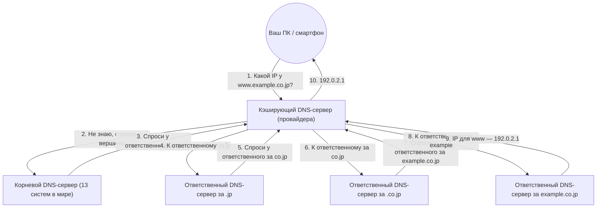

## 1. «Языковой барьер» между человеком и компьютером

В мире интернета местоположение всех компьютеров и серверов определяется последовательностью цифр, называемой «**IP-адресом**» (например, 142.250.196.110).
Однако человеку невозможно запомнить все IP-адреса веб-сайтов, к которым он обращается каждый день. Гораздо проще запоминать «**доменные имена**» (осмысленные строки), такие как «google.com» или «apple.com».

Огромная система, которая автоматически переводит и связывает эти «используемые человеком доменные имена» и «используемые компьютерами IP-адреса», называется «**DNS (система доменных имен)**».
DNS часто сравнивают с «телефонной книгой интернета». Точно так же, как вы ищете фамилию «Ямада» в телефонной книге, чтобы узнать его номер, ваш браузер в фоновом режиме отправляет запрос к DNS-серверу, чтобы узнать IP-адрес «google.com».

## 2. Необходимость огромной распределенной базы данных

Что бы произошло, если бы мы попытались управлять таблицей соответствия всех доменных имен и IP-адресов в мире на «одном гигантском сервере»?
Миллиарды запросов со всего мира в секунду обрушились бы на сервер, и он бы немедленно вышел из строя. А если бы этот сервер сломался, никто в мире не смог бы пользоваться интернетом.

Поэтому DNS была спроектирована как «**иерархическая распределенная база данных**», в которой сотни тысяч серверов по всему миру совместно управляют данными децентрализованно. Считается, что это самая успешная и масштабная работающая распределенная система в истории компьютерных наук.

## 3. Иерархическая структура доменных имен (древовидная структура)

Чтобы понять, как работает DNS, необходимо знать «структуру» доменных имен.
На самом деле, доменные имена имеют иерархическую (древовидную) структуру справа налево.

Например, если разобрать домен `www.example.co.jp.` справа, получится следующее:

1. **`.` (корень)**: Вершина всех доменов. На самом деле, в конце каждого домена скрывается невидимая точка «.».
2. **`jp` (домен верхнего уровня / TLD)**: Уровень, представляющий страну Японию. Существуют также и другие, например `.com` или `.net`.
3. **`co` (домен второго уровня)**: Уровень, представляющий компании (company).
4. **`example` (домен третьего уровня)**: Название компании или организации.
5. **`www` (имя хоста)**: Имя конкретного сервера (например, веб-сервера) внутри этой организации.

В мире DNS для каждого уровня существует свой «ответственный DNS-сервер (авторитетный DNS-сервер)», который знает только контактные данные (IP-адреса) ответственных за уровень, находящийся непосредственно под ним.

## 4. Процесс разрешения имен: эстафетная передача

Когда вы вводите `https://www.example.co.jp` в браузере, в фоновом режиме за доли секунды (несколько десятков миллисекунд) происходит грандиозный процесс «разрешения имен (поиска IP-адреса по имени)».

1. **Запрос к кэширующему DNS-серверу**: Ваш компьютер сначала просит «кэширующий DNS-сервер» вашего провайдера (например, NTT или KDDI) выполнить поиск от вашего имени.
2. **Запрос к корневому серверу**: Если сервер провайдера не знает ответа, он обращается к «корневому DNS-серверу» (их в мире всего 13 систем), который находится на вершине иерархии. Корневой сервер отвечает: «Я не знаю, но дам IP-адрес ответственного за `.jp`, спроси у него».
3. **Эстафетная передача**: Сервер провайдера обращается к указанному серверу, отвечающему за `.jp`, затем к серверу, отвечающему за `.co.jp`... и так далее, спускаясь по иерархии (делегирование), передавая эстафету дальше.
4. **Окончательный ответ**: Наконец, запрос достигает DNS-сервера компании, управляющей `example.co.jp`, и получает окончательный ответ: «Вот IP-адрес для `www`».

Эта сложная эстафета происходит по всему миру каждый раз, когда мы нажимаем на ссылку.

## 5. Ускорение за счет кэширования

Если бы такая эстафета происходила каждый раз, весь интернет работал бы медленно, а корневые DNS-серверы на вершине просто бы не выдержали нагрузки.

Этого удается избежать благодаря механизму «**кэширования (временного сохранения)**».
Кэширующий DNS-сервер провайдера сохраняет в памяти однажды найденный «IP-адрес google.com» на определенное время (TTL: Time To Live).
В следующий раз, когда вы или ваш сосед спросит «Какой IP-адрес у google.com?», сервер не будет отправлять запросы по всему миру, а ответит мгновенно (за несколько миллисекунд): «Я только что проверял, вот он».

Более 99% всех DNS-запросов в мире мгновенно обрабатываются с помощью этого кэша, что и обеспечивает комфортную скорость работы интернета.

## 6. Заключение

DNS — это «невидимый герой», о котором мы обычно даже не задумываемся.
Однако без этой иерархической распределенной системы, разработанной Полом Мокапетрисом и его коллегами в 1980-х годах, сегодняшний гигантский интернет был бы абсолютно невозможен.

Сотни тысяч DNS-серверов, разбросанных по всему миру, несут ответственность за свои зоны и взаимодействуют друг с другом, как в эстафете. DNS — это инфраструктура, которая самым прекрасным образом воплощает философию интернета: «автономность и децентрализация».
