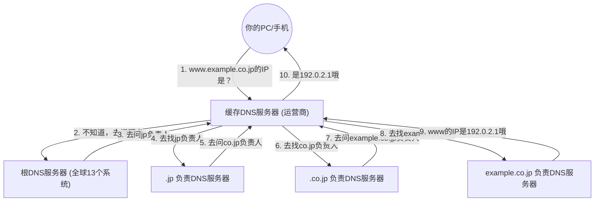

## 1. 人类与计算机的「语言障碍」

在互联网的世界里，所有的计算机和服务器都是通过被称为「 **IP地址** （例如: 142.250.196.110）」的一串数字来确定位置的。
然而，要记住人类每天访问的所有网站的IP地址是不可能的。因为对人类来说，像「google.com」或「apple.com」这样的「 **域名** （有意义的字符串）」要容易记住得多。

能够自动翻译并将这种「人类使用的域名」与「计算机使用的IP地址」联系起来的巨大系统就是「 **DNS（Domain Name System）** 」。
DNS经常被比作「互联网的电话簿」。如果你想知道山田先生的电话号码，就会在电话簿中查找「山田」，同样地，浏览器为了知道「google.com」的IP地址，在后台向DNS服务器进行查询。

## 2. 庞大分布式数据库的必要性

如果试图用「一台巨大的服务器」来管理世界上所有的域名和IP地址的对应表，会发生什么呢？
来自世界各地的查询每秒将达到数亿次，服务器会立即崩溃，如果那台服务器坏了，世界上所有的人都将无法使用互联网。

因此，DNS被设计为一个「 **分层分布式数据库** 」，由世界各地的数十万台服务器协作并分布式地管理数据。这被称为计算机科学史上最成功、最大规模运行的分布式系统。

## 3. 域名的层级结构（树状结构）

为了理解DNS的机制，有必要了解域名的「结构」。
实际上，域名从右向左呈现分层（树状结构）。

例如，将 `www.example.co.jp.` 这个域名从右边开始分解如下：

1. **`.`（根）**: 所有域名的顶点。实际上在所有的域名最后都隐藏着一个看不见的「.」。
2. **`jp`（顶级域名 / TLD）**: 代表日本这个国家的层级。其他还有 `.com` 和 `.net` 等。
3. **`co`（二级域名）**: 代表企业（company）的层级。
4. **`example`（三级域名）**: 企业名称或组织名称。
5. **`www`（主机名）**: 该组织内特定服务器（如Web服务器等）的名称。

在DNS的世界里，每个层级都配置了「负责的DNS服务器（权威DNS服务器）」，并且只知道其紧接下级负责人的联系方式（IP地址）。

## 4. 名称解析的过程：接力传递之旅

当你在浏览器中输入 `https://www.example.co.jp` 时，后台瞬间（几十毫秒）就进行了以下壮观的「名称解析（从名称查询IP地址）」过程。

1. **向缓存DNS服务器请求**: 你的PC首先请求签约的运营商（如NTT或KDDI等）的「缓存DNS服务器」代为查询。
2. **向根服务器查询**: 如果运营商的服务器不知道答案，就会询问位于世界顶端的「根DNS服务器（全球只有13个系统）」。根服务器会回答：「我不知道，但我会告诉你 `.jp` 负责人的IP地址，去问他们吧」。
3. **推诿式的接力**: 运营商的服务器会去问被告知的 `.jp` 负责服务器，然后再问 `.co.jp` 负责服务器……就这样，一边逐层向下，一边不断被推诿（委派）。
4. **最终回答**: 最后到达管理 `example.co.jp` 的企业的DNS服务器，得到「`www`的IP地址是这个」的最终答案。

每当我们点击链接时，这个复杂的接力传递过程就会在全世界范围内进行。

## 5. 借助缓存力量的加速

如果每次都进行这样的接力传递，整个互联网的速度就会变慢，而且顶点的根DNS服务器将会瘫痪。

防止这种情况发生的就是「 **缓存（临时保存）** 」机制。
运营商的缓存DNS服务器将查询过一次的「google.com的IP地址」在一定时间（TTL：Time To Live）内记忆在内存中。
下次你或附近的人询问「google.com的IP地址是？」时，不用再去问全世界，而是可以立即（几毫秒内）回答：「刚才查过了，是这个哦」。

世界上99%以上的DNS查询都通过这种缓存被瞬间处理，这支撑着互联网舒适的速度。

## 6. 总结

DNS是我们平时完全意识不到的「幕后英雄」。
然而，如果没有20世纪80年代由保罗·莫卡佩特里斯（Paul Mockapetris）等人设计的这种分层分布式系统，现在庞大的互联网是绝对无法成立的。

散布在世界各地的数十万台DNS服务器，各自对其负责领域负责，通过接力传递相互合作。DNS是最完美地体现了互联网「自治去中心化」哲学的底层基础设施。
