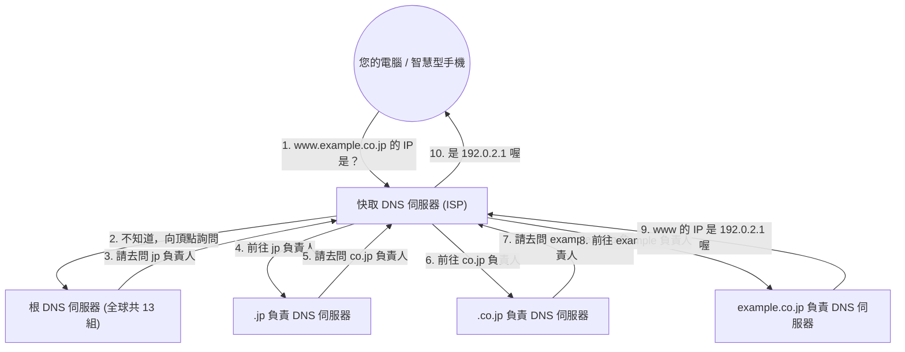

## 1. 人類與電腦間的「語言隔閡」

在網際網路的世界中，所有的電腦與伺服器都是透過被稱為「 **IP 位址** （例如: 142.250.196.110）」的一連串數字來確認位置。
然而，要人類記住每天造訪的所有網站 IP 位址是不可能的。因為對人類而言，像是「google.com」或「apple.com」等這類具備意義的字串（即「 **網域名稱** 」）絕對比較容易記憶。

而能夠自動將這「人類使用的網域名稱」與「電腦使用的 IP 位址」進行翻譯並連結起來的龐大系統，就是「 **DNS（Domain Name System）** 」。
DNS 常被比喻為「網際網路的電話簿」。就像我們如果想知道山田先生的電話號碼，就會去翻電話簿找「山田」一樣，瀏覽器為了得知「google.com」的 IP 位址，也會在幕後向 DNS 伺服器進行查詢。

## 2. 龐大分散式資料庫的必要性

如果我們試圖用「1 台巨大的伺服器」來管理全世界所有網域名稱與 IP 位址的對照表，會發生什麼事呢？
這台伺服器將會面臨來自世界各地每秒數億次的查詢蜂擁而至，並迅速癱瘓；而且萬一這台伺服器損壞，全世界的人都將無法使用網際網路。

因此，DNS 被設計成由分布在世界各地的數十萬台伺服器共同合作、分散管理資料的「 **階層式分散式資料庫** 」。這被譽為電腦科學史上最成功、且運作規模最大的分散式系統。

## 3. 網域名稱的階層結構（樹狀結構）

為了理解 DNS 的運作原理，我們必須先了解網域名稱的「結構」。
實際上，網域名稱是由右至左形成階層（樹狀結構）的。

舉例來說，若將 `www.example.co.jp.` 這個網域由右向左拆解，會是以下的形式：

1. **`.`（根 / Root）** : 所有網域的頂點。其實所有網域的最後面都隱藏著一個看不見的「.」。
2. **`jp`（頂級網域 / TLD）** : 代表日本這個國家的階層。其他還有 `.com` 或 `.net` 等。
3. **`co`（次級網域 / 第二層網域）** : 代表企業（company）的階層。
4. **`example`（第三級網域）** : 企業或組織名稱。
5. **`www`（主機名稱）** : 該組織內特定伺服器（如 Web 伺服器等）的名稱。

在 DNS 的世界中，每個階層都配置了「負責的 DNS 伺服器（權威 DNS 伺服器）」，且它們只會知道自己下一層負責人的聯絡資訊（IP 位址）。

## 4. 名稱解析的過程：傳遞水桶接力賽

當您在瀏覽器中輸入 `https://www.example.co.jp` 時，在幕後會瞬間（幾十毫秒內）進行著如下壯觀的「名稱解析（從名稱查詢 IP 位址）」過程。

1. **委託快取 DNS 伺服器** : 您的電腦會先委託所簽約的 ISP（網際網路服務供應商）的「快取 DNS 伺服器」代為查詢。
2. **向根伺服器查詢** : 如果 ISP 的伺服器不知道答案，它會向君臨全球頂點的「根 DNS 伺服器（全世界只有 13 組）」詢問。根伺服器會回答：「我不知道，但我告訴你 `.jp` 負責人的 IP 位址，去問那邊吧」。
3. **踢皮球般的接力賽** : ISP 的伺服器會向被告知的 `.jp` 負責伺服器詢問，接著再問 `.co.jp` 負責伺服器……就這樣順著階層向下，不斷地被轉交（委派）。
4. **最終解答** : 最後抵達管理 `example.co.jp` 之企業的 DNS 伺服器，並獲得「`www` 的 IP 位址是這個」的最終答案。

我們每次點擊連結時，全世界都在進行著這場複雜的接力賽。

## 5. 透過快取機制提升速度

如果每次都要進行這樣的接力賽，不僅會讓整個網際網路變慢，位於頂點的根 DNS 伺服器也會被擠爆。

為了防止這種情況，便有了「 **快取（暫存）** 」的機制。
ISP 的快取 DNS 伺服器會將查過一次的「google.com 的 IP 位址」保存在記憶體中一段時間（TTL：Time To Live）。
下次當您或附近的人再問「google.com 的 IP 位址是？」時，就不必一一去向全世界詢問，而是能即時（幾毫秒內）回答：「剛才查過了，是這個喔」。

全世界超過 99% 的 DNS 查詢都是透過這種快取機制在瞬間處理完畢，這正是維持網際網路順暢速度的幕後功臣。

## 6. 總結

DNS 是我們平時完全不會意識到的「幕後英雄」。
然而，如果沒有 1980 年代由保羅·莫卡派喬斯（Paul Mockapetris）等人設計的這個階層式分散式系統，現在如此龐大的網際網路絕對無法成形。

散佈在全球的數十萬台 DNS 伺服器，各自為自己負責的領域擔起責任，並以接力賽的方式互相合作。DNS 可以說是最完美體現網際網路「自主分散」哲學的基礎設施。
