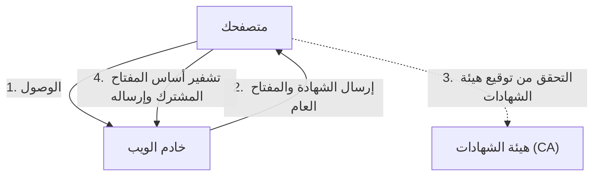

## 1. الفرق بين "http" و "https"

كانت عناوين الويب (URLs) للمواقع التي نتصفحها يوميًا تبدأ بـ "`http://`". ولكن اليوم، تبدأ معظم المواقع بـ "`https://`".
إن حرف " **s (Secure)** " في النهاية هو الدليل على استخدام تقنية " **SSL/TLS** " لتشفير الاتصالات على الإنترنت.

إذا قمت بإدخال رقم بطاقة الائتمان الخاصة بك وإرساله على موقع Amazon أثناء استخدام "http"، فإن تلك البيانات ستتدفق عبر الشبكة العامة (الإنترنت) **مكشوفة تمامًا مثل "بطاقة بريدية"** . وإذا قام شخص ما بالتنصت على أجهزة التوجيه (routers) أو نقاط اتصال Wi-Fi في الطريق، فسوف يسرق رقم بطاقتك بسهولة.
باستخدام SSL/TLS، يتم وضع بيانات الاتصال في "خزنة" قوية قبل إرسالها، لذلك حتى لو تم اعتراضها في الطريق، فمن المستحيل فك تشفيرها.

## 2. حماية الاتصالات من 3 تهديدات رئيسية

لا يقتصر دور SSL/TLS على تشفير البيانات فحسب، بل يحمينا أيضًا من "3 تهديدات كبيرة" على الإنترنت.

1. **منع التنصت (التشفير)**: تشفير البيانات بحيث لا يمكن لأي طرف ثالث معرفة محتواها حتى لو رآها.
2. **منع التلاعب (مصادقة الرسائل)**: اكتشاف ما إذا كان قد تم تغيير البيانات من قبل طرف ثالث أثناء النقل (مثل: تغيير حساب المستفيد من التحويل المالي).
3. **منع الانتحال (شهادة الخادم)**: إثبات أن الموقع الذي تتصل به الآن هو بالفعل "Amazon الحقيقي" وليس موقعًا احتياليًا مزيفًا.

## 3. آلية التشفير في SSL/TLS: النظام الهجين

لتشفير الاتصالات، نحتاج إلى "مفتاح". ولكن كيف يمكننا مشاركة المفتاح بأمان مع طرف مجهول (خادم) على الإنترنت؟ يحل SSL/TLS هذه المشكلة باستخدام " **النظام الهجين** " الذي يجمع بين طريقتين مختلفتين للتشفير.

### ① تشفير المفتاح العام (التسليم الآمن للمفتاح)
- يستخدم زوجًا من " **المفتاح العام (ثقب قفل يمكن للجميع استخدامه)** " و " **المفتاح الخاص (مفتاح احتياطي يمتلكه الخادم فقط)** ".
- يتلقى العميل (متصفحك) المفتاح العام من الخادم، ويستخدمه لتشفير "أساس المفتاح المشترك الذي سيتم استخدامه للاتصال من الآن فصاعدًا (Pre-Master Secret)" ويرسله إلى الخادم.
- نظرًا لأنه لا يمكن فك هذا التشفير إلا باستخدام المفتاح الخاص الموجود على الخادم، يمكن مشاركة "المفتاح المشترك" بأمان حتى لو تمت سرقته في الطريق.
- *العيب*: العمليات الحسابية الرياضية معقدة، واستخدامه في كل اتصال يجعله بطيئًا للغاية.

### ② تشفير المفتاح المتماثل (اتصال البيانات الفعلي)
- يتم استخدام " **المفتاح المشترك** " الذي تمت مشاركته بأمان في الخطوة ① لتشفير وفك تشفير البيانات بين الطرفين.
- *الميزة*: العمليات الحسابية خفيفة وسريعة جدًا، مما يجعله مناسبًا لتبادل كميات كبيرة من البيانات (مثل مقاطع الفيديو والصور).

بمعنى آخر، آلية SSL/TLS هي **"استخدام تشفير المفتاح العام في بداية الاتصال فقط لتسليم المفتاح المشترك بأمان، ثم استخدام تشفير المفتاح المتماثل السريع في الاتصال الفعلي بعد ذلك"** .

## 4. شهادة الخادم وهيئة الشهادات (CA)

ما يثبت أن الطرف الذي تتصل به "حقيقي" هو " **شهادة الخادم** ".
يتم إصدار هذه الشهادة من قبل جهة خارجية موثوقة عالميًا تسمى " **هيئة الشهادات (CA: Certificate Authority)** ".

يحتوي المتصفح مسبقًا على قائمة بهيئات الشهادات الموثوقة (شهادات الجذر). إذا كان الموقع الذي تم الوصول إليه يستخدم "شهادة من هيئة شهادات مشبوهة" أو "شهادة منتهية الصلاحية"، فسيقوم المتصفح بعرض شاشة حمراء بالكامل وتحذير قوي يقول " **اتصالك ليس خاصًا** " لحماية المستخدم.

## 5. التطور من SSL إلى TLS

كمعلومة تقنية، الاسم الرسمي للتقنية التي نطلق عليها الآن اسم "SSL" هو في الواقع " **TLS (Transport Layer Security)** ".
بالنسبة لـ "SSL" الذي طورته شركة Netscape في الأصل، تم العثور على ثغرة أمنية قاتلة في الإصدار 3.0، وقد تم حظر استخدامه بالفعل. كخليفة له، قامت IETF بتوحيد "TLS"، والإصدارات السائدة حاليًا هي TLS 1.2 و TLS 1.3.
ومع ذلك، نظرًا لأن اسم "SSL" قد انتشر بشكل كبير بين الناس، فإنه لا يزال يشار إليه عرفيًا باسم "SSL/TLS" أو ببساطة "SSL" حتى يومنا هذا.

## 6. الخلاصة

يعد SSL/TLS "أساس الثقة" في الإنترنت الحديث.
سواء كان ذلك للتسوق عبر الإنترنت، أو الخدمات المصرفية عبر الإنترنت، أو تبادل الرسائل على وسائل التواصل الاجتماعي، يمكننا الاستمتاع بفوائد الإنترنت براحة بال بفضل تقنية التشفير المتقدمة هذه التي تعمل في الخلفية على مدار 24 ساعة دون توقف.
