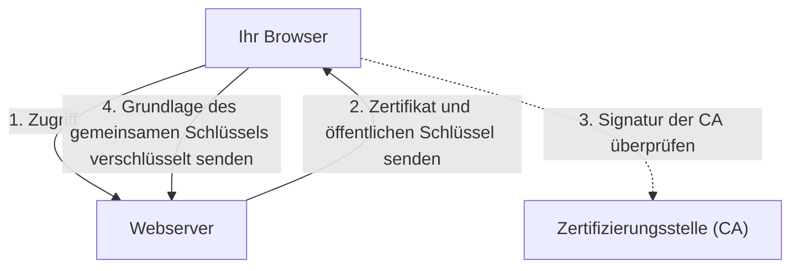

## 1. Der Unterschied zwischen „http“ und „https“

Die URLs der Websites, die wir uns jeden Tag ansehen, begannen früher mit `http://`. Heutzutage beginnen jedoch die meisten Websites mit `https://`.
Dieses **s (Secure)** am Ende ist der Beweis dafür, dass die Technologie **SSL/TLS** verwendet wird, um die Kommunikation im Internet zu verschlüsseln.

Wenn Sie Ihre Kreditkartennummer bei Amazon über „http“ eingeben und senden würden, würden diese Daten über das öffentliche Netzwerk des Internets **wie eine Postkarte, deren Vorder- und Rückseite für jeden sichtbar ist**, fließen. Wenn jemand an einem Router oder einem WLAN-Zugangspunkt auf dem Weg spioniert, könnte Ihre Kartennummer leicht gestohlen werden.
Durch die Verwendung von SSL/TLS werden die Kommunikationsdaten vor dem Senden in einen sicheren „Tresor“ gelegt, sodass es unmöglich ist, sie zu entschlüsseln, selbst wenn jemand sie auf dem Weg abfängt.

## 2. Die Kommunikation vor 3 Bedrohungen schützen

SSL/TLS verschlüsselt nicht nur Daten, sondern schützt uns auch vor den „drei großen Bedrohungen“ des Internets.

1. **Verhinderung von Abhören (Verschlüsselung)**: Die Daten werden verschlüsselt, sodass der Inhalt nicht verstanden werden kann, selbst wenn sie von einem Dritten eingesehen werden.
2. **Verhinderung von Manipulationen (Nachrichtenauthentifizierung)**: Es wird erkannt, ob die Daten während der Kommunikation von einem Dritten manipuliert wurden (z. B. ob das Überweisungskonto geändert wurde).
3. **Verhinderung von Spoofing (Serverzertifikate)**: Es beweist, dass die Website, mit der Sie derzeit verbunden sind, keine gefälschte Betrugsseite ist, sondern definitiv das „echte Amazon“.

## 3. Der Verschlüsselungsmechanismus von SSL/TLS: Die hybride Methode

Um die Kommunikation zu verschlüsseln, benötigen Sie einen „Schlüssel“. Aber wie können Sie einen Schlüssel sicher mit einem unbekannten Dritten (einem Server) im Internet teilen? SSL/TLS löst dieses Problem mit einer **hybriden Methode**, die zwei verschiedene Verschlüsselungsmethoden kombiniert.

### ① Asymmetrische Verschlüsselung (Sichere Schlüsselübergabe)
- Es wird ein Paar aus einem **öffentlichen Schlüssel (einem Schlüsselloch, das jeder benutzen kann)** und einem **privaten Schlüssel (einem Ersatzschlüssel, den nur der Server besitzt)** verwendet.
- Der Client (Ihr Browser) empfängt den öffentlichen Schlüssel vom Server, verwendet ihn, um die „Grundlage des gemeinsamen Schlüssels (Pre-Master-Secret), der fortan für die Kommunikation verwendet wird“, zu verschlüsseln, und sendet diese an den Server.
- Da diese Verschlüsselung nur mit dem privaten Schlüssel des Servers entschlüsselt werden kann, kann der „gemeinsame Schlüssel“ sicher geteilt werden, selbst wenn er auf dem Weg gestohlen wird.
- *Nachteil*: Die mathematischen Berechnungen sind komplex, und es wäre sehr langsam, sie für jede Kommunikation zu verwenden.

### ② Symmetrische Verschlüsselung (Eigentliche Datenkommunikation)
- Die Daten werden mithilfe des in ① sicher geteilten **gemeinsamen Schlüssels** gegenseitig verschlüsselt und entschlüsselt.
- *Vorteil*: Die Berechnungen sind sehr leicht und schnell, wodurch sie sich für den Austausch großer Datenmengen (wie Videos und Bilder) eignen.

Zusammenfassend lässt sich sagen: **„Nur am Anfang der Kommunikation wird asymmetrische Verschlüsselung verwendet, um den symmetrischen Schlüssel sicher zu übergeben, und für die eigentliche anschließende Kommunikation wird die schnelle symmetrische Verschlüsselung genutzt.“** Das ist der Mechanismus von SSL/TLS.

## 4. Serverzertifikate und Zertifizierungsstellen (CA)

Das **Serverzertifikat** beweist, dass der Kommunikationspartner „echt“ ist.
Dieses Zertifikat wird von einer weltweit vertrauenswürdigen Drittorganisation namens **Zertifizierungsstelle (CA: Certificate Authority)** ausgestellt.

Browser haben eine integrierte Liste vertrauenswürdiger Zertifizierungsstellen (Stammzertifikate). Wenn die von Ihnen besuchte Website ein „Zertifikat einer fragwürdigen Zertifizierungsstelle“ oder ein „abgelaufenes Zertifikat“ verwendet, schützt der Browser den Benutzer, indem er einen roten Bildschirm mit der deutlichen Warnung anzeigt: **„Ihre Verbindung ist nicht privat“**.

## 5. Die Entwicklung von SSL zu TLS

Als kleines technisches Detail: Der offizielle Name der Technologie, die wir heute „SSL“ nennen, ist eigentlich **TLS (Transport Layer Security)**.
Das ursprünglich von Netscape entwickelte „SSL“ wies in der Version 3.0 eine kritische Schwachstelle auf, weshalb dessen Verwendung bereits untersagt ist. Als Nachfolger hat die IETF „TLS“ standardisiert, wobei heute TLS 1.2 und TLS 1.3 am weitesten verbreitet sind.
Da der Name „SSL“ jedoch in der Öffentlichkeit so tief verwurzelt ist, wird er aus Gewohnheit bis heute als „SSL/TLS“ oder einfach als „SSL“ bezeichnet.

## 6. Zusammenfassung

SSL/TLS ist die „Vertrauensbasis“ im modernen Internet.
Ob Online-Shopping, Online-Banking oder der Austausch von Nachrichten in sozialen Netzwerken – wir können die Vorteile des Internets nur deshalb unbesorgt nutzen, weil diese fortschrittliche Verschlüsselungstechnologie im Hintergrund rund um die Uhr unermüdlich für uns arbeitet.
