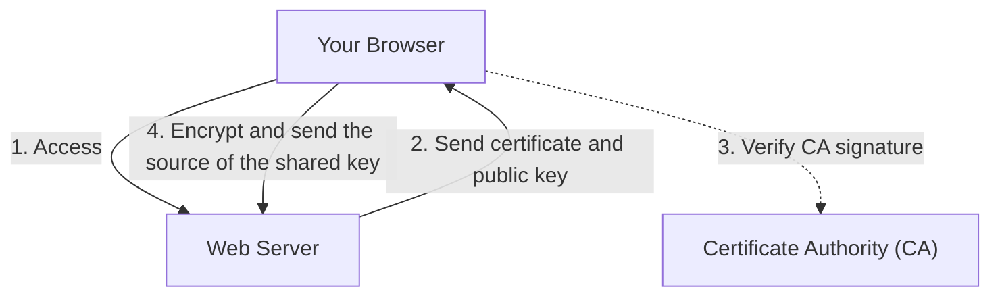

## 1. The Difference Between "http" and "https"

The URLs of the websites we look at every day used to start with "`http://`". However, today, most websites start with "`https://`".
This "**s (Secure)**" at the end is proof that "**SSL/TLS**", a technology that encrypts communications on the Internet, is being used.

If you enter your credit card number on Amazon and send it using "http", the data will travel across the public Internet **completely exposed, like a "postcard."** If someone peeks at it at an intermediate router or Wi-Fi access point, your card number could easily be stolen.
By using SSL/TLS, your communication data is placed in a strong "safe" before being sent, so even if someone intercepts it along the way, it is impossible for them to decrypt it.

## 2. Protecting Communications from 3 Threats

SSL/TLS doesn't just encrypt data; it protects us from the "three major threats" on the Internet.

1. **Prevention of Eavesdropping (Encryption)**: Encrypts data so that even if a third party intercepts it, they cannot understand its contents.
2. **Prevention of Tampering (Message Authentication)**: Detects if the data has been altered by a third party during transit (e.g., changing the destination bank account for a money transfer).
3. **Prevention of Spoofing (Server Certificate)**: Proves that the site you are currently connected to is definitely the "real Amazon" and not a fake scam site.

## 3. How SSL/TLS Encryption Works: The Hybrid Method

"Keys" are necessary to encrypt communications. However, how can we safely share a key with an unknown party (server) over the Internet? SSL/TLS solves this problem with a "**hybrid method**" that combines two different encryption methods.

### ① Public Key Cryptography (Safe Delivery of the Key)
- Uses a pair consisting of a "**public key (a keyhole anyone can use)**" and a "**private key (a spare key only the server has)**".
- The client (your browser) receives the public key from the server and uses it to encrypt the "source of the shared key (pre-master secret)" that will be used for future communications, then sends it to the server.
- Since this encryption can only be decrypted by the private key held by the server, the "shared key" can be shared safely even if intercepted.
- *Disadvantage*: The mathematical calculations are complex, and using it for every communication would make things extremely slow.

### ② Symmetric Key Cryptography (Actual Data Communication)
- Uses the "**shared key**" safely established in ① to encrypt and decrypt data with each other.
- *Advantage*: The calculations are very light and fast, making it suitable for exchanging large amounts of data (such as videos and images).

In short, the mechanism of SSL/TLS is to **"use public key cryptography only at the very beginning of the communication to safely pass the symmetric key, and then use the faster symmetric key cryptography for the actual communication that follows."**

## 4. Server Certificates and Certificate Authorities (CA)

A "**server certificate**" proves that the communication partner is "genuine."
This certificate is issued by a globally trusted third-party organization called a "**Certificate Authority (CA)**".

Browsers have a built-in list of trusted Certificate Authorities (root certificates). If a site you visit uses a "suspicious CA certificate" or an "expired certificate," the browser will display a strong warning on a bright red screen saying, "**Your connection is not private**" to protect the user.

## 5. Evolution from SSL to TLS

As a technical piece of trivia, the formal name of the technology we currently call "SSL" is actually "**TLS (Transport Layer Security)**".
The original "SSL" developed by Netscape was found to have a fatal vulnerability in version 3.0 and is already prohibited from use. As its successor, the IETF standardized "TLS", and the mainstream versions today are TLS 1.2 and TLS 1.3.
However, because the name "SSL" has become so deeply ingrained in society, it continues to be customarily called "SSL/TLS" or simply "SSL" even today.

## 6. Conclusion

SSL/TLS is the "foundation of trust" in today's Internet.
The reason we can safely enjoy the benefits of the Internet, such as online shopping, online banking, and exchanging messages on social media, is because this advanced encryption technology is working tirelessly behind the scenes, 24 hours a day.
