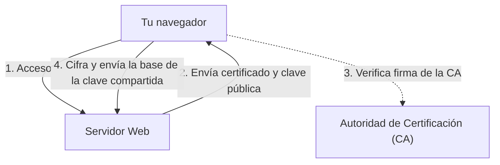

## 1. La diferencia entre "http" y "https"

Las URL de los sitios web que vemos todos los días solían comenzar con `http://`. Sin embargo, en la actualidad, la mayoría de los sitios comienzan con `https://`.
La **s (Secure)** que se encuentra al final es la prueba de que se está utilizando **SSL/TLS**, una tecnología para cifrar las comunicaciones en Internet.

Si ingresas y envías tu número de tarjeta de crédito en Amazon usando "http", esos datos viajarán a través de la red pública de Internet **como si fueran una "postal"**, visibles por ambos lados. Si alguien espía la comunicación a través de un router o un punto de acceso Wi-Fi intermedio, tu número de tarjeta será robada fácilmente.
Al usar SSL/TLS, los datos de comunicación se introducen en una "caja fuerte" robusta para ser enviados, de modo que aunque alguien intercepte la información en el camino, es imposible descifrarla.

## 2. Protegiendo la comunicación de 3 grandes amenazas

SSL/TLS no solo cifra los datos, sino que nos protege de "tres grandes amenazas" en Internet.

1. **Prevención de espionaje (cifrado)**: Cifra los datos para que, aunque un tercero los vea, no pueda comprender su contenido.
2. **Prevención de manipulación (autenticación de mensajes)**: Detecta si un tercero ha modificado los datos durante la comunicación (por ejemplo: si se ha cambiado la cuenta bancaria de destino de una transferencia).
3. **Prevención de suplantación de identidad (certificado del servidor)**: Demuestra que el sitio al que estás conectado es sin duda el "Amazon real" y no un sitio web fraudulento o falso.

## 3. El mecanismo de cifrado de SSL/TLS: Sistema híbrido

Para cifrar las comunicaciones se necesita una "clave". Pero, ¿cómo se puede compartir de forma segura una clave en Internet con un destinatario desconocido (servidor)? SSL/TLS resuelve este problema utilizando un **sistema híbrido** que combina dos métodos de cifrado diferentes.

### ① Cifrado de clave pública (entrega segura de claves)
- Utiliza un par de claves: una **clave pública (una cerradura que cualquiera puede usar)** y una **clave privada (una llave de repuesto que solo tiene el servidor)**.
- El cliente (tu navegador) recibe la clave pública del servidor, la usa para cifrar "la base de la clave compartida que se usará para la comunicación en el futuro (Pre-Master Secret)" y la envía al servidor.
- Como este cifrado solo se puede descifrar con la clave privada que tiene el servidor, incluso si se roba en el camino, se puede compartir la "clave compartida" de manera segura.
- *Desventaja*: Los cálculos matemáticos son complejos y si se usa en cada comunicación, se vuelve muy lento.

### ② Cifrado de clave compartida (comunicación de datos real)
- Utilizan la **clave compartida** que se compartió de forma segura en el paso ① para cifrar y descifrar los datos mutuamente.
- *Ventaja*: Como el cálculo es muy ligero y rápido, es adecuado para el intercambio de grandes cantidades de datos (como videos o imágenes).

En resumen, el funcionamiento de SSL/TLS consiste en **"usar el cifrado de clave pública solo al principio de la comunicación para entregar la clave compartida de forma segura, y luego usar el cifrado rápido de clave compartida para la comunicación real"**.

## 4. Certificados de servidor y Autoridades de Certificación (CA)

Lo que demuestra que la otra parte en la comunicación es "auténtica" es el **certificado del servidor**.
Este certificado es emitido por una organización de terceros llamada **Autoridad de Certificación (CA: Certificate Authority)** que es de confianza a nivel mundial.

El navegador lleva incorporada una lista de Autoridades de Certificación de confianza (certificados raíz). Si el sitio al que accedes usa un "certificado de una CA sospechosa" o un "certificado caducado", el navegador mostrará una pantalla roja con una fuerte advertencia que dice **"La conexión no es privada"** para proteger al usuario.

## 5. La evolución de SSL a TLS

Como dato técnico curioso, el nombre oficial de la tecnología que hoy llamamos "SSL" es en realidad **TLS (Transport Layer Security)**.
El "SSL", desarrollado originalmente por Netscape, presentaba una vulnerabilidad crítica en su versión 3.0, por lo que su uso ya está prohibido. Su sucesor, estandarizado por el IETF, es "TLS", y las versiones predominantes en la actualidad son TLS 1.2 y TLS 1.3.
Sin embargo, dado que el nombre "SSL" se ha arraigado tanto en el público en general, se le sigue llamando por costumbre "SSL/TLS" o simplemente "SSL".

## 6. Conclusión

SSL/TLS es la "base de la confianza" en el Internet moderno.
Las compras en línea, la banca electrónica, el intercambio de mensajes en redes sociales y otros servicios nos permiten disfrutar de los beneficios de Internet con tranquilidad gracias a que esta avanzada tecnología de cifrado trabaja silenciosamente las 24 horas del día.
