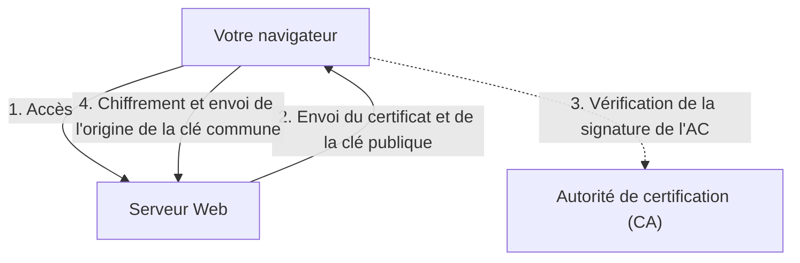

## 1. La différence entre « http » et « https »

Les URL des sites Web que nous consultons tous les jours commençaient autrefois par « `http://` ». Cependant, aujourd'hui, la plupart des sites commencent par « `https://` ».
Ce « **s (Secure)** » final est la preuve que la technologie « **SSL/TLS** » est utilisée pour chiffrer les communications sur Internet.

Si vous saisissez et envoyez votre numéro de carte de crédit sur Amazon en utilisant « http », ces données voyageront sur le réseau public d'Internet **comme une « carte postale » dont le recto et le verso sont visibles par tous**. Si quelqu'un jette un coup d'œil depuis un routeur intermédiaire ou un point d'accès Wi-Fi, votre numéro de carte peut facilement être volé.
Grâce à SSL/TLS, les données de communication sont placées dans un « coffre-fort » robuste avant d'être envoyées, de sorte que même si quelqu'un les intercepte en cours de route, il lui est impossible de les déchiffrer.

## 2. Protéger les communications contre 3 menaces

SSL/TLS ne se contente pas de chiffrer les données, il nous protège également de « 3 menaces majeures » sur Internet.

1. **Prévention des écoutes clandestines (Chiffrement)** : Chiffre les données afin que même si un tiers les voit, il ne puisse pas en comprendre le contenu.
2. **Prévention de la falsification (Authentification des messages)** : Détecte si les données ont été altérées par un tiers pendant la communication (ex : vérifie si le compte bancaire de destination n'a pas été modifié).
3. **Prévention de l'usurpation d'identité (Certificat de serveur)** : Prouve que le site auquel vous êtes actuellement connecté n'est pas un faux site frauduleux, mais sans aucun doute le « véritable Amazon ».

## 3. Le mécanisme de chiffrement de SSL/TLS : La méthode hybride

Pour chiffrer les communications, une « clé » est nécessaire. Mais comment partager cette clé en toute sécurité sur Internet avec un inconnu (un serveur) ? SSL/TLS résout ce problème grâce à une « **méthode hybride** » qui combine deux méthodes de chiffrement différentes.

### ① Chiffrement à clé publique (Transmission sécurisée de la clé)
- Il utilise une paire composée d'une « **clé publique (une serrure que tout le monde peut utiliser)** » et d'une « **clé privée (une clé unique que seul le serveur possède)** ».
- Le client (votre navigateur) reçoit la clé publique du serveur et l'utilise pour chiffrer l'« origine de la clé commune (pre-master secret) qui sera utilisée pour les communications futures », puis l'envoie au serveur.
- Comme ce chiffrement ne peut être déverrouillé qu'avec la clé privée détenue par le serveur, la « clé commune » peut être partagée en toute sécurité même si elle est interceptée en cours de route.
- *Inconvénient* : Les calculs mathématiques sont complexes et cela devient très lent si on l'utilise à chaque communication.

### ② Chiffrement à clé commune (Communication de données réelle)
- L'« **clé commune** » partagée en toute sécurité à l'étape ① est utilisée pour chiffrer et déchiffrer mutuellement les données.
- *Avantage* : Les calculs sont très légers et rapides, ce qui le rend adapté à l'échange de grandes quantités de données (vidéos, images, etc.).

En résumé, le mécanisme de SSL/TLS consiste à **« utiliser le chiffrement à clé publique uniquement au début de la communication pour transmettre en toute sécurité la clé commune, puis utiliser le chiffrement à clé commune, plus rapide, pour les communications réelles qui suivent »**.

## 4. Certificat de serveur et Autorité de certification (CA)

Le « **certificat de serveur** » permet de prouver que le correspondant est « authentique ».
Ce certificat est émis par une organisation tierce de confiance à l'échelle mondiale appelée « **Autorité de certification (CA : Certificate Authority)** ».

Le navigateur intègre à l'avance une liste d'autorités de certification de confiance (certificats racines). Si le site auquel vous accédez utilise un « certificat d'une autorité de certification suspecte » ou un « certificat expiré », le navigateur affiche un écran rouge avec un avertissement fort indiquant que **« Votre connexion n'est pas privée »** afin de protéger l'utilisateur.

## 5. L'évolution du SSL vers le TLS

Pour la petite histoire technique, le nom officiel de la technologie que nous appelons aujourd'hui « SSL » est en fait « **TLS (Transport Layer Security)** ».
Une vulnérabilité critique a été découverte dans la version 3.0 du « SSL » original développé par Netscape, et son utilisation est déjà interdite. Son successeur, normalisé par l'IETF, est le « TLS », et les versions actuellement les plus répandues sont TLS 1.2 et TLS 1.3.
Cependant, le nom « SSL » étant devenu si populaire auprès du grand public, il continue d'être appelé « SSL/TLS » ou simplement « SSL » par habitude.

## 6. Résumé

SSL/TLS est le « fondement de la confiance » sur l'Internet moderne.
Si nous pouvons profiter d'Internet en toute sécurité, que ce soit pour les achats en ligne, les services bancaires ou les échanges de messages sur les réseaux sociaux, c'est parce que cette technologie de chiffrement sophistiquée fonctionne sans relâche, 24 heures sur 24, en arrière-plan.
