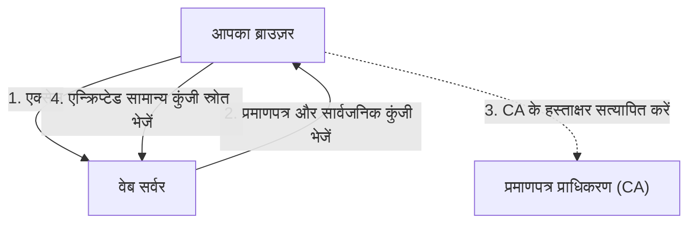

## 1. "http" और "https" के बीच का अंतर

वेबसाइटों के URL जिन्हें हम रोज़ देखते हैं, वे पहले "`http://`" से शुरू होते थे। लेकिन आज, अधिकांश साइटें "`https://`" से शुरू होती हैं।
इसके अंत में लगा "**s (Secure)**" इस बात का प्रमाण है कि इंटरनेट पर संचार को एन्क्रिप्ट करने वाली तकनीक "**SSL/TLS**" का उपयोग किया जा रहा है।

यदि आप Amazon पर "http" पर ही अपना क्रेडिट कार्ड नंबर दर्ज करके भेजते हैं, तो वह डेटा इंटरनेट जैसे सार्वजनिक नेटवर्क पर **"पोस्टकार्ड" की तरह पूरी तरह खुला** प्रवाहित होता है। यदि रास्ते में किसी राउटर या वाई-फाई एक्सेस पॉइंट पर कोई इसे देख ले, तो आपका कार्ड नंबर आसानी से चोरी हो सकता है।
SSL/TLS का उपयोग करने पर, संचार डेटा एक मजबूत "तिजोरी" में डालकर भेजा जाता है, इसलिए यदि रास्ते में कोई इसे देख भी ले, तो इसे डिकोड करना असंभव है।

## 2. संचार को 3 खतरों से सुरक्षित रखना

SSL/TLS केवल डेटा को एन्क्रिप्ट नहीं करता है, बल्कि हमें इंटरनेट पर "3 बड़े खतरों" से भी बचाता है।

1. **ईव्सड्रॉपिंग (छिपकर सुनने) की रोकथाम (एन्क्रिप्शन)**: डेटा को एन्क्रिप्ट करना ताकि तीसरे पक्ष को इसे देखने पर भी इसकी सामग्री समझ में न आए।
2. **छेड़छाड़ की रोकथाम (संदेश प्रमाणीकरण)**: यह पता लगाना कि संचार के दौरान किसी तीसरे पक्ष द्वारा डेटा में बदलाव तो नहीं किया गया है (उदाहरण के लिए: क्या पैसे भेजने वाला खाता बदल दिया गया है)।
3. **स्पूफिंग (प्रतिरूपण) की रोकथाम (सर्वर प्रमाणपत्र)**: यह साबित करना कि जिस साइट से आप अभी जुड़े हैं वह कोई नकली घोटाले वाली साइट नहीं है, बल्कि निश्चित रूप से "असली Amazon" है।

## 3. SSL/TLS एन्क्रिप्शन तंत्र: हाइब्रिड प्रणाली

संचार को एन्क्रिप्ट करने के लिए "कुंजी (Key)" की आवश्यकता होती है। लेकिन इंटरनेट पर किसी अजनबी (सर्वर) के साथ कुंजी को सुरक्षित रूप से कैसे साझा किया जा सकता है? SSL/TLS दो अलग-अलग एन्क्रिप्शन विधियों को मिलाकर "**हाइब्रिड प्रणाली**" के साथ इस समस्या को हल करता है।

### ① सार्वजनिक कुंजी एन्क्रिप्शन (कुंजी का सुरक्षित आदान-प्रदान)
- इसमें एक जोड़ी का उपयोग होता है: "**सार्वजनिक कुंजी (Public Key - एक कीहोल जिसका कोई भी उपयोग कर सकता है)**" और "**निजी कुंजी (Private Key - एक डुप्लिकेट कुंजी जो केवल सर्वर के पास होती है)**"।
- क्लाइंट (आपका ब्राउज़र) सर्वर से सार्वजनिक कुंजी प्राप्त करता है, और इसका उपयोग "भविष्य के संचार के लिए उपयोग की जाने वाली सामान्य कुंजी का स्रोत (प्री-मास्टर सीक्रेट)" एन्क्रिप्ट करने और इसे सर्वर को भेजने के लिए करता है।
- चूंकि इस एन्क्रिप्शन को केवल सर्वर के पास मौजूद निजी कुंजी से ही डिकोड किया जा सकता है, इसलिए रास्ते में चोरी हो जाने पर भी "सामान्य कुंजी" सुरक्षित रूप से साझा की जा सकती है।
- *नुकसान*: गणितीय गणना जटिल होती है, और हर बार संचार के लिए इसका उपयोग करने पर यह बहुत धीमा हो जाता है।

### ② सिमेट्रिक (सामान्य) कुंजी एन्क्रिप्शन (वास्तविक डेटा संचार)
- ① में सुरक्षित रूप से साझा की गई "**सामान्य कुंजी (Symmetric Key)**" का उपयोग करके दोनों एक-दूसरे के डेटा को एन्क्रिप्ट और डिक्रिप्ट करते हैं।
- *फायदा*: गणना बहुत हल्की और तेज़ होती है, जो इसे बड़ी मात्रा में डेटा (वीडियो, चित्र आदि) के आदान-प्रदान के लिए उपयुक्त बनाती है।

संक्षेप में, **"केवल संचार की शुरुआत में एक सामान्य कुंजी को सुरक्षित रूप से पार करने के लिए सार्वजनिक कुंजी एन्क्रिप्शन का उपयोग करना, और फिर बाद के वास्तविक संचार के लिए तेज़ सामान्य कुंजी एन्क्रिप्शन का उपयोग करना"** SSL/TLS का तंत्र है।

## 4. सर्वर प्रमाणपत्र और प्रमाणपत्र प्राधिकरण (CA)

"**सर्वर प्रमाणपत्र**" वह है जो यह साबित करता है कि संचार भागीदार "असली" है।
यह प्रमाणपत्र विश्व स्तर पर विश्वसनीय तीसरे पक्ष के संगठन द्वारा जारी किया जाता है जिसे "**प्रमाणपत्र प्राधिकरण (CA: Certificate Authority)**" कहा जाता है।

विश्वसनीय प्रमाणपत्र प्राधिकरणों (रूट प्रमाणपत्रों) की एक सूची ब्राउज़र में अंतर्निहित होती है। यदि कोई एक्सेस की गई साइट "संदिग्ध CA प्रमाणपत्र" या "समाप्त हो चुके प्रमाणपत्र" का उपयोग कर रही है, तो ब्राउज़र उपयोगकर्ता की सुरक्षा के लिए एक चमकदार लाल स्क्रीन के साथ "**आपका कनेक्शन निजी नहीं है**" की कड़ी चेतावनी प्रदर्शित करेगा।

## 5. SSL से TLS में विकास

एक तकनीकी ट्रिविया के रूप में, जिसे हम वर्तमान में "SSL" कहते हैं, उसका आधिकारिक नाम वास्तव में "**TLS (Transport Layer Security)**" है।
मूल रूप से नेटस्केप द्वारा विकसित "SSL" के संस्करण 3.0 में एक घातक भेद्यता पाई गई थी, और इसके उपयोग पर पहले ही प्रतिबंध लगा दिया गया है। इसके उत्तराधिकारी के रूप में, IETF ने "TLS" को मानकीकृत किया, और वर्तमान में TLS 1.2 और TLS 1.3 मुख्यधारा में हैं।
हालाँकि, चूंकि "SSL" नाम आम जनता के बीच इतना लोकप्रिय हो गया है, इसलिए इसे आज भी प्रथागत रूप से "SSL/TLS" या केवल "SSL" कहा जाता है।

## 6. निष्कर्ष

SSL/TLS आधुनिक इंटरनेट में "विश्वास की नींव" है।
ऑनलाइन शॉपिंग, ऑनलाइन बैंकिंग, और SNS पर संदेशों के आदान-प्रदान जैसे इंटरनेट के लाभों का हम मन की शांति के साथ आनंद ले पा रहे हैं, इसका कारण यह है कि यह उन्नत एन्क्रिप्शन तकनीक पृष्ठभूमि में 24 घंटे बिना रुके काम कर रही है।
