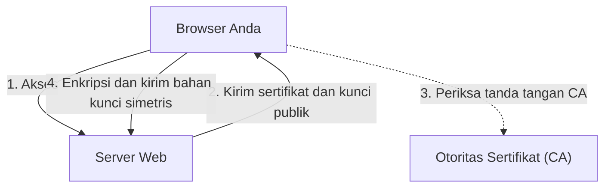

## 1. Perbedaan antara "http" dan "https"

URL situs web yang kita lihat setiap hari dulunya selalu diawali dengan "`http://`". Namun saat ini, hampir semua situs diawali dengan "`https://`".
Huruf "**s (Secure)**" di bagian akhir inilah yang menjadi bukti bahwa teknologi enkripsi komunikasi di internet yang disebut "**SSL/TLS**" sedang digunakan.

Jika Anda memasukkan dan mengirimkan nomor kartu kredit di Amazon saat masih menggunakan "http", data tersebut akan mengalir melalui jaringan publik internet **secara terbuka seperti "kartu pos" yang bagian depan dan belakangnya dapat dilihat oleh siapa saja**. Jika ada yang mengintip melalui router atau titik akses Wi-Fi di tengah jalan, nomor kartu kredit Anda akan dengan mudah dicuri.
Dengan menggunakan SSL/TLS, data komunikasi dimasukkan ke dalam "brankas" yang kuat sebelum dikirim, sehingga mustahil untuk diuraikan bahkan jika ada yang menyadapnya di tengah jalan.

## 2. Melindungi Komunikasi dari 3 Ancaman

SSL/TLS tidak hanya sekadar mengenkripsi data, tetapi juga melindungi kita dari "3 ancaman besar" di internet.

1. **Pencegahan Penyadapan (Enkripsi)**: Mengenkripsi data sehingga isinya tidak dapat diketahui meskipun dilihat oleh pihak ketiga.
2. **Pencegahan Pemalsuan (Autentikasi Pesan)**: Mendeteksi apakah data telah diubah oleh pihak ketiga selama komunikasi (misalnya: apakah rekening tujuan transfer telah diubah).
3. **Pencegahan Peniruan Identitas (Sertifikat Server)**: Membuktikan bahwa situs yang sedang terhubung bukanlah situs penipuan palsu, melainkan benar-benar "Amazon asli".

## 3. Mekanisme Enkripsi SSL/TLS: Metode Hibrida

Untuk mengenkripsi komunikasi, diperlukan sebuah "kunci". Namun, bagaimana cara membagikan kunci dengan aman kepada pihak yang tidak dikenal (server) di internet? SSL/TLS memecahkan masalah ini dengan "**metode hibrida**" yang menggabungkan 2 metode enkripsi yang berbeda.

### ① Kriptografi Kunci Publik (Pengiriman Kunci yang Aman)
- Menggunakan pasangan "**kunci publik (lubang kunci yang dapat digunakan siapa saja)**" dan "**kunci privat (kunci cadangan yang hanya dimiliki oleh server)**".
- Klien (browser Anda) menerima kunci publik dari server, lalu menggunakannya untuk mengenkripsi "bahan kunci simetris yang akan digunakan untuk komunikasi selanjutnya (pre-master secret)" dan mengirimkannya ke server.
- Karena enkripsi ini hanya dapat dibuka dengan kunci privat yang dimiliki server, "kunci simetris" dapat dibagikan dengan aman meskipun disadap di tengah jalan.
- *Kekurangan*: Perhitungan matematisnya rumit, sehingga akan menjadi sangat lambat jika digunakan setiap kali berkomunikasi.

### ② Kriptografi Kunci Simetris (Komunikasi Data Aktual)
- Saling mengenkripsi dan mendekripsi data menggunakan "**kunci simetris**" yang telah dibagikan dengan aman pada tahap ①.
- *Kelebihan*: Perhitungannya sangat ringan dan cepat, sehingga cocok untuk pertukaran data dalam jumlah besar (seperti video dan gambar).

Singkatnya, mekanisme SSL/TLS adalah **"menggunakan kriptografi kunci publik hanya di awal komunikasi untuk mengirimkan kunci simetris secara aman, dan kemudian menggunakan kriptografi kunci simetris yang cepat untuk komunikasi aktual selanjutnya"**.

## 4. Sertifikat Server dan Otoritas Sertifikat (CA)

"**Sertifikat server**" adalah hal yang membuktikan bahwa pihak yang diajak berkomunikasi adalah "asli".
Sertifikat ini diterbitkan oleh pihak ketiga yang dipercaya secara global, yang disebut "**Otoritas Sertifikat (CA: Certificate Authority)**".

Di dalam browser, sudah tertanam daftar otoritas sertifikat tepercaya (sertifikat root) sebelumnya. Jika situs yang diakses menggunakan "sertifikat dari otoritas sertifikat yang mencurigakan" atau "sertifikat yang sudah kedaluwarsa", browser akan memunculkan layar merah terang dengan peringatan keras bahwa "**Koneksi Anda tidak pribadi**" untuk melindungi pengguna.

## 5. Evolusi dari SSL ke TLS

Sebagai informasi teknis, nama resmi dari teknologi yang saat ini kita sebut "SSL" sebenarnya adalah "**TLS (Transport Layer Security)**".
"SSL" yang awalnya dikembangkan oleh perusahaan Netscape telah dilarang penggunaannya karena ditemukannya kerentanan fatal pada versi 3.0. Sebagai penerusnya, IETF menstandardisasi "TLS", dan yang menjadi arus utama saat ini adalah TLS 1.2 dan TLS 1.3.
Namun, karena nama "SSL" sudah terlalu melekat di masyarakat, hingga saat ini masih secara umum disebut sebagai "SSL/TLS" atau hanya "SSL" saja.

## 6. Kesimpulan

SSL/TLS adalah "fondasi kepercayaan" di internet modern.
Kita dapat menikmati manfaat internet dengan tenang, seperti belanja online, perbankan online, dan bertukar pesan di media sosial, karena teknologi enkripsi canggih ini bekerja tanpa henti selama 24 jam di belakang layar.
