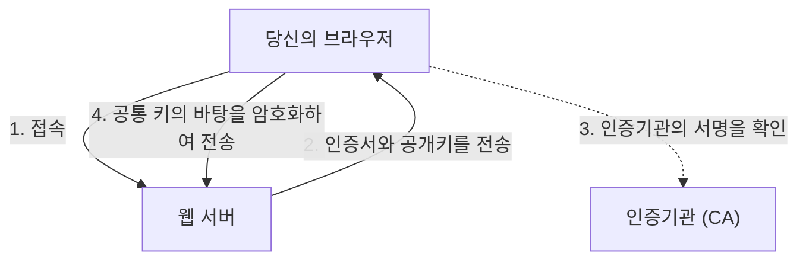

## 1. 'http'와 'https'의 차이

우리가 매일 보는 웹사이트의 URL은 예전에는 '`http://`'로 시작했습니다. 하지만 현재 대부분의 사이트는 '`https://`'로 시작합니다.
이 마지막에 붙어 있는 '**s(Secure)**'야말로 인터넷상의 통신을 암호화하는 기술 '**SSL/TLS**'가 사용되고 있다는 증거입니다.

만약 'http'인 상태로 아마존에서 신용카드 번호를 입력하고 전송하면, 그 데이터는 인터넷이라는 공공 네트워크를 **'엽서'처럼 앞뒤가 훤히 보이는 상태로** 흘러가게 됩니다. 중간에 있는 라우터나 Wi-Fi 액세스 포인트에서 누군가 훔쳐본다면, 쉽게 카드 번호를 도둑맞게 됩니다.
SSL/TLS를 사용하면 통신 데이터는 견고한 '금고'에 넣어져서 전송되기 때문에, 도중에 누군가 훔쳐보더라도 해독하는 것은 불가능합니다.

## 2. 3가지 위협으로부터 통신을 보호하기

SSL/TLS는 단순히 데이터를 암호화하는 것뿐만 아니라, 인터넷에서의 '3가지 큰 위협'으로부터 우리를 보호해 줍니다.

1. **도청 방지(암호화)**: 데이터를 암호화하여 제3자가 보더라도 내용을 알 수 없게 합니다.
2. **변조 방지(메시지 인증)**: 통신 도중에 제3자에 의해 데이터가 조작되지 않았는지(예: 송금할 계좌가 변경되지 않았는지)를 감지합니다.
3. **위장 방지(서버 인증서)**: 현재 연결된 사이트가 가짜 사기 사이트가 아니라 틀림없이 '진짜 아마존'임을 증명합니다.

## 3. SSL/TLS의 암호화 원리: 하이브리드 방식

통신을 암호화하기 위해서는 '키'가 필요합니다. 하지만 인터넷상에서 전혀 모르는 상대(서버)와 어떻게 안전하게 키를 공유해야 할까요? SSL/TLS는 2가지 서로 다른 암호화 방식을 조합한 '**하이브리드 방식**'으로 이 문제를 해결합니다.

### ① 공개키 암호 방식(키의 안전한 전달)
- '**공개키(누구나 사용할 수 있는 열쇠 구멍)**'와 '**비밀키(서버만 가지고 있는 예비 키)**' 쌍을 사용합니다.
- 클라이언트(당신의 브라우저)는 서버로부터 공개키를 받고, 그것을 사용하여 '앞으로 통신에 사용할 공통 키의 바탕(프리마스터 시크릿)'을 암호화하여 서버로 보냅니다.
- 이 암호는 서버가 가진 비밀키로만 풀 수 있기 때문에, 도중에 도둑맞더라도 안전하게 '공통 키'를 공유할 수 있습니다.
- *단점*: 수학적인 계산이 복잡해서 통신할 때마다 사용하면 매우 느려집니다.

### ② 공통키 암호 방식(실제 데이터 통신)
- ①에서 안전하게 공유한 '**공통 키**'를 사용하여 서로 데이터를 암호화하고 복호화합니다.
- *장점*: 계산이 매우 가볍고 빠르기 때문에 대량의 데이터(동영상이나 이미지 등)를 주고받는 데 적합합니다.

즉, **'통신의 처음에만 공개키 암호를 사용하여 안전하게 공통키를 건네주고, 그 후의 실제 통신은 빠른 공통키 암호를 사용하는 것'** 이 SSL/TLS의 원리입니다.

## 4. 서버 인증서와 인증기관(CA)

통신 상대가 '진짜'임을 증명하는 것이 '**서버 인증서**'입니다.
이 인증서는 세계적으로 신뢰받는 '**인증기관(CA: Certificate Authority)**'이라는 제3자 기관에 의해 발급됩니다.

브라우저에는 미리 신뢰할 수 있는 인증기관의 목록(루트 인증서)이 내장되어 있습니다. 만약 접속한 사이트가 '수상한 인증기관의 인증서'나 '기한이 만료된 인증서'를 사용하고 있다면, 브라우저는 새빨간 화면으로 '**이 연결에서는 프라이버시가 보호되지 않습니다**'라는 강력한 경고를 띄워 사용자를 보호합니다.

## 5. SSL에서 TLS로의 진화

기술적인 토막 상식이지만, 현재 우리가 'SSL'이라고 부르는 기술의 정식 명칭은 사실 '**TLS(Transport Layer Security)**'입니다.
원래 넷스케이프(Netscape)사가 개발한 'SSL'은 버전 3.0에서 치명적인 취약점이 발견되어 이미 사용이 금지되었습니다. 그 후속으로 IETF가 표준화한 것이 'TLS'이며, 현재 주류가 되고 있는 것은 TLS 1.2나 TLS 1.3입니다.
하지만 'SSL'이라는 이름이 워낙 세상에 널리 퍼져버렸기 때문에, 현재도 관례적으로 'SSL/TLS'나 단순히 'SSL'이라고 계속 불리고 있습니다.

## 6. 요약

SSL/TLS는 현대 인터넷에 있어서 '신뢰의 기반'입니다.
인터넷 쇼핑, 온라인 뱅킹, SNS에서의 메시지 교환 등 우리가 안심하고 인터넷의 혜택을 누릴 수 있는 것은, 배후에서 이 고도의 암호 기술이 24시간 쉬지 않고 일해주고 있는 덕분입니다.
