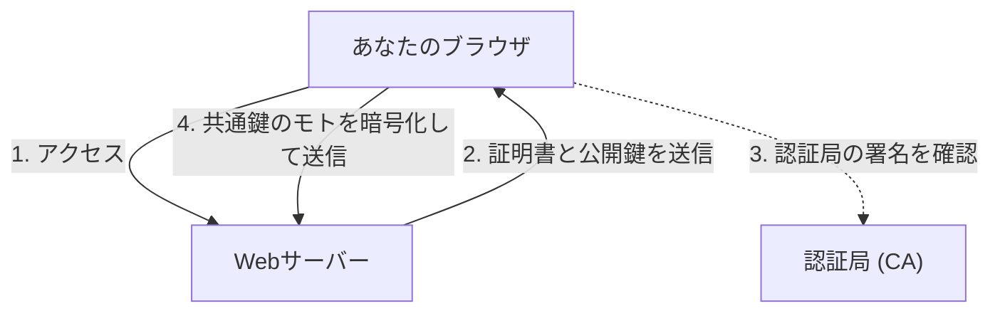

## 1. 「http」と「https」の違い

私たちが毎日見ているWebサイトのURLは、かつては「`http://`」から始まっていました。しかし現在、ほとんどのサイトは「`https://`」から始まっています。
この最後についている「**s（Secure）**」こそが、インターネット上の通信を暗号化する技術「**SSL/TLS**」が使われている証拠です。

もし「http」のままAmazonでクレジットカード番号を入力して送信すると、そのデータはインターネットという公共のネットワークを**「ハガキ」のように裏表丸見えのまま**流れていきます。途中のルーターやWi-Fiのアクセスポイントで誰かに覗き見されれば、簡単にカード番号を盗まれてしまいます。
SSL/TLSを使えば、通信データは強固な「金庫」に入れられて送られるため、途中で誰かに盗み見られても解読することは不可能です。

## 2. 3つの脅威から通信を守る

SSL/TLSは、単にデータを暗号化するだけでなく、インターネットにおける「3つの大きな脅威」から私たちを守ってくれています。

1. **盗聴の防止（暗号化）**: データを暗号化し、第三者に見られても中身がわからないようにする。
2. **改ざんの防止（メッセージ認証）**: 通信の途中で、第三者によってデータが書き換えられていないか（例: 送金先口座が変更されていないか）を検知する。
3. **なりすましの防止（サーバー証明書）**: 今繋がっているサイトが、偽物の詐欺サイトではなく、間違いなく「本物のAmazon」であることを証明する。

## 3. SSL/TLSの暗号化の仕組み：ハイブリッド方式

通信を暗号化するためには「鍵」が必要です。しかし、インターネット上で見ず知らずの相手（サーバー）と、どうやって安全に鍵を共有すればよいのでしょうか？SSL/TLSは、2つの異なる暗号化方式を組み合わせた「**ハイブリッド方式**」でこの問題を解決しています。

### ① 公開鍵暗号方式（鍵の安全な受け渡し）
- 「**公開鍵（誰でも使える鍵穴）**」と「**秘密鍵（サーバーだけが持っている合鍵）**」のペアを使います。
- クライアント（あなたのブラウザ）は、サーバーから公開鍵を受け取り、それを使って「これから通信に使う共通の鍵のモト（プレマスターシークレット）」を暗号化してサーバーに送ります。
- この暗号はサーバーが持つ秘密鍵でしか解けないため、途中で盗まれても安全に「共通の鍵」を共有できます。
- *欠点*: 数学的な計算が複雑で、通信のたびに使うと非常に遅くなる。

### ② 共通鍵暗号方式（実際のデータ通信）
- ①で安全に共有した「**共通の鍵**」を使って、お互いにデータを暗号化・復号化します。
- *長所*: 計算が非常に軽くて速いため、大量のデータ（動画や画像など）のやり取りに向いている。

つまり、**「通信の最初だけ公開鍵暗号を使って安全に共通鍵を渡し、その後の実際の通信は速い共通鍵暗号を使う」**のがSSL/TLSの仕組みです。

## 4. サーバー証明書と認証局（CA）

通信相手が「本物」であることを証明するのが「**サーバー証明書**」です。
この証明書は、世界的に信頼されている「**認証局（CA: Certificate Authority）**」という第三者機関によって発行されます。

ブラウザには、あらかじめ信頼できる認証局のリスト（ルート証明書）が組み込まれています。もしアクセスしたサイトが「怪しい認証局の証明書」や「期限切れの証明書」を使っていた場合、ブラウザは真っ赤な画面で「**この接続ではプライバシーが保護されません**」という強い警告を出してユーザーを守ります。

## 5. SSLからTLSへの進化

技術的な豆知識ですが、現在私たちが「SSL」と呼んでいる技術の正式名称は、実は「**TLS（Transport Layer Security）**」です。
元々Netscape社が開発した「SSL」は、バージョン3.0で致命的な脆弱性が見つかり、すでに使用が禁止されています。その後継としてIETFが標準化したのが「TLS」であり、現在主流となっているのはTLS 1.2やTLS 1.3です。
しかし「SSL」という名前があまりにも世間に浸透してしまったため、現在でも慣例的に「SSL/TLS」や、単に「SSL」と呼ばれ続けています。

## 6. まとめ

SSL/TLSは、現代のインターネットにおける「信頼の基盤」です。
ネットショッピング、オンラインバンキング、SNSでのメッセージのやり取りなど、私たちが安心してインターネットの恩恵を受けられるのは、背後でこの高度な暗号技術が24時間休むことなく働いてくれているおかげなのです。
