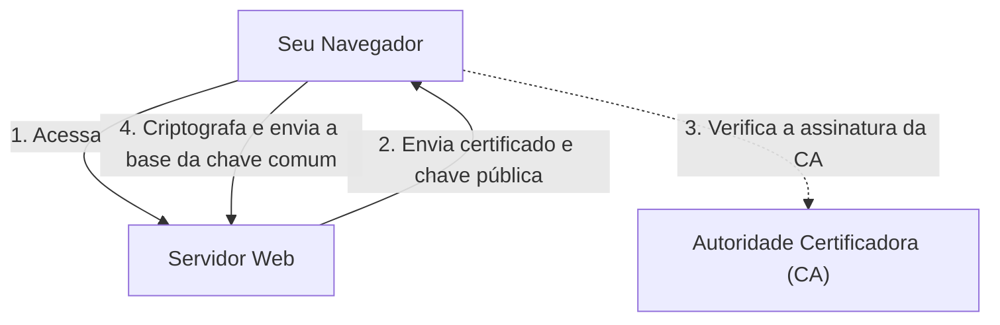

## 1. A Diferença Entre "http" e "https"

As URLs dos sites que vemos todos os dias costumavam começar com "`http://`". No entanto, atualmente, a maioria dos sites começa com "`https://`".
Este "**s (Secure)**" no final é a prova de que a tecnologia de criptografia "**SSL/TLS**" está sendo usada para proteger a comunicação na internet.

Se você inserir e enviar o número do seu cartão de crédito na Amazon enquanto ainda estiver usando "http", esses dados fluirão pela rede pública (a internet) **totalmente visíveis, como um "cartão postal"**. Se alguém interceptar a conexão em um roteador ou ponto de acesso Wi-Fi ao longo do caminho, o número do seu cartão poderá ser facilmente roubado.
Ao usar o SSL/TLS, os dados da comunicação são colocados em um "cofre" forte e enviados, de modo que é impossível decifrá-los mesmo se alguém os interceptar no meio do caminho.

## 2. Protegendo a Comunicação Contra 3 Ameaças

O SSL/TLS não apenas criptografa os dados, mas também nos protege das "3 grandes ameaças" da internet.

1. **Prevenção de Interceptação (Criptografia)**: Criptografa os dados para que o conteúdo não possa ser lido mesmo se for visto por terceiros.
2. **Prevenção de Falsificação (Autenticação de Mensagem)**: Detecta se os dados foram alterados por terceiros durante a comunicação (ex: se a conta de destino de uma transferência foi alterada).
3. **Prevenção de Falsidade Ideológica / Spoofing (Certificado do Servidor)**: Prova que o site ao qual você está conectado no momento é definitivamente a "Amazon autêntica" e não um site falso e fraudulento.

## 3. O Mecanismo de Criptografia do SSL/TLS: Sistema Híbrido

Para criptografar as comunicações, você precisa de uma "chave". No entanto, como você pode compartilhar chaves com segurança com um servidor desconhecido na internet? O SSL/TLS resolve esse problema usando um "**sistema híbrido**" que combina dois métodos de criptografia diferentes.

### ① Criptografia de Chave Pública (Entrega Segura de Chaves)
- Usa um par formado por uma "**chave pública (uma fechadura que qualquer um pode usar)**" e uma "**chave privada (uma chave mestra que apenas o servidor possui)**".
- O cliente (seu navegador) recebe a chave pública do servidor e a utiliza para criptografar a "base para a chave comum a ser usada na comunicação futura (pre-master secret)" e enviá-la ao servidor.
- Como essa criptografia só pode ser descriptografada com a chave privada do servidor, a "chave comum" pode ser compartilhada com segurança, mesmo se for roubada no caminho.
- *Desvantagem*: Os cálculos matemáticos são complexos e, se usados todas as vezes para comunicação, o processo seria muito lento.

### ② Criptografia de Chave Comum (Comunicação Real de Dados)
- Os dados são criptografados e descriptografados mutuamente usando a "**chave comum**" compartilhada com segurança no passo ①.
- *Vantagem*: Os cálculos são muito leves e rápidos, tornando-o adequado para a troca de grandes quantidades de dados (como vídeos e imagens).

Em outras palavras, **"usar a criptografia de chave pública apenas no início da comunicação para passar a chave comum com segurança e, em seguida, usar a criptografia de chave comum rápida para a comunicação real subsequente"** é como o SSL/TLS funciona.

## 4. Certificado de Servidor e Autoridade Certificadora (CA)

O que prova que a outra ponta da comunicação é "autêntica" é o "**certificado de servidor**".
Este certificado é emitido por uma entidade terceira, mundialmente confiável, chamada "**Autoridade Certificadora (CA: Certificate Authority)**".

O navegador possui uma lista integrada de Autoridades Certificadoras confiáveis (certificados raiz). Se o site que você acessar usar um "certificado de uma autoridade certificadora suspeita" ou um "certificado expirado", o navegador protegerá o usuário exibindo uma forte mensagem de aviso em uma tela vermelha dizendo "**Sua conexão não é particular**" ou "**Sua privacidade não está protegida**".

## 5. Evolução de SSL para TLS

Como curiosidade técnica, o nome oficial da tecnologia que atualmente chamamos de "SSL" é, na verdade, "**TLS (Transport Layer Security)**".
O "SSL", originalmente desenvolvido pela Netscape, teve uma vulnerabilidade fatal encontrada na versão 3.0, e seu uso já foi proibido. Como seu sucessor, a IETF padronizou o "TLS", e atualmente o TLS 1.2 e o TLS 1.3 são os mais usados.
No entanto, como o nome "SSL" se tornou tão difundido no mundo, ele continua a ser comumente chamado de "SSL/TLS" ou simplesmente "SSL" ainda hoje.

## 6. Conclusão

O SSL/TLS é a "base da confiança" na internet moderna.
Compras online, operações bancárias, mensagens em redes sociais — podemos desfrutar os benefícios da internet com segurança porque essa tecnologia avançada de criptografia trabalha incansavelmente nos bastidores 24 horas por dia.
