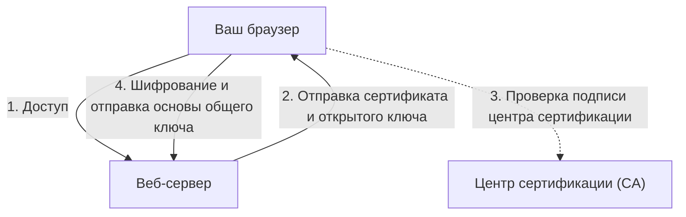

## 1. Разница между "http" и "https"

URL-адреса веб-сайтов, которые мы просматриваем каждый день, раньше начинались с `http://`. Однако сегодня большинство сайтов начинается с `https://`.
Буква **s (Secure)** в конце является доказательством того, что используется технология шифрования связи в интернете — **SSL/TLS**.

Если вы введете номер своей кредитной карты на Amazon и отправите его по протоколу "http", эти данные пройдут через общедоступную сеть интернет **подобно открытой почтовой открытке**, где всё видно с обеих сторон. Если кто-то перехватит их на промежуточном маршрутизаторе или точке доступа Wi-Fi, он сможет легко украсть номер вашей карты.
При использовании SSL/TLS передаваемые данные помещаются в прочный "сейф", поэтому даже если кто-то перехватит их по пути, расшифровать их будет невозможно.

## 2. Защита связи от трех угроз

SSL/TLS не только шифрует данные, но и защищает нас от "трех главных угроз" в интернете.

1. **Предотвращение подслушивания (шифрование)**: Шифрует данные, чтобы их содержимое оставалось непонятным, даже если его увидит третья сторона.
2. **Предотвращение подделки (аутентификация сообщений)**: Обнаруживает, не были ли данные изменены третьей стороной в процессе передачи (например, не изменен ли счет получателя перевода).
3. **Предотвращение подмены (сертификат сервера)**: Подтверждает, что сайт, к которому вы сейчас подключены, является настоящим, а не мошенническим сайтом (например, "настоящим Amazon").

## 3. Как работает шифрование SSL/TLS: Гибридный метод

Для шифрования связи необходим "ключ". Но как безопасно обменяться ключом с незнакомцем (сервером) в интернете? SSL/TLS решает эту проблему с помощью **гибридного метода**, сочетающего два различных способа шифрования.

### ① Шифрование с открытым ключом (безопасная передача ключа)
- Используется пара: **открытый ключ (замочная скважина, доступная всем)** и **закрытый ключ (уникальный ключ, который есть только у сервера)**.
- Клиент (ваш браузер) получает открытый ключ от сервера, использует его для шифрования "основы для общего ключа (pre-master secret)", который будет использоваться для связи, и отправляет его на сервер.
- Поскольку это шифрование может быть расшифровано только с помощью закрытого ключа сервера, это позволяет безопасно обменяться "общим ключом", даже если данные будут перехвачены по пути.
- *Недостаток*: Математические вычисления сложны, и если использовать их при каждой передаче, связь становится очень медленной.

### ② Шифрование с симметричным ключом (фактическая передача данных)
- Используя **общий ключ**, безопасно переданный на этапе ①, обе стороны шифруют и расшифровывают данные.
- *Преимущество*: Вычисления очень легкие и быстрые, поэтому метод подходит для обмена большими объемами данных (видео, изображения и т.д.).

Другими словами, механизм SSL/TLS заключается в том, что **на начальном этапе связи используется шифрование с открытым ключом для безопасной передачи общего ключа, а последующая фактическая связь осуществляется с использованием быстрого симметричного шифрования**.

## 4. Сертификат сервера и Центр сертификации (CA)

**Сертификат сервера** доказывает, что ваш собеседник является "подлинным".
Этот сертификат выдается доверенной во всем мире третьей стороной, называемой **Центром сертификации (CA: Certificate Authority)**.

В браузере заранее встроен список доверенных центров сертификации (корневые сертификаты). Если сайт, к которому вы обращаетесь, использует "сертификат сомнительного центра" или "сертификат с истекшим сроком действия", браузер защитит вас, отобразив ярко-красный экран с серьезным предупреждением: **Ваше подключение не защищено**.

## 5. Эволюция от SSL к TLS

Технический факт: официальное название технологии, которую мы сейчас называем "SSL", на самом деле **TLS (Transport Layer Security)**.
Оригинальная технология "SSL", разработанная компанией Netscape, имела критическую уязвимость в версии 3.0 и уже запрещена к использованию. В качестве ее преемника организация IETF стандартизировала "TLS", и в настоящее время в основном используются версии TLS 1.2 и TLS 1.3.
Однако название "SSL" настолько прочно вошло в обиход, что по привычке технологию продолжают называть "SSL/TLS" или просто "SSL".

## 6. Заключение

SSL/TLS — это "основа доверия" в современном интернете.
Мы можем безопасно наслаждаться благами интернета, такими как онлайн-покупки, интернет-банкинг и обмен сообщениями в социальных сетях, именно потому, что эта передовая технология шифрования работает в фоновом режиме 24 часа в сутки, без перерывов.
