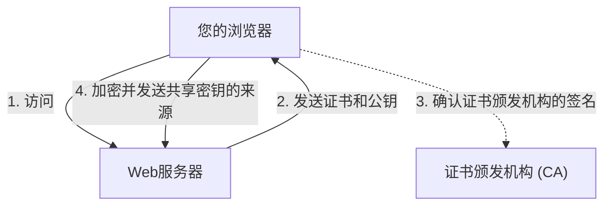

## 1. “http”与“https”的区别

我们每天浏览的Web网站的URL，曾经都是以“`http://`”开头的。但是现在，几乎所有的网站都是以“`https://`”开头。
在这个最后加上去的“ **s（Secure）** ”，正是使用了对互联网上的通信进行加密的技术“ **SSL/TLS** ”的证据。

如果是保持“http”的状态在Amazon上输入信用卡号并发送，那么该数据在互联网这个公共网络中，就会像“明信片”一样 **正反面完全暴露** 地流传。如果在途中的路由器或Wi-Fi接入点被任何人偷看，信用卡号就会被轻易盗取。
如果使用了SSL/TLS，通信数据会被放入坚固的“保险箱”中发送，因此即使在途中被任何人偷看，也无法解密。

## 2. 保护通信免受3大威胁

SSL/TLS不仅能对数据进行加密，还能保护我们免受互联网中“3大威胁”的侵害。

1. **防止窃听（加密）**: 对数据进行加密，确保即使被第三方看到也无法知道其内容。
2. **防止篡改（消息认证）**: 检测通信途中数据是否被第三方篡改（例如：汇款目标账户是否被更改）。
3. **防止伪装（服务器证书）**: 证明当前连接的网站绝对是“真正的Amazon”，而不是伪造的诈骗网站。

## 3. SSL/TLS的加密机制：混合加密方式

为了加密通信，我们需要“密钥”。但是，在互联网上，该如何与素未谋面的对方（服务器）安全地共享密钥呢？SSL/TLS通过结合2种不同的加密方式，即“ **混合加密方式** ”，解决了这个问题。

### ① 公钥加密方式（安全地传递密钥）
- 使用“ **公钥（任何人都可以使用的锁眼）** ”和“ **私钥（只有服务器才拥有的备用钥匙）** ”的密钥对。
- 客户端（您的浏览器）从服务器接收公钥，并使用它将“接下来用于通信的共享密钥的来源（预主密钥）”进行加密后发送给服务器。
- 由于这种加密只能用服务器拥有的私钥才能解密，因此即使在途中被盗，也能安全地共享“共享密钥”。
- *缺点*: 数学计算复杂，如果每次通信都使用，速度会非常慢。

### ② 对称密钥加密方式（实际的数据通信）
- 使用在①中安全共享的“ **共享密钥** ”，互相进行数据的加密与解密。
- *优点*: 计算非常轻量且快速，适合交换大量数据（如视频和图像等）。

也就是说， **“只在通信的最开始使用公钥加密来安全地传递对称密钥，之后的实际通信则使用快速的对称密钥加密”** ，这就是SSL/TLS的机制。

## 4. 服务器证书与证书颁发机构（CA）

证明通信对方是“真实”的东西，就是“ **服务器证书** ”。
这个证书，是由全球信赖的第三方机构“ **证书颁发机构（CA: Certificate Authority）** ”颁发的。

浏览器中，预先内置了可信赖的证书颁发机构的列表（根证书）。如果访问的网站使用了“可疑证书颁发机构的证书”或“已过期的证书”，浏览器就会显示出红色的画面，发出“ **您的连接不是私密连接** ”的强烈警告来保护用户。

## 5. 从SSL到TLS的进化

作为技术性的小常识，现在我们称之为“SSL”的技术，其正式名称其实是“ **TLS（Transport Layer Security）** ”。
原本由Netscape公司开发的“SSL”，在3.0版本中发现了致命的漏洞，目前已被禁止使用。作为其后继者，由IETF进行标准化的就是“TLS”，现在主流的是TLS 1.2和TLS 1.3。
但是由于“SSL”这个名字已经在世间过于深入人心，因此现在即使是惯例，人们仍然继续称其为“SSL/TLS”，或者简称为“SSL”。

## 6. 总结

SSL/TLS是现代互联网中的“信任基础”。
无论是网络购物、网上银行，还是在SNS上的消息交流，我们之所以能够安心地享受互联网的恩惠，正是因为在背后，这种高度的加密技术在24小时不休止地工作着。
