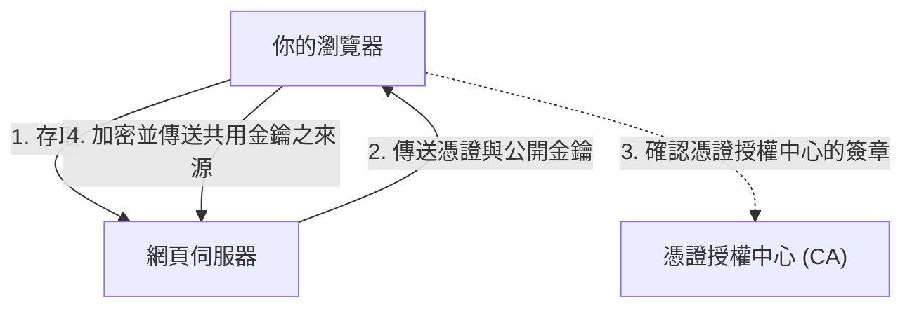

## 1. 「http」與「https」的差異

我們每天瀏覽的網站 URL，過去都是以「`http://`」開頭。但現在，大多數的網站都是以「`https://`」開頭。
這個結尾的「 **s（Secure）** 」正是網際網路通訊使用了「 **SSL/TLS** 」加密技術的證據。

如果在 Amazon 保持「http」輸入信用卡號碼並送出，該資料就會在網際網路這個公共網路上，如 **「明信片」般正反面皆被看光** 地傳遞。若在途中的路由器或 Wi-Fi 存取點被任何人偷看，卡號就會輕易被盜走。
只要使用 SSL/TLS，通訊資料就會被放進堅固的「金庫」中傳送，因此即使中途被任何人竊聽，也無法進行解密。

## 2. 抵禦 3 大威脅以保護通訊

SSL/TLS 不僅是將資料加密，還能保護我們免於網際網路中的「3 大威脅」。

1. **防止竊聽（加密）** : 將資料加密，即使被第三方看到也無法得知內容。
2. **防止竄改（訊息鑑別）** : 偵測通訊途中，資料是否遭第三方修改（例如：匯款帳戶是否被變更）。
3. **防止身分偽裝（伺服器憑證）** : 證明目前連線的網站，確實是「真正的 Amazon」，而非偽造的詐騙網站。

## 3. SSL/TLS 的加密機制：混合架構

為了加密通訊，我們需要「金鑰」。然而，在網際網路上，該如何與素未謀面的對象（伺服器）安全地共享金鑰呢？SSL/TLS 透過結合兩種不同加密方式的「 **混合架構** 」，解決了這個問題。

### ① 公開金鑰加密架構（安全傳遞金鑰）
- 使用「 **公開金鑰（任何人皆可使用的鑰匙孔）** 」與「 **私密金鑰（僅伺服器擁有的備用鑰匙）** 」配對。
- 用戶端（您的瀏覽器）會從伺服器接收公開金鑰，並利用它來將「接下來通訊要使用的共用金鑰之來源（預主密鑰）」加密，然後傳送給伺服器。
- 由於此密文只有伺服器持有的私密金鑰才能解開，因此即使途中被竊取，也能安全地共享「共用金鑰」。
- *缺點* : 數學計算複雜，每次通訊都使用的話速度會變得非常緩慢。

### ② 對稱金鑰加密架構（實際資料通訊）
- 使用在①中安全共享的「 **共用金鑰** 」，對彼此的資料進行加密與解密。
- *優點* : 計算負擔極輕且快速，因此適合處理大量資料（如影片或圖片）的傳輸。

總言之， **「只有在通訊初期使用公開金鑰加密來安全地傳遞共用金鑰，其後實際的通訊則使用快速的對稱金鑰加密」** 就是 SSL/TLS 的運作原理。

## 4. 伺服器憑證與憑證授權中心（CA）

能證明通訊對象是「本尊」的，就是「 **伺服器憑證** 」。
此憑證是由全球廣受信任的第三方機構「 **憑證授權中心（CA: Certificate Authority）** 」所核發。

瀏覽器中已事先內建了可信任憑證授權中心的清單（根憑證）。如果存取的網站使用的是「可疑憑證授權中心的憑證」或「已過期的憑證」，瀏覽器就會在鮮紅的畫面上發出「 **這個連線無法保護您的隱私** 」的強烈警告，藉此保護使用者。

## 5. 從 SSL 到 TLS 的進化

做個技術性小補充，目前我們稱為「SSL」的技術，正式名稱其實是「 **TLS（Transport Layer Security）** 」。
最初由 Netscape 公司開發的「SSL」，在 3.0 版本中被發現有致命的漏洞，目前已被禁止使用。作為其後繼者，由 IETF 標準化的便是「TLS」，現在主流使用的是 TLS 1.2 或 TLS 1.3。
然而，因為「SSL」這個名稱已深植人心，所以現在仍習慣稱之為「SSL/TLS」，或單純稱作「SSL」。

## 6. 總結

SSL/TLS 是現代網際網路中的「信任基礎」。
無論是網路購物、網路銀行，或是 SNS 上的訊息交流等，我們能安心地享受網際網路帶來的便利，全歸功於這項高度的加密技術在背後 24 小時無休地運作。
