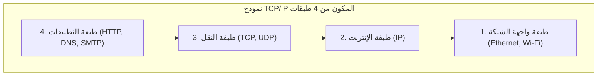

## 1. ما وراء برج بابل: حوار بين الحواسيب

في السبعينيات من القرن العشرين، كان عالم الحواسيب محكوماً بهيمنة الحواسيب الكبيرة (Mainframes). كانت كل شركة مصنعة مثل IBM و DEC و Fujitsu تطور قواعد اتصال (بروتوكولات) خاصة بها لربط حواسيبها ببعضها البعض.

لكن هذا الوضع كان أشبه بالقول: "حواسيب IBM تتحدث الإنجليزية فقط، وحواسيب DEC تتحدث الفرنسية فقط". كان ربط حواسيب من شركات مختلفة لتبادل البيانات أمراً في غاية الصعوبة من الناحية التقنية. تماماً مثل "برج بابل" الذي انهار بسبب عدم فهم اللغات، كانت شبكات الحواسيب منقسمة بجدران الشركات المصنعة.

لتحطيم هذا الجدار وتمكين جميع الحواسيب حول العالم من التحدث بلغة مشتركة، تم ابتكار **TCP/IP (Transmission Control Protocol / Internet Protocol)** ليكون بمثابة "قواعد الترجمة القياسية العالمية".

## 2. ARPANET وفلسفة حقبة الحرب الباردة

تعود أصول TCP/IP إلى **ARPANET** ، التي أنشأتها وكالة مشاريع الأبحاث المتقدمة (ARPA) التابعة لوزارة الدفاع الأمريكية.
كان ذلك في ذروة الحرب الباردة. وكضرورة عسكرية، كانت هناك حاجة إلى "شبكة يمكنها الاستمرار في الاتصال عن طريق إيجاد مسارات بديلة دون أن تتعطل بالكامل حتى لو تعرضت لهجوم نووي ودُمر جزء من شبكة الاتصالات".

كانت الإجابة على ذلك هي **طريقة تحويل الحزم (Packet Switching)** .
بدلاً من احتكار خط مخصص بين النقطتين A و B كما في شبكات الهاتف التقليدية (طريقة تحويل الدوائر)، يتم تقسيم البيانات إلى قطع صغيرة تسمى "حزم" (Packets)، ويُكتب على كل منها الوجهة، ثم تُرسل إلى شبكة الاتصالات. حتى لو تعطلت الموجهات (Routers) في الطريق، تقوم الحزم بالبحث تلقائياً عن مسار آخر للوصول إلى الهدف.

فوق شبكة تحويل الحزم هذه، صمم فينتون سيرف (Vinton Cerf) وروبرت كان (Robert Kahn) بروتوكولي TCP و IP كقواعد برمجية لضمان وصول البيانات بشكل مؤكد.

## 3. النموذج الطبقي لـ TCP/IP: تقسيم التعقيد

الشيء الرائع في TCP/IP هو أنه قسّم عملية الاتصال المعقدة للغاية إلى **أربع طبقات (Layers)** ، وجعل دور كل منها مستقلاً تماماً. يُعرف هذا باسم النموذج الطبقي لـ TCP/IP.

الطبقات العليا لا تحتاج إلى معرفة "كيف تقوم الطبقات السفلى بعملها بالتحديد".

1. **طبقة واجهة الشبكة** : دورها توصيل "الإشارات الكهربائية 0 و 1" بأي شكل إلى الجهاز المجاور باستخدام الكابلات الفيزيائية أو موجات Wi-Fi.
2. **طبقة الإنترنت (IP)** : دورها النظر إلى عنوان IP (العنوان) وإيجاد المسار للوصول إلى الوجهة النهائية من بين الشبكات في جميع أنحاء العالم، ونقل الحزم.
3. **طبقة النقل (TCP)** : دورها ضمان "دقة" البيانات من خلال إعادة ترتيب الحزم الواصلة أو طلب إعادة إرسال الحزم المفقودة.
4. **طبقة التطبيقات** : دورها تحديد التنسيق الدقيق للبيانات حسب الاستخدام، مثل متصفح الويب (HTTP) أو البريد الإلكتروني (SMTP).

بفضل هذه البنية الطبقية، حتى لو تطورت الطبقات السفلى من "الشبكة المحلية السلكية (LAN)" إلى "الألياف الضوئية" أو "هواتف الجيل الخامس (5G)"، يمكن لبرمجيات الطبقات العليا (المتصفحات والتطبيقات) أن تعمل كما هي دون الحاجة إلى إعادة كتابتها على الإطلاق.

## 4. لماذا هُزم النموذج المرجعي OSI؟

في الواقع، في الثمانينيات، كانت المنظمة الدولية للمعايير (ISO)، وهي منظمة دولية رسمية، تروج لتوحيد المعايير على المستوى الوطني لمجموعة بروتوكولات اتصال صارمة وجميلة جداً تسمى **النموذج المرجعي OSI (نموذج من 7 طبقات)** ، بمعزل عن TCP/IP.

ولكن باختصار، لم تنتشر بروتوكولات OSI في السوق، وحقق TCP/IP النصر.
كان السبب واضحاً. فبينما كان OSI "مواصفات صنعها الأكاديميون في قاعات الاجتماعات، وكانت ثقيلة ومعقدة لأنها مثالية جداً"، كان TCP/IP **مواصفات بسيطة وخفيفة، تم تشغيلها بالفعل من قبل المهندسين في الميدان وأثبتت فعاليتها العملية** ، لأنها ببساطة تعمل.

تم دمج TCP/IP كمعيار قياسي في نظام التشغيل UNIX (BSD UNIX) الذي طورته جامعة كاليفورنيا في بيركلي، وتم توزيعه مجاناً على الجامعات ومعاهد الأبحاث حول العالم. ونتيجة لذلك، رسخ TCP/IP مكانته كمعيار واقعي (De facto standard) بسرعة، حيث ساد اعتقاد بأنه "إذا أردت فقط الاتصال، فإن TCP/IP هو الأسهل والأكثر فاعلية".

## 5. مبدأ من النهاية إلى النهاية: الشبكة هي "أنبوب"

في صميم فلسفة تصميم TCP/IP، توجد فلسفة قوية تسمى **مبدأ من النهاية إلى النهاية (End-to-End Principle)** .

هذه الفلسفة تعني أن "الأجهزة الموجودة على مسار الشبكة، مثل الموجهات (Routers)، يجب أن تقوم فقط بالمهمة البسيطة المتمثلة في إعادة توجيه الحزم، بينما يجب ترك جميع العمليات المعقدة مثل تصحيح الأخطاء والتشفير للحواسيب الموجودة على أطراف (نهايات) الشبكة".

كانت شبكات الهاتف القديمة في اليابان (NTT) وغيرها عبارة عن "شبكات ذكية" حيث كان مقسم سنترال الهاتف المركزي يمتلك جميع الوظائف (الفوترة، التحكم، معالجة الأخطاء).
في المقابل، الإنترنت هو مجرد "أنبوب" وظيفته نقل البيانات فقط، والذكاء يكمن في حواسيبنا وهواتفنا الذكية المتصلة بأطرافه.

وبفضل هذا التصميم البسيط الذي يعتبر "الشبكة مجرد أنبوب"، لم يُقيَّد الإنترنت بمسؤولين محددين، وتمكن من النمو ليصبح "بنية تحتية للابتكار" حيث يمكن لأي شخص نشر تطبيقات جديدة بحرية (الويب، بث الفيديو، P2P، البلوكشين، إلخ) حول العالم بمجرد إنشائها على الأجهزة الطرفية.

## 6. الخلاصة

بدأ TCP/IP كمشروع تجريبي لربط حواسيب من شركات مصنعة مختلفة، وأصبح الآن القاعدة الأساسية للشبكة العصبية الرقمية التي تغطي المجتمع البشري.

إن سبب نجاحه ليس سوى انتصار للتصميم المعماري الجميل لأسلافنا، الذين أعطوا الأولوية لـ "البساطة وقابلية التشغيل" على المثالية، وحافظوا على خفة الشبكة نفسها عن طريق ترك المعالجة المعقدة للأجهزة الطرفية.
إن الإنترنت الحر والمفتوح الذي نتمتع به كل يوم مبني على هذه الفلسفة الخاصة بـ TCP/IP.
