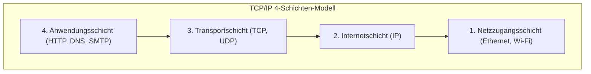

## 1. Jenseits des Turms von Babel: Der Dialog zwischen Computern

In den 1970er Jahren wurde die Computerwelt von riesigen Mainframes (Großrechnern) dominiert. Hersteller wie IBM, DEC und Fujitsu entwickelten jeweils eigene Kommunikationsregeln (Protokolle), um ihre eigenen Computer miteinander zu verbinden.

Dies führte jedoch zu einer Situation, in der "der IBM-Computer nur Englisch und der DEC-Computer nur Französisch sprach". Es war technisch extrem schwierig, Computer verschiedener Hersteller miteinander zu verbinden und Daten auszutauschen. Wie ein eingestürzter "Turm von Babel", in dem sich niemand mehr verständigen konnte, war das Computernetzwerk durch die Mauern der Hersteller fragmentiert.

Um diese Mauer zu durchbrechen und eine "globale Übersetzungsregel" zu schaffen, durch die alle Computer weltweit in einer gemeinsamen Sprache kommunizieren konnten, wurde **TCP/IP (Transmission Control Protocol / Internet Protocol)** entwickelt.

## 2. ARPANET und die Philosophie des Kalten Krieges

Die Ursprünge von TCP/IP gehen auf das **ARPANET** zurück, das von der Advanced Research Projects Agency (ARPA) des US-Verteidigungsministeriums aufgebaut wurde.
Damals befand man sich mitten im Kalten Krieg. Eine militärische Anforderung war ein Netzwerk, das "selbst bei der Zerstörung eines Teils des Kommunikationsnetzes durch einen nuklearen Angriff nicht vollständig ausfällt, sondern die Kommunikation über Umwege aufrechterhalten kann".

Die Antwort darauf war die **Paketvermittlung**.
Anders als beim traditionellen Telefonnetz (Leitungsvermittlung), bei dem Punkt A und Punkt B eine exklusive Leitung belegen, werden die Daten in kleine Päckchen ("Pakete") aufgeteilt, jeweils mit einer Zieladresse versehen und in das Netzwerk eingespeist. Selbst wenn ein Router (eine Kreuzung) auf dem Weg ausfällt, suchen sich die Pakete automatisch einen anderen Weg zum Ziel.

Als softwareseitige Regel, um die zuverlässige Zustellung von Daten über dieses paketvermittelte Netzwerk zu gewährleisten, wurden TCP und IP von Vinton Cerf und Robert Kahn entworfen.

## 3. Das TCP/IP-Schichtenmodell: Komplexität aufteilen

Das Geniale an TCP/IP ist, dass es den extrem komplexen Prozess der Kommunikation in **vier Schichten (Layer)** unterteilt und die Rolle jeder Schicht völlig unabhängig macht. Dies wird als TCP/IP-Schichtenmodell bezeichnet.

Die oberen Schichten müssen nicht wissen, "wie genau" die unteren Schichten ihre Arbeit verrichten.

1. **Netzzugangsschicht**: Die Aufgabe besteht darin, "elektrische Signale aus 0 und 1" über physische Kabel oder Wi-Fi-Funkwellen an das benachbarte Gerät zu senden.
2. **Internetschicht (IP)**: Die Aufgabe besteht darin, anhand der IP-Adresse (Adresse) die Route (den [Pfad](/de/p/windows-%E3%81%A7pfad%E3%81%AE%E9%80%9A%E3%81%A3%E3%81%9Fausf%C3%BChrbare-datei%E3%81%AE%E5%A0%B4%E6%89%80%E3%82%92%E8%A6%8B%E3%81%A4%E3%81%91%E3%82%8B%E6%96%B9%E6%B3%95/)) zum endgültigen Ziel im weltweiten Netzwerk zu finden und die Pakete zu transportieren.
3. **Transportschicht (TCP)**: Die Aufgabe besteht darin, den Daten "Genauigkeit" zu garantieren, indem empfangene Pakete neu geordnet oder verlorene Pakete erneut angefordert werden.
4. **Anwendungsschicht**: Die Aufgabe besteht darin, das spezifische Datenformat entsprechend der Anwendung festzulegen, wie z. B. für Webbrowser (HTTP) oder E-Mail (SMTP).

Dank dieser hierarchischen Struktur kann die Software der oberen Schichten (Browser oder Apps) völlig unverändert weiterlaufen, selbst wenn sich die unteren Schichten von "Kabelgebundenem LAN" zu "Glasfaser" oder "5G-Smartphones" weiterentwickeln.

## 4. Warum ist das OSI-Referenzmodell gescheitert?

In den 1980er Jahren förderte die Internationale Organisation für Normung (ISO), eine offizielle internationale Einrichtung, auf nationaler Ebene die Standardisierung einer sehr strengen und eleganten Kommunikationsprotokoll-Suite namens **OSI-Referenzmodell (7-Schichten-Modell)**, unabhängig von TCP/IP.

Das Fazit vorweg: Die OSI-Protokolle setzten sich auf dem Markt nicht durch, und TCP/IP ging als Sieger hervor.
Der Grund war klar: Während OSI eine "von Wissenschaftlern im Konferenzraum entworfene Spezifikation war, die zu perfekt und daher komplex und schwerfällig war", war TCP/IP eine "**einfache und ressourcenschonende Spezifikation, die bereits von Ingenieuren in der Praxis eingesetzt wurde und deren Praxistauglichkeit bewiesen war**".

TCP/IP wurde standardmäßig in das von der University of California, Berkeley, entwickelte UNIX-Betriebssystem (BSD UNIX) integriert und kostenlos an Universitäten und Forschungsinstitute weltweit verteilt. Dadurch etablierte es sich schnell als De-facto-Standard nach dem Motto: "Wenn man sich einfach nur verbinden will, ist TCP/IP am einfachsten und funktioniert."

## 5. Das Ende-zu-Ende-Prinzip: Das Netzwerk ist ein "dummes Rohr"

Dem Design von TCP/IP liegt eine starke Philosophie zugrunde: das **Ende-zu-Ende-Prinzip (End-to-End Principle)**.

Diese Philosophie besagt, dass "Geräte wie Router auf dem Weg des Netzwerks nur die einfache Aufgabe der Paketweiterleitung übernehmen sollten, während komplexe Verarbeitungen wie Fehlerkorrektur und Verschlüsselung vollständig den Computern an den Enden des Netzwerks überlassen werden sollten".

Ältere Telefonnetze (wie das japanische NTT-Netz) waren "intelligente Netzwerke", in denen die Vermittlungsstellen in den zentralen Telefonämtern alle Funktionen (Abrechnung, Steuerung, Fehlerbehandlung) innehatten.
Das Internet hingegen ist nur ein "dummes Rohr" (Dumb Pipe), das Daten transportiert, während die Intelligenz in unseren PCs und Smartphones an den Enden liegt.

Gerade wegen dieses einfachen Designs, bei dem "das Netzwerk nur ein Rohr ist", konnte das Internet zu einer "Infrastruktur für Innovationen" heranwachsen, in der jeder neue Anwendungen (Web, Videostreaming, P2P, [Blockchain](/de/p/blockchain-technology-smart-contract-distributed-ledger/) usw.) auf Endgeräten entwickeln und weltweit bereitstellen kann, ohne an bestimmte Administratoren gebunden zu sein.

## 6. Zusammenfassung

TCP/IP, das als experimentelles Projekt zur Verbindung von Computern verschiedener Hersteller begann, ist heute die grundlegende Regel für das digitale Nervennetz, das die menschliche Gesellschaft umspannt.

Der Grund für diesen Erfolg liegt im Sieg des eleganten Architekturdesigns der Pioniere, die "Einfachheit und Funktionalität" über Perfektion stellten, die komplexe Verarbeitung den Endgeräten überließen und das Netzwerk selbst schlank hielten.
Das freie und offene Internet, das wir heute genießen, basiert auf dieser TCP/IP-Philosophie.
