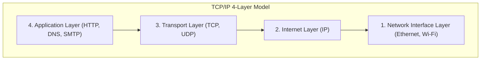

## 1. Beyond the Tower of Babel: Dialogue Between Computers

In the computer world of the 1970s, giant mainframes (large-scale computers) reigned supreme. Manufacturers like IBM, DEC, and Fujitsu each developed their own communication rules (protocols) to connect their own computers.

However, this situation was akin to saying, "IBM computers only speak English, and DEC computers only speak French." Connecting computers from different manufacturers to exchange data was technically extremely difficult. Like the collapsed "Tower of Babel" where people could not understand each other's languages, computer networks were divided by the walls of manufacturers.

To break down these walls and allow all computers worldwide to converse in a common language, **TCP/IP (Transmission Control Protocol / Internet Protocol)** was created as the "global standard translation rules."

## 2. ARPANET and Cold War Era Philosophy

The origins of TCP/IP trace back to "**ARPANET**," built by the Advanced Research Projects Agency (ARPA) of the US Department of Defense.
It was the middle of the Cold War. As a military requirement, there was a demand for "a network that would not completely go down even if part of the communication network was destroyed by a nuclear attack, but could detour and continue communication."

The answer to this was the "**packet switching method**."
Unlike traditional telephone networks (circuit switching method) where a single dedicated line is occupied between point A and point B, this method divides data into small parcels called "packets," writes the destination on each, and throws them into the mesh of the network. Even if an intermediate router (intersection) is broken, the packets automatically find another path and head toward the goal.

To ensure data is reliably delivered over this packet-switched network, Vinton Cerf and Robert Kahn designed TCP and IP as software-based rules.

## 3. The TCP/IP Layer Model: Dividing Complexity

The brilliance of TCP/IP lies in dividing the extremely complex process of communication into "**4 layers**," making the role of each completely independent. This is called the TCP/IP layer model.

The upper layers do not need to know "exactly how the lower layers are doing their job."

1. **Network Interface Layer**: The role of delivering "electrical signals of 0s and 1s" to the neighboring device anyway, using physical cables or Wi-Fi radio waves.
2. **Internet Layer (IP)**: The role of looking at the IP address (address), finding the route (path) from the global network to the final destination, and carrying the packet.
3. **Transport Layer (TCP)**: The role of guaranteeing the "accuracy" of the data by rearranging the order of the received packets or requesting the retransmission of lost packets.
4. **Application Layer**: The role of determining the specific data format tailored to the purpose, such as a web browser (HTTP) or email (SMTP).

Thanks to this hierarchical structure, even if the lower layer evolves from "Wired LAN" to "Optical Fiber" or "5G Smartphone," the software in the upper layer (browsers and apps) can be run exactly as is without having to be rewritten at all.

## 4. Why Did the OSI Reference Model Lose?

Actually, in the 1980s, an official international organization called the International Organization for Standardization (ISO) was pushing on a national scale to standardize a very strict and beautiful set of communication protocols called the "**OSI Reference Model (7-Layer Model)**," separate from TCP/IP.

However, to get to the conclusion, the OSI protocols did not become popular in the market, and TCP/IP emerged victorious.
The reason was clear. While OSI was "a specification created by scholars in a conference room, which was heavy and complex because it was too perfect," TCP/IP was "**a simple and lightweight specification that field engineers were already running and whose practicality had been proven**."

TCP/IP was built as a standard into the UNIX OS (BSD UNIX) developed by the University of California, Berkeley, and was distributed free of charge to universities and research institutes around the world. Because of this, it quickly established its position as the de facto standard, based on the fact that "if you just want to connect, TCP/IP is the easiest and works."

## 5. The End-to-End Principle: The Network is a "Dumb Pipe"

At the root of the TCP/IP design philosophy is a powerful philosophy called the "**End-to-End Principle**."

This is the idea that "equipment such as routers on the network path should only perform the simple job of forwarding packets, and complex processing such as error correction and encryption should all be left to the computers at the ends of the network."

Japan's old telephone network (NTT) and others were "smart networks" where the central telephone exchange held all the functions (billing, control, error handling).
On the other hand, the Internet is just a "dumb pipe" (clay pipe) that simply carries data, and the smart ones are our PCs and smartphones connected to its ends.

Because of this simple design that "the network side is just a dumb pipe," the Internet was not tied down by a specific administrator, and anyone could freely create new applications (Web, video streaming, P2P, blockchain, etc.) on the end terminals and deploy them worldwide, growing into an "infrastructure of innovation."

## 6. Conclusion

TCP/IP, which started as an experimental project to connect computers from different manufacturers, has now become the fundamental rule of the digital nervous system covering human society.

The reason for its success is nothing other than the victory of the beautiful architecture design by our predecessors, who prioritized "simple and working" over perfection and kept the network itself lightweight by leaving complex processing to the terminals.
The free and open Internet we enjoy every day is built upon this philosophy of TCP/IP.
