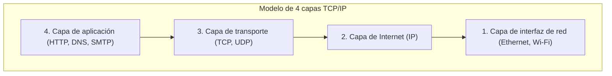

## 1. Más allá de la Torre de Babel: El diálogo entre ordenadores

En la década de 1970, el mundo de la informática estaba dominado por los gigantescos *mainframes* (grandes ordenadores). Los fabricantes como IBM, DEC y Fujitsu desarrollaban sus propias reglas de comunicación (protocolos) para conectar sus propios ordenadores.

Sin embargo, esto creaba una situación en la que «los ordenadores de IBM solo hablaban inglés y los de DEC solo hablaban francés». Conectar ordenadores de distintos fabricantes para intercambiar datos era técnicamente muy difícil. Como una «Torre de Babel» colapsada por la incomprensión de los idiomas, la red de ordenadores estaba fragmentada por las barreras de los fabricantes.

El **TCP/IP (Transmission Control Protocol / Internet Protocol)** se creó como las «reglas de traducción del estándar mundial» para romper este muro y permitir que cualquier ordenador del mundo pudiera conversar en un idioma común.

## 2. ARPANET y la ideología de la Guerra Fría

El origen del TCP/IP se remonta a **ARPANET**, construida por la Agencia de Proyectos de Investigación Avanzados (ARPA) del Departamento de Defensa de los Estados Unidos.
Era plena Guerra Fría. Había una necesidad militar de «una red que, incluso si parte de su red de comunicaciones fuera destruida por un ataque nuclear, no se cayera en su totalidad y pudiera continuar comunicándose tomando rutas alternativas».

La respuesta a esto fue el **sistema de conmutación de paquetes**.
A diferencia de la red telefónica tradicional (sistema de conmutación de circuitos), que ocupaba una línea dedicada entre un punto A y un punto B, este método divide los datos en pequeños paquetes, escribe el destino en cada uno y los lanza a la malla de la red. Incluso si un enrutador (una intersección) en el camino está dañado, los paquetes buscan automáticamente otro camino hacia su objetivo.

Sobre esta red de conmutación de paquetes, Vinton Cerf y Robert Kahn diseñaron TCP e IP como las reglas de software para garantizar que los datos se entregaran de manera segura.

## 3. El modelo de capas TCP/IP: Dividiendo la complejidad

Lo maravilloso del TCP/IP es que divide el complejo proceso de comunicación en **4 capas (niveles)** y hace que las funciones de cada una sean completamente independientes. A esto se le llama el modelo de capas TCP/IP.

Las capas superiores no necesitan saber «cómo están trabajando concretamente» las capas inferiores.

1. **Capa de interfaz de red**: Su función es enviar, de todos modos, las «señales eléctricas de 0 y 1» al dispositivo adyacente utilizando cables físicos u ondas de radio Wi-Fi.
2. **Capa de Internet (IP)**: Su función es mirar la dirección IP (la ubicación) para encontrar la ruta (el camino) hacia el destino final dentro de la red mundial y transportar los paquetes.
3. **Capa de transporte (TCP)**: Su función es garantizar la «precisión» de los datos ordenando los paquetes recibidos o solicitando el reenvío de paquetes perdidos.
4. **Capa de aplicación**: Su función es determinar el formato específico de los datos adaptado al uso, como un navegador web (HTTP) o un correo electrónico (SMTP).

Gracias a esta estructura de capas, aunque las capas inferiores evolucionen de una «LAN por cable» a «fibra óptica» o un «smartphone 5G», el software de las capas superiores (navegadores y aplicaciones) puede seguir funcionando tal cual, sin necesidad de reescribirse en absoluto.

## 4. ¿Por qué perdió el modelo de referencia OSI?

En realidad, en la década de 1980, la Organización Internacional de Normalización (ISO), una institución internacional oficial, estaba promoviendo a escala nacional la estandarización del **Modelo de referencia OSI (modelo de 7 capas)**, un conjunto de protocolos de comunicación sumamente riguroso y elegante, independientemente del TCP/IP.

Sin embargo, en conclusión, los protocolos OSI no se popularizaron en el mercado y el TCP/IP se alzó con la victoria.
La razón era clara. Mientras que OSI era una «especificación pesada y compleja porque era demasiado perfecta, creada por académicos en salas de conferencias», el TCP/IP era una «**especificación simple y ligera que ya estaba siendo utilizada por ingenieros en el campo de trabajo y cuya practicidad estaba demostrada**».

El TCP/IP se incluyó de forma predeterminada en el sistema operativo UNIX (BSD UNIX) desarrollado por la Universidad de California en Berkeley, y se distribuyó gratuitamente a universidades e institutos de investigación de todo el mundo. Esto estableció de un plumazo su estatus como el estándar de facto, basándose en la idea de que «si solo quieres conectarte, el TCP/IP es el que funciona de manera más sencilla».

## 5. El principio de extremo a extremo: La red es una «tubería»

En la base de la filosofía de diseño del TCP/IP se encuentra una poderosa ideología llamada **principio de extremo a extremo (End-to-End Principle)**.

Esta es la idea de que «los dispositivos como los enrutadores en la ruta de la red solo deben realizar el simple trabajo de reenviar paquetes, y todos los procesos complejos, como la corrección de errores y el cifrado, deben dejarse en manos de los ordenadores que se encuentran en los extremos de la red».

Las antiguas redes telefónicas, como la de Japón (NTT), eran «redes inteligentes» en las que la centralita de la oficina telefónica central albergaba todas las funciones (facturación, control, procesamiento de errores).
Por otro lado, Internet es simplemente una «tubería» que transporta datos, y los que son inteligentes son nuestros ordenadores o teléfonos inteligentes conectados a sus extremos.

Precisamente por tener este diseño simple donde «el lado de la red es solo una tubería», Internet no se limitó a administradores específicos, sino que se convirtió en una «infraestructura de innovación» que cualquier persona podía implementar en todo el mundo simplemente creando nuevas aplicaciones (Web, transmisión de video, P2P, blockchain, etc.) en los dispositivos terminales.

## 6. Conclusión

El TCP/IP, que comenzó como un proyecto experimental para conectar ordenadores de distintos fabricantes, se ha convertido hoy en la regla fundamental de la red neuronal digital que envuelve a la sociedad humana.

La razón de su éxito no es otra que la victoria del elegante diseño de la arquitectura de nuestros predecesores, que priorizaron el «ser simple y funcionar» sobre la perfección, y mantuvieron la red en sí ligera al delegar el procesamiento complejo a los dispositivos terminales.
El Internet libre y abierto del que disfrutamos a diario se asienta sobre esta filosofía del TCP/IP.
