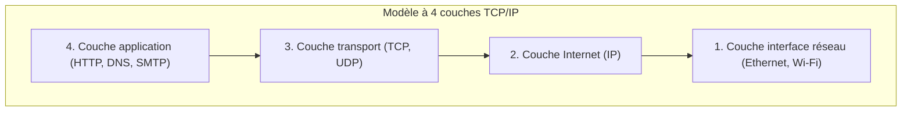

## 1. Au-delà de la tour de Babel : le dialogue entre les ordinateurs

Dans le monde de l'informatique des années 1970, c'était l'ère où d'énormes mainframes (gros ordinateurs) détenaient l'hégémonie. Chaque fabricant, tel qu'IBM, DEC ou Fujitsu, développait ses propres règles de communication (protocoles) pour connecter ses propres ordinateurs.

Cependant, c'était une situation comparable à : « Les ordinateurs d'IBM ne peuvent parler que l'anglais, et les ordinateurs de DEC ne peuvent parler que le français ». Il était techniquement extrêmement difficile de connecter des ordinateurs de différents fabricants pour échanger des données. Tout comme la « tour de Babel » qui s'est effondrée en raison de l'incompréhension des langues, le réseau informatique était divisé par les barrières des fabricants.

C'est pour abattre ce mur et créer une « règle de traduction standard mondiale » permettant à tous les ordinateurs du monde entier de communiquer dans une langue commune qu'a été créé **TCP/IP (Transmission Control Protocol / Internet Protocol)**.

## 2. L'ARPANET et l'idéologie de la guerre froide

Les origines de TCP/IP remontent à l'« **ARPANET** » construit par l'Agence pour les projets de recherche avancée (ARPA) du département de la Défense des États-Unis.
C'était en pleine guerre froide. En tant qu'exigence militaire, on recherchait « un réseau capable de continuer à communiquer en contournant la panne même si une partie du réseau de communication est détruite par une attaque nucléaire, sans que l'ensemble du système ne tombe en panne ».

La réponse à cela a été la « **commutation de paquets** ».
Contrairement aux réseaux téléphoniques traditionnels (commutation de circuits) qui occupaient une ligne dédiée entre un point A et un point B, cette méthode divise les données en petits colis appelés « paquets », écrit la destination sur chacun d'eux et les jette dans les mailles du réseau. Même si un routeur (intersection) en chemin est détruit, le paquet cherche automatiquement un autre chemin vers l'objectif.

Sur ce réseau à commutation de paquets, TCP et IP ont été conçus par Vinton Cerf et Robert Kahn en tant que règles logicielles permettant de garantir la livraison des données.

## 3. Le modèle en couches de TCP/IP : diviser la complexité

Le point merveilleux de TCP/IP est d'avoir divisé le processus extrêmement complexe de communication en « **4 couches (layers)** », et d'avoir rendu le rôle de chacune complètement indépendant. C'est ce qu'on appelle le modèle en couches TCP/IP.

Les couches supérieures n'ont pas besoin de savoir « comment les couches inférieures font concrètement leur travail ».

1. **Couche interface réseau** : Son rôle est de livrer de toute façon des « signaux électriques de 0 et de 1 » à l'appareil voisin en utilisant des câbles physiques ou des ondes Wi-Fi.
2. **Couche Internet (IP)** : Son rôle est de regarder l'adresse IP (domicile), de trouver la route (le chemin) parmi les réseaux du monde entier jusqu'à la destination finale, et de transporter les paquets.
3. **Couche transport (TCP)** : Son rôle est de garantir « l'exactitude » des données en réorganisant l'ordre des paquets reçus ou en demandant la retransmission des paquets perdus.
4. **Couche application** : Son rôle est de déterminer le format concret des données en fonction de l'utilisation, comme un navigateur Web (HTTP) ou un e-mail (SMTP).

Grâce à cette structure hiérarchique, même si la couche inférieure évolue d'un « réseau local filaire (LAN) » à la « fibre optique » ou au « smartphone 5G », les logiciels de la couche supérieure (navigateurs et applications) peuvent fonctionner tels quels sans être réécrits du tout.

## 4. Pourquoi le modèle de référence OSI a-t-il échoué ?

En fait, dans les années 1980, une organisation internationale officielle appelée l'Organisation internationale de normalisation (ISO) promouvait à l'échelle nationale la normalisation d'un groupe de protocoles de communication très stricts et beaux appelé « **modèle de référence OSI (modèle à 7 couches)** », indépendamment de TCP/IP.

Cependant, pour en venir à la conclusion, le protocole OSI ne s'est pas imposé sur le marché et TCP/IP a remporté la victoire.
La raison était claire. OSI était « une spécification complexe et lourde créée par des universitaires dans des salles de conférence, trop parfaite », tandis que TCP/IP était « **une spécification simple et légère déjà utilisée par des ingénieurs sur le terrain et dont l'aspect pratique avait été prouvé** ».

TCP/IP a été intégré en standard dans le système d'exploitation UNIX (BSD UNIX) développé par l'Université de Californie à Berkeley, et a été distribué gratuitement aux universités et instituts de recherche du monde entier. Cela a immédiatement établi sa position de norme de fait (de facto standard) du fait que « si vous voulez juste vous connecter, TCP/IP est ce qu'il y a de plus facile et ça marche ».

## 5. Le principe de bout en bout : le réseau est un « tuyau »

À la base de la philosophie de conception de TCP/IP, il y a une philosophie puissante appelée « **principe de bout en bout (End-to-End Principle)** ».

C'est l'idée que « les équipements tels que les routeurs sur le chemin du réseau ne devraient effectuer que la tâche simple de transférer les paquets, et les traitements complexes tels que la correction d'erreurs et le chiffrement devraient tous être laissés aux ordinateurs situés aux extrémités (bouts) du réseau ».

L'ancien réseau téléphonique du Japon (NTT), par exemple, était un « réseau intelligent » où les commutateurs du bureau central de téléphonie possédaient toutes les fonctions (facturation, contrôle, traitement des erreurs).
D'autre part, Internet est simplement un « tuyau » qui transporte des données, et ce qui est intelligent, ce sont nos ordinateurs et nos smartphones qui y sont connectés à ses extrémités.

C'est précisément parce qu'il s'agissait d'une conception simple où « le côté réseau n'est qu'un tuyau », qu'Internet a pu devenir une « infrastructure d'innovation » qui n'est pas liée à des administrateurs spécifiques, et où n'importe qui peut librement déployer de nouvelles applications (Web, streaming vidéo, P2P, blockchain, etc.) dans le monde entier simplement en les créant sur les terminaux finaux.

## 6. Résumé

Commencé comme un projet expérimental pour connecter des ordinateurs de différents fabricants, TCP/IP est maintenant devenu la règle fondamentale du réseau neuronal numérique qui couvre la société humaine.

La raison de son succès n'est autre que la victoire de la belle conception architecturale de nos prédécesseurs, qui ont privilégié le fait d'être « simple et fonctionnel » plutôt que la perfection, et ont gardé le réseau lui-même léger en confiant les traitements complexes aux terminaux.
L'Internet libre et ouvert dont nous profitons chaque jour repose sur cette philosophie de TCP/IP.
