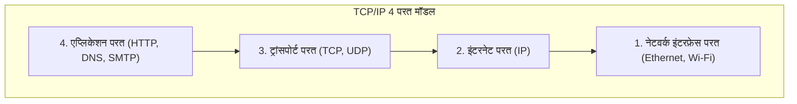

## 1. बेबल की मीनार के पार: कंप्यूटरों के बीच संवाद

1970 के दशक की कंप्यूटर दुनिया विशाल मेनफ्रेम (बड़े कंप्यूटर) के वर्चस्व का युग था। IBM, DEC और Fujitsu जैसे प्रत्येक निर्माता ने अपने स्वयं के कंप्यूटरों को जोड़ने के लिए अपने स्वयं के संचार नियम (प्रोटोकॉल) विकसित किए थे।

हालाँकि, यह एक ऐसी स्थिति थी जहाँ "IBM के कंप्यूटर केवल अंग्रेज़ी बोल सकते थे, और DEC के कंप्यूटर केवल फ्रेंच बोल सकते थे।" विभिन्न निर्माताओं के कंप्यूटरों को जोड़ना और डेटा का आदान-प्रदान करना तकनीकी रूप से अत्यंत कठिन था। एक ढही हुई "बेबल की मीनार" की तरह जहाँ भाषा समझ में नहीं आती थी, कंप्यूटर नेटवर्क निर्माताओं की दीवारों से विभाजित था।

इस दीवार को तोड़ने और दुनिया भर के सभी कंप्यूटरों को एक सामान्य भाषा में बातचीत करने में सक्षम बनाने के लिए "विश्व मानक अनुवाद नियम" के रूप में जो बनाया गया था, वह **TCP/IP (Transmission Control Protocol / Internet Protocol)** है।

## 2. ARPANET और शीत युद्ध युग की विचारधारा

TCP/IP की उत्पत्ति का पता अमेरिकी रक्षा विभाग की उन्नत अनुसंधान परियोजना एजेंसी (ARPA) द्वारा निर्मित "**ARPANET**" से लगाया जा सकता है।
यह शीत युद्ध का मध्य था। एक सैन्य आवश्यकता के रूप में, एक ऐसे नेटवर्क की मांग थी "जो परमाणु हमले में संचार नेटवर्क का एक हिस्सा नष्ट होने पर भी, पूरे नेटवर्क को डाउन किए बिना दूसरे रास्ते से संचार जारी रख सके"।

इसका उत्तर "**पैकेट स्विचिंग प्रणाली**" था।
पारंपरिक टेलीफोन नेटवर्क (सर्किट स्विचिंग प्रणाली) की तरह बिंदु A और बिंदु B को एक समर्पित लाइन से घेरने के बजाय, यह डेटा को "पैकेट" नामक छोटे टुकड़ों में विभाजित करने, प्रत्येक पर गंतव्य लिखने और उन्हें नेटवर्क के जाल में फेंकने की एक विधि है। यदि रास्ते में कोई राउटर (चौराहा) टूट जाता है, तो पैकेट स्वचालित रूप से एक अलग रास्ता खोजेगा और लक्ष्य की ओर जाएगा।

इस पैकेट स्विचिंग नेटवर्क पर डेटा को सुरक्षित रूप से वितरित करने के लिए सॉफ़्टवेयर नियमों के रूप में विंटन सेर्फ़ और रॉबर्ट कान द्वारा TCP और IP को डिज़ाइन किया गया था।

## 3. TCP/IP का पदानुक्रमित मॉडल: जटिलता को विभाजित करना

TCP/IP के बारे में आश्चर्यजनक बात यह है कि इसने संचार की अत्यंत जटिल प्रक्रिया को "**4 परतों (लेयर्स)**" में विभाजित किया और प्रत्येक की भूमिका को पूरी तरह से स्वतंत्र कर दिया। इसे TCP/IP पदानुक्रमित मॉडल कहा जाता है।

ऊपरी परतों को यह जानने की आवश्यकता नहीं है कि "निचली परतें विशेष रूप से कैसे काम कर रही हैं"।

1. **नेटवर्क इंटरफ़ेस परत**: भौतिक केबलों या Wi-Fi रेडियो तरंगों का उपयोग करके, कम से कम "0 और 1 के विद्युत संकेतों" को आसन्न उपकरणों तक पहुँचाने की भूमिका।
2. **इंटरनेट परत (IP)**: IP पते (address) को देखकर दुनिया भर के नेटवर्क से अंतिम गंतव्य तक मार्ग (रूट) खोजने और पैकेट वितरित करने की भूमिका।
3. **ट्रांसपोर्ट परत (TCP)**: प्राप्त पैकेटों के क्रम को पुनर्व्यवस्थित करके और खोए हुए पैकेटों के पुन: प्रसारण का अनुरोध करके डेटा की "सटीकता" की गारंटी देने की भूमिका।
4. **एप्लिकेशन परत**: वेब ब्राउज़र (HTTP) और ईमेल (SMTP) जैसे उपयोग के आधार पर विशिष्ट डेटा स्वरूप निर्धारित करने की भूमिका।

इस पदानुक्रमित संरचना के लिए धन्यवाद, भले ही निचली परत "वायर्ड LAN" से "ऑप्टिकल फाइबर" या "5G स्मार्टफोन" में विकसित हो, ऊपरी परत के सॉफ़्टवेयर (ब्राउज़र और ऐप) को बिना किसी पुनर्लेखन के वैसे ही चलाया जा सकता है।

## 4. OSI संदर्भ मॉडल की हार क्यों हुई?

वास्तव में, 1980 के दशक में, अंतर्राष्ट्रीय मानकीकरण संगठन (ISO) नामक एक आधिकारिक अंतर्राष्ट्रीय संगठन ने राष्ट्रीय स्तर पर TCP/IP से अलग, संचार प्रोटोकॉल के एक बहुत ही सख्त और सुंदर समूह, "**OSI संदर्भ मॉडल (7 परत मॉडल)**" को मानकीकृत करने के लिए जोर दिया था।

हालाँकि, निष्कर्ष के तौर पर, OSI प्रोटोकॉल बाज़ार में लोकप्रिय नहीं हो पाया, और TCP/IP विजयी हुआ।
कारण स्पष्ट था। जबकि OSI "सम्मेलन कक्ष में विद्वानों द्वारा बनाया गया था, एक विनिर्देश जो बहुत ही परिपूर्ण होने के कारण जटिल और भारी था," TCP/IP "**एक सरल और हल्का विनिर्देश था जो पहले ही ऑन-साइट इंजीनियरों द्वारा चलाया जा चुका था और इसकी व्यावहारिकता सिद्ध हो चुकी थी**"।

TCP/IP को कैलिफोर्निया विश्वविद्यालय, बर्कले द्वारा विकसित UNIX OS (BSD UNIX) में एक मानक के रूप में बनाया गया था, और दुनिया भर के विश्वविद्यालयों और अनुसंधान संस्थानों को निःशुल्क वितरित किया गया था। परिणामस्वरूप, इसने तुरंत एक वास्तविक मानक (de facto standard) की स्थिति स्थापित कर ली कि "यदि आप बस कनेक्ट करना चाहते हैं, तो TCP/IP सबसे आसान है और काम करता है"।

## 5. एंड-टू-एंड का सिद्धांत: नेटवर्क एक "पाइप" है

TCP/IP के डिज़ाइन दर्शन के मूल में, "**एंड-टू-एंड का सिद्धांत (End-to-End Principle)**" नामक एक शक्तिशाली दर्शन है।

यह एक विचारधारा है कि "नेटवर्क पथ पर राउटर जैसे उपकरणों को केवल पैकेट अग्रेषित (फ़ॉरवर्ड) करने का सरल कार्य करना चाहिए, और त्रुटियों को ठीक करने और एन्क्रिप्शन जैसी जटिल प्रक्रियाओं को नेटवर्क के छोर (एंड) पर मौजूद कंप्यूटरों पर छोड़ दिया जाना चाहिए"।

जापान का पुराना टेलीफोन नेटवर्क (NTT) आदि एक "स्मार्ट नेटवर्क" था जहाँ केंद्रीय टेलीफोन एक्सचेंज में सभी कार्य (बिलिंग, नियंत्रण, त्रुटि प्रबंधन) होते थे।
दूसरी ओर, इंटरनेट केवल डेटा ले जाने वाला एक "डंब पाइप (पाइप)" है, और जो स्मार्ट हैं वे हमारे कंप्यूटर और स्मार्टफोन हैं जो इसके सिरों से जुड़े हैं।

ठीक इसी सरल डिज़ाइन के कारण कि "नेटवर्क पक्ष केवल एक पाइप है", इंटरनेट एक "नवाचार के बुनियादी ढांचे" में विकसित होने में सक्षम था जहाँ कोई भी इसे किसी विशिष्ट व्यवस्थापक से बंधे बिना, केवल छोर (एंड) के उपकरणों पर नए एप्लिकेशन (वेब, वीडियो स्ट्रीमिंग, P2P, ब्लॉकचेन, आदि) बनाकर दुनिया भर में स्वतंत्र रूप से तैनात कर सकता है।

## 6. निष्कर्ष

विभिन्न निर्माताओं के कंप्यूटरों को जोड़ने के लिए एक प्रायोगिक परियोजना के रूप में शुरू हुआ TCP/IP, अब मानव समाज को कवर करने वाले डिजिटल तंत्रिका नेटवर्क का बुनियादी नियम बन गया है।

इसकी सफलता का कारण हमारे पूर्वजों के सुंदर वास्तुकला डिजाइन की जीत से कम नहीं है, जिन्होंने पूर्णता के बजाय "सरल और काम करने वाली चीजों" को प्राथमिकता दी, और जटिल प्रसंस्करण को उपकरणों पर छोड़ दिया और नेटवर्क को हल्का रखा।
मुक्त और खुला इंटरनेट जिसका हम हर दिन आनंद लेते हैं, वह TCP/IP के इसी दर्शन पर बना है।
