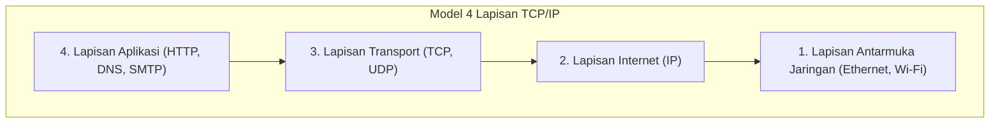

## 1. Melampaui Menara Babel: Dialog Antarkomputer

Pada tahun 1970-an, dunia komputer berada di era di mana mainframe raksasa (komputer skala besar) memegang supremasi. Produsen seperti IBM, DEC, dan Fujitsu masing-masing mengembangkan aturan komunikasi (protokol) mereka sendiri untuk menghubungkan komputer di dalam perusahaan mereka.

Namun, situasi ini ibarat "komputer IBM hanya dapat berbicara bahasa Inggris, dan komputer DEC hanya dapat berbicara bahasa Prancis". Secara teknis sangat sulit untuk menghubungkan komputer dari produsen yang berbeda untuk saling bertukar data. Sama seperti "Menara Babel" yang runtuh karena bahasa yang tidak dipahami satu sama lain, jaringan komputer terpecah oleh dinding produsen.

Untuk mendobrak dinding ini dan memungkinkan setiap komputer di seluruh dunia untuk berkomunikasi dengan bahasa yang sama, **TCP/IP (Transmission Control Protocol / Internet Protocol)** diciptakan sebagai "aturan terjemahan standar global".

## 2. ARPANET dan Filosofi Era Perang Dingin

Asal usul TCP/IP dapat ditelusuri kembali ke "**ARPANET**", yang dibangun oleh Advanced Research Projects Agency (ARPA) dari Departemen Pertahanan Amerika Serikat.
Saat itu berada di tengah-tengah Perang Dingin. Sebagai persyaratan militer, mereka membutuhkan "jaringan yang dapat terus berkomunikasi melalui rute alternatif meskipun sebagian dari jaringan komunikasi hancur akibat serangan nuklir, tanpa menyebabkan seluruh sistem down".

Jawaban atas kebutuhan ini adalah "**sistem packet-switching**".
Alih-alih menempati jalur khusus tunggal antara titik A dan titik B seperti jaringan telepon tradisional (sistem circuit-switching), metode ini membagi data menjadi paket-paket kecil ("packet"), menuliskan alamat tujuan pada masing-masing paket, dan melemparkannya ke dalam jaringan. Bahkan jika router (persimpangan) di tengah jalan rusak, paket tersebut secara otomatis akan mencari jalur lain untuk mencapai tujuannya.

Di atas jaringan packet-switching ini, TCP dan IP dirancang oleh Vinton Cerf dan Robert Kahn sebagai aturan perangkat lunak untuk memastikan bahwa data terkirim dengan andal.

## 3. Model Berlapis TCP/IP: Membagi Kompleksitas

Hal yang menakjubkan dari TCP/IP adalah ia membagi proses komunikasi yang sangat kompleks menjadi "**4 lapisan (layer)**" dan membuat peran masing-masing sepenuhnya independen. Ini disebut model berlapis TCP/IP.

Lapisan atas tidak perlu mengetahui "bagaimana tepatnya pekerjaan dilakukan" oleh lapisan bawah.

1. **Lapisan Antarmuka Jaringan**: Berperan untuk mengirimkan "sinyal listrik 0 dan 1" ke perangkat terdekat, menggunakan kabel fisik atau gelombang Wi-Fi.
2. **Lapisan Internet (IP)**: Berperan untuk melihat alamat IP (alamat), menemukan rute (jalur) ke tujuan akhir dari semua jaringan di seluruh dunia, dan mengangkut paket.
3. **Lapisan Transport (TCP)**: Berperan untuk menjamin "keakuratan" data dengan mengurutkan ulang paket yang diterima atau meminta pengiriman ulang paket yang hilang.
4. **Lapisan Aplikasi**: Berperan untuk menentukan format data spesifik sesuai dengan tujuan penggunaan, seperti peramban web (HTTP) atau email (SMTP).

Berkat struktur berlapis ini, meskipun lapisan bawah berevolusi dari "LAN kabel" menjadi "serat optik" atau "ponsel pintar 5G", perangkat lunak (peramban dan aplikasi) di lapisan atas dapat berjalan apa adanya tanpa perlu ditulis ulang.

## 4. Mengapa Model Referensi OSI Kalah?

Sebenarnya pada tahun 1980-an, sebuah organisasi internasional resmi bernama Organisasi Internasional untuk Standardisasi (ISO) mempromosikan "**Model Referensi OSI (Model 7 Lapisan)**" dalam skala nasional sebagai standar yang sangat ketat dan indah untuk kumpulan protokol komunikasi, terpisah dari TCP/IP.

Namun, pada akhirnya protokol OSI tidak diadopsi secara luas di pasar, dan TCP/IP meraih kemenangan.
Alasannya jelas. OSI adalah "spesifikasi yang rumit dan berat karena terlalu sempurna, yang dibuat oleh para akademisi di ruang rapat", sedangkan TCP/IP adalah "**spesifikasi yang sederhana dan ringan, yang telah dioperasikan dan terbukti kepraktisannya oleh para insinyur di lapangan**".

TCP/IP diintegrasikan sebagai standar ke dalam OS UNIX (BSD UNIX) yang dikembangkan oleh University of California, Berkeley, dan didistribusikan secara gratis ke universitas serta lembaga penelitian di seluruh dunia. Akibatnya, TCP/IP dengan cepat menetapkan posisinya sebagai standar de facto, dengan anggapan bahwa "jika Anda ingin menghubungkan sesuatu, TCP/IP adalah yang paling mudah dan berfungsi dengan baik".

## 5. Prinsip End-to-End: Jaringan Adalah "Pipa"

Di dasar filosofi desain TCP/IP, terdapat filosofi kuat yang disebut "**Prinsip End-to-End (End-to-End Principle)**".

Ini adalah gagasan bahwa "perangkat di jalur jaringan, seperti router, hanya boleh melakukan tugas sederhana yaitu meneruskan paket, sedangkan proses rumit seperti koreksi kesalahan dan enkripsi harus sepenuhnya diserahkan kepada komputer yang berada di ujung (end) jaringan satu sama lain".

Jaringan telepon lama di Jepang (NTT) dan lainnya adalah "jaringan pintar" di mana mesin pertukaran di kantor telepon pusat memiliki semua fungsi (penagihan, kontrol, penanganan kesalahan).
Di sisi lain, internet hanyalah sebuah "pipa" untuk mengangkut data, dan yang pintar adalah komputer atau ponsel pintar kita yang terhubung ke ujungnya.

Karena desain yang sederhana yaitu "jaringan hanyalah sebuah pipa", internet tidak terikat oleh administrator tertentu, dan siapa pun dapat dengan bebas menciptakan aplikasi baru (Web, streaming video, P2P, [blockchain](/id/p/blockchain-technology-smart-contract-distributed-ledger/), dll.) di terminal akhir, memungkinkannya tumbuh menjadi "infrastruktur inovasi" yang dapat diluncurkan ke seluruh dunia.

## 6. Kesimpulan

Bermula sebagai proyek eksperimental untuk menghubungkan komputer dari produsen yang berbeda, TCP/IP kini telah menjadi aturan dasar bagi sistem saraf digital yang menyelimuti peradaban manusia.

Alasan di balik kesuksesan ini tidak lain adalah kemenangan arsitektur indah yang dirancang oleh para pendahulu kita, yang memprioritaskan "sederhana dan berfungsi" daripada kesempurnaan, serta menjaga jaringan itu sendiri tetap ringan dengan menyerahkan pemrosesan kompleks ke terminal.
Internet bebas dan terbuka yang kita nikmati setiap hari dibangun di atas fondasi filosofi TCP/IP ini.
