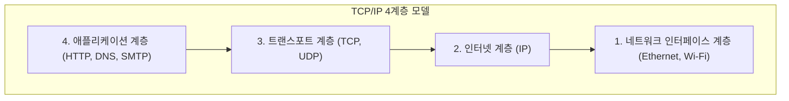

## 1. 바벨탑을 넘어：컴퓨터 간의 대화

1970년대의 컴퓨터 세계는 거대한 메인프레임(대형 계산기)이 패권을 쥐고 있던 시대였습니다. IBM이나 DEC, 후지쯔 등 각 제조사는 저마다 독자적인 통신 규칙(프로토콜)을 개발하여 자사의 컴퓨터를 연결하고 있었습니다.

하지만 이것은 "IBM의 컴퓨터는 영어만 할 줄 알고, DEC의 컴퓨터는 프랑스어만 할 줄 아는" 것과 같은 상황이었습니다. 서로 다른 제조사의 컴퓨터끼리 연결하여 데이터를 주고받는 것은 기술적으로 매우 어려웠습니다. 마치 말이 통하지 않아 붕괴된 '바벨탑'처럼, 컴퓨터 네트워크는 제조사의 장벽에 의해 분절되어 있었던 것입니다.

이 장벽을 허물고 전 세계의 모든 컴퓨터가 공통된 언어로 대화할 수 있도록 하기 위한 '세계 표준 번역 규칙'으로서 탄생한 것이 바로 **TCP/IP (Transmission Control Protocol / Internet Protocol)** 입니다.

## 2. ARPANET과 냉전 시대의 사상

TCP/IP의 기원은 미국 국방부의 고등연구계획국(ARPA)이 구축한 **ARPANET** 으로 거슬러 올라갑니다.
당시는 냉전의 한가운데였습니다. 군사적인 요구로서, "핵 공격을 받아 통신망의 일부가 파괴되더라도, 전체가 다운되지 않고 우회하여 통신을 계속할 수 있는 네트워크"가 요구되고 있었습니다.

이에 대한 해답이 **패킷 교환 방식** 이었습니다.
기존의 전화망(회선 교환 방식)처럼 A지점과 B지점을 1개의 전용선으로 점유하는 것이 아니라, 데이터를 '패킷'이라는 잘게 쪼갠 소포로 분할하고 각각에 목적지를 적어 네트워크 망에 던져 넣는 방식입니다. 도중의 라우터(교차로)가 고장 나더라도, 패킷은 자동으로 다른 길을 찾아 목적지를 향해 나아갑니다.

이 패킷 교환 네트워크 상에서 데이터를 확실하게 전달하기 위한 소프트웨어적인 규칙으로서 빈튼 서프(Vinton Cerf)와 로버트 칸(Robert Kahn)에 의해 설계된 것이 TCP와 IP였습니다.

## 3. TCP/IP의 계층 모델: 복잡성을 분할하다

TCP/IP의 훌륭한 점은 통신이라는 매우 복잡한 처리 과정을 **4개의 계층(레이어)** 으로 분할하고, 각각의 역할을 완전히 독립시켰다는 것입니다. 이를 TCP/IP 계층 모델이라고 부릅니다.

상위 계층은 하위 계층이 "구체적으로 어떻게 일을 하고 있는지"를 알 필요가 없습니다.

1. **네트워크 인터페이스 계층**: 물리적인 케이블이나 Wi-Fi 전파를 사용하여, 옆의 기기까지 어찌 됐든 "0과 1의 전기 신호"를 전달하는 역할.
2. **인터넷 계층 (IP)**: IP 주소(주소)를 보고, 전 세계의 네트워크 중에서 최종 목적지까지의 경로를 찾아내어 패킷을 운반하는 역할.
3. **트랜스포트 계층 (TCP)**: 도착한 패킷의 순서를 재배열하거나, 분실된 패킷의 재전송을 요구하여 데이터에 '정확성'을 보증하는 역할.
4. **애플리케이션 계층**: 웹 브라우저(HTTP)나 이메일(SMTP) 등 용도에 맞춘 구체적인 데이터 형식을 결정하는 역할.

이 계층 구조 덕분에 아래 계층이 '유선 LAN'에서 '광케이블'이나 '5G 스마트폰'으로 진화하더라도, 위 계층의 소프트웨어(브라우저나 앱)는 전혀 수정할 필요 없이 그대로 작동할 수 있는 것입니다.

## 4. 왜 OSI 참조 모델은 패배했는가?

사실 1980년대, 국제표준화기구(ISO)라는 공적인 국제기관이 TCP/IP와는 별도로 **OSI 참조 모델 (7계층 모델)** 이라는 매우 엄격하고 아름다운 통신 프로토콜군을 표준화하려고 국가 규모로 추진하고 있었습니다.

하지만 결론부터 말하자면 OSI 프로토콜은 시장에서 보급되지 못했고, TCP/IP가 승리를 거두었습니다.
이유는 명확했습니다. OSI는 "회의실에서 학자가 만든, 너무 완벽해서 오히려 복잡하고 무거운 사양"이었던 반면, TCP/IP는 **이미 현장의 엔지니어들이 가동하여 실용성이 증명된, 심플하고 가벼운 사양** 이었기 때문입니다.

TCP/IP는 캘리포니아 대학교 버클리 캠퍼스에서 개발한 UNIX OS(BSD UNIX)에 기본으로 내장되어, 전 세계의 대학과 연구소에 무상으로 배포되었습니다. 이를 통해 "일단 연결하려면 TCP/IP가 가장 쉽고 잘 작동한다"는 사실상의 표준(디팩토 스탠다드) 지위를 단숨에 확립한 것입니다.

## 5. 엔드 투 엔드 원칙: 네트워크는 '토관'이다

TCP/IP의 설계 사상 기저에는 **엔드 투 엔드 원칙 (End-to-End Principle)** 이라는 강력한 철학이 있습니다.

이것은 "네트워크 경로 상에 있는 라우터 등의 기기는 패킷을 전송하는 단순한 일만 수행하고, 오류 수정이나 암호화 같은 복잡한 처리는 모두 네트워크의 말단(엔드)에 있는 컴퓨터들에게 맡겨야 한다"는 사상입니다.

일본의 오래된 전화망(NTT) 등은 중앙 전화국의 교환기가 모든 기능(과금, 제어, 오류 처리)을 갖춘 '똑똑한 네트워크'였습니다.
반면 인터넷은 단순한 데이터를 나르기만 하는 '토관(파이프)'이며, 똑똑한 것은 그 끝에 연결되어 있는 우리의 PC나 스마트폰입니다.

이 "네트워크 측은 단순한 토관일 뿐이다"라는 심플한 설계였기 때문에, 인터넷은 특정 관리자에게 얽매이지 않고 누구나 자유롭게 새로운 애플리케이션(웹, 동영상 스트리밍, P2P, [블록체인](/ko/p/blockchain-technology-smart-contract-distributed-ledger/) 등)을 맨 끝의 단말기에서 만드는 것만으로 전 세계로 전개할 수 있는 '혁신의 인프라'로 성장할 수 있었던 것입니다.

## 6. 요약

서로 다른 제조사의 컴퓨터를 연결하기 위한 실험적 프로젝트에서 시작된 TCP/IP는 이제 인류 사회를 덮는 디지털 신경망의 기본 규칙이 되었습니다.

그 성공의 이유는 완벽함보다 '심플하게 작동하는 것'을 우선시하고, 복잡한 처리를 단말기에 맡겨 네트워크 자체를 가볍게 유지한 선인들의 아름다운 아키텍처 설계의 승리에 다름 아닙니다.
우리가 매일 누리고 있는 자유롭고 열린 인터넷은 이 TCP/IP의 철학 위에서 성립되어 있는 것입니다.
