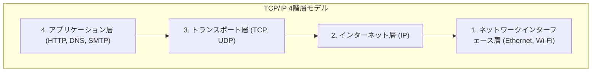

## 1. バベルの塔を越えて：コンピュータ同士の対話

1970年代のコンピュータ世界は、巨大なメインフレーム（大型計算機）が覇権を握る時代でした。IBMやDEC、富士通など、各メーカーはそれぞれ独自の通信ルール（プロトコル）を開発して自社のコンピュータを繋いでいました。

しかし、これは「IBMのコンピュータは英語しか話せず、DECのコンピュータはフランス語しか話せない」というような状況でした。異なるメーカーのコンピュータ同士を繋いでデータをやり取りすることは、技術的に極めて困難でした。まるで言葉が通じずに崩壊した「バベルの塔」のように、コンピュータネットワークはメーカーの壁によって分断されていたのです。

この壁を打ち破り、世界中のあらゆるコンピュータが共通の言語で会話できるようにするための「世界標準の翻訳ルール」として生み出されたのが、**TCP/IP (Transmission Control Protocol / Internet Protocol)** です。

## 2. ARPANETと冷戦時代の思想

TCP/IPの起源は、アメリカ国防総省の高等研究計画局（ARPA）が構築した「**ARPANET**」に遡ります。
当時は冷戦の真っ只中。軍事的な要請として、「核攻撃を受けて通信網の一部が破壊されても、全体がダウンせずに迂回して通信を継続できるネットワーク」が求められていました。

これに対する回答が「**パケット交換方式**」でした。
従来の電話網（回線交換方式）のように、A地点とB地点を1本の専用線で占有するのではなく、データを「パケット」という細切れの小包に分割し、それぞれに宛先を書いてネットワークの網の目に放り込む手法です。途中のルーター（交差点）が壊れていても、パケットは自動的に別の道を探してゴールへと向かいます。

このパケット交換ネットワーク上で、データを確実に送り届けるためのソフトウェア的なルールとして、ヴィントン・サーフとロバート・カーンによって設計されたのが TCP と IP でした。

## 3. TCP/IPの階層モデル：複雑さを分割する

TCP/IPの素晴らしい点は、通信という極めて複雑な処理を「**4つの階層（レイヤー）**」に分割し、それぞれの役割を完全に独立させたことです。これをTCP/IP階層モデルと呼びます。

上位の層は、下位の層が「具体的にどうやって仕事をしているか」を知る必要がありません。

1. **ネットワークインターフェース層**: 物理的なケーブルやWi-Fiの電波を使って、隣の機器までとにかく「0と1の電気信号」を届ける役割。
2. **インターネット層 (IP)**: IPアドレス（住所）を見て、世界中のネットワークの中から最終目的地までのルート（経路）を見つけ出し、パケットを運ぶ役割。
3. **トランスポート層 (TCP)**: 届いたパケットの順番を並べ替えたり、紛失したパケットの再送を要求したりして、データに「正確性」を保証する役割。
4. **アプリケーション層**: Webブラウザ（HTTP）やメール（SMTP）など、用途に合わせた具体的なデータの形式を決める役割。

この階層構造のおかげで、下の層が「有線LAN」から「光ファイバー」や「5Gのスマホ」に進化しても、上の層のソフトウェア（ブラウザやアプリ）は全く書き換えることなくそのまま動かすことができるのです。

## 4. なぜOSI参照モデルは敗北したのか？

実は1980年代、国際標準化機構 (ISO) という公的な国際機関が、TCP/IPとは別に「**OSI参照モデル（7階層モデル）**」という非常に厳密で美しい通信プロトコル群を標準化しようと国家規模で推進していました。

しかし、結論から言えばOSIプロトコルは市場で普及せず、TCP/IPが勝利を収めました。
理由は明確でした。OSIは「会議室で学者が作った、完璧すぎるがゆえに複雑で重い仕様」だったのに対し、TCP/IPは「**すでに現場のエンジニアたちが動かし、実用性が証明されている、シンプルで軽い仕様**」だったからです。

TCP/IPは、カリフォルニア大学バークレー校が開発したUNIX OS（BSD UNIX）に標準で組み込まれ、無償で世界中の大学や研究所に配布されました。これにより「とりあえず繋ぐならTCP/IPが一番簡単で動く」という事実上の標準（デファクトスタンダード）の地位を一気に確立したのです。

## 5. エンドツーエンドの原則：ネットワークは「土管」である

TCP/IPの設計思想の根底には、「**エンドツーエンドの原則 (End-to-End Principle)**」という強力な哲学があります。

これは、「ネットワークの経路上にあるルーターなどの機器は、パケットを転送するという単純な仕事だけを行い、エラーの訂正や暗号化といった複雑な処理は、すべてネットワークの末端（エンド）にあるコンピュータ同士に任せるべきだ」という思想です。

日本の古い電話網（NTT）などは、中央の電話局の交換機がすべての機能（課金、制御、エラー処理）を持つ「賢いネットワーク」でした。
一方、インターネットは単なるデータを運ぶだけの「土管」であり、賢いのはその端に繋がっている私たちのパソコンやスマートフォンです。

この「ネットワーク側はただの土管である」というシンプルな設計だったからこそ、インターネットは特定の管理者に縛られることなく、誰もが自由に新しいアプリケーション（Web、動画配信、P2P、[ブロックチェーン](/p/blockchain-technology-smart-contract-distributed-ledger/)など）を端っこの端末で作るだけで、世界中に展開できる「イノベーションのインフラ」へと成長できたのです。

## 6. まとめ

異なるメーカーのコンピュータを繋ぐための実験的プロジェクトから始まったTCP/IPは、いまや人類社会を覆うデジタルな神経網の基本ルールとなりました。

その成功の理由は、完璧さよりも「シンプルで動くこと」を優先し、複雑な処理を端末に任せてネットワーク自体を身軽に保ったという、先人たちの美しいアーキテクチャ設計の勝利に他なりません。
私たちが日々享受している自由でオープンなインターネットは、このTCP/IPの哲学の上で成り立っているのです。
