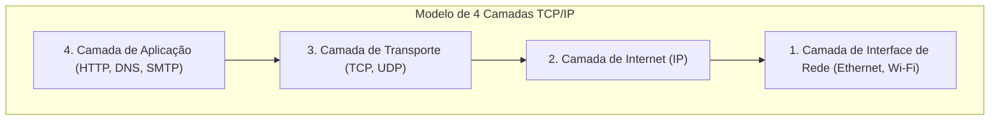

## 1. Indo Além da Torre de Babel: O Diálogo Entre Computadores

Na década de 1970, o mundo da computação era uma era dominada por enormes mainframes (computadores de grande porte). Fabricantes como IBM, DEC e Fujitsu desenvolviam suas próprias regras de comunicação (protocolos) para conectar seus próprios computadores.

No entanto, era como uma situação onde "os computadores da IBM só falavam inglês e os computadores da DEC só falavam francês". Conectar computadores de diferentes fabricantes e trocar dados era tecnicamente extremamente difícil. Como a "Torre de Babel" que desmoronou devido à incapacidade de comunicação, as redes de computadores estavam divididas por barreiras dos fabricantes.

O **TCP/IP (Transmission Control Protocol / Internet Protocol)** foi criado como uma "regra de tradução de padrão global" para quebrar essas barreiras e permitir que computadores de todo o mundo se comuniquem através de uma linguagem comum.

## 2. ARPANET e a Filosofia da Era da Guerra Fria

As origens do TCP/IP remontam à "**ARPANET**", construída pela Agência de Projetos de Pesquisa Avançada (ARPA) do Departamento de Defesa dos Estados Unidos.
Naquela época, estávamos no auge da Guerra Fria. Como um requisito militar, havia a necessidade de uma "rede que pudesse continuar a se comunicar através de desvios sem cair completamente, mesmo se parte da rede de comunicação fosse destruída por um ataque nuclear".

A resposta para isso foi o método de "**comutação de pacotes**".
Em vez de monopolizar uma única linha dedicada entre os pontos A e B, como as redes telefônicas tradicionais (comutação de circuitos), esse método divide os dados em pequenos pacotes, escreve o destino em cada um deles e os lança na rede. Mesmo se um roteador (cruzamento) no caminho estiver quebrado, o pacote procurará automaticamente por outro caminho em direção ao seu objetivo.

Nesta rede de comutação de pacotes, o TCP e o IP foram projetados por Vinton Cerf e Robert Kahn como regras de software para garantir que os dados fossem entregues com confiabilidade.

## 3. O Modelo de Camadas do TCP/IP: Dividindo a Complexidade

A grande vantagem do TCP/IP é que ele dividiu o processo extremamente complexo da comunicação em "**4 camadas (layers)**", tornando a função de cada uma completamente independente. Isso é chamado de modelo de camadas TCP/IP.

As camadas superiores não precisam saber "como exatamente as camadas inferiores estão fazendo seu trabalho".

1. **Camada de Interface de Rede**: Tem a função de usar cabos físicos ou ondas de rádio Wi-Fi para entregar de qualquer forma os "sinais elétricos de 0 e 1" ao dispositivo vizinho.
2. **Camada de Internet (IP)**: Tem a função de olhar o endereço IP (domicílio) e encontrar uma rota (caminho) através de todas as redes do mundo até o destino final, e transportar os pacotes.
3. **Camada de Transporte (TCP)**: Tem a função de garantir a "precisão" dos dados, reordenando a sequência dos pacotes que chegam e solicitando a retransmissão de pacotes perdidos.
4. **Camada de Aplicação**: Tem a função de determinar o formato específico dos dados adaptado à aplicação, como navegadores web (HTTP) ou e-mail (SMTP).

Graças a essa estrutura em camadas, mesmo que a camada inferior evolua de uma "LAN com fio" para "fibra óptica" ou um "smartphone 5G", o software da camada superior (navegador ou aplicativo) pode continuar funcionando perfeitamente sem precisar ser reescrito.

## 4. Por Que o Modelo de Referência OSI Foi Derrotado?

Na verdade, na década de 1980, uma organização internacional oficial chamada Organização Internacional de Normalização (ISO) estava promovendo em escala nacional, separadamente do TCP/IP, a padronização de um conjunto de protocolos de comunicação muito rigoroso e elegante chamado "**Modelo de Referência OSI (Modelo de 7 Camadas)**".

No entanto, indo direto ao ponto, os protocolos OSI não se popularizaram no mercado e o TCP/IP saiu vitorioso.
O motivo era claro. O OSI era uma "especificação pesada e complexa por ser perfeita demais, criada por acadêmicos em salas de reunião", enquanto o TCP/IP era uma "**especificação simples e leve, que já estava sendo operada por engenheiros em campo e que havia comprovado sua praticidade**".

O TCP/IP foi incorporado como padrão no sistema operacional UNIX (BSD UNIX) desenvolvido pela Universidade da Califórnia, Berkeley, e foi distribuído gratuitamente para universidades e institutos de pesquisa em todo o mundo. Como resultado disso, ele rapidamente estabeleceu a sua posição como o padrão de fato (de facto standard) com a ideia de que "para simplesmente conectar, o TCP/IP é o mais fácil e o que funciona".

## 5. O Princípio Fim-a-Fim (End-to-End): A Rede é um "Cano"

Na base da filosofia de design do TCP/IP está uma filosofia poderosa chamada "**Princípio Fim-a-Fim (End-to-End Principle)**".

Esta é a filosofia de que "equipamentos como roteadores no caminho da rede devem realizar apenas o trabalho simples de transferir pacotes, e os processamentos complexos como correção de erros e criptografia devem ser todos deixados a cargo dos computadores nas extremidades (ends) da rede".

Antigas redes telefônicas no Japão (como a NTT) eram "redes inteligentes", onde as centrais de comutação nas agências telefônicas centrais possuíam todas as funções (faturamento, controle, tratamento de erros).
Por outro lado, a internet é simplesmente um "cano" que transporta dados, e quem é inteligente são os nossos computadores e smartphones conectados em suas extremidades.

Foi exatamente por causa desse design simples de que "o lado da rede é apenas um cano" que a internet não foi limitada a um administrador específico, permitindo-lhe crescer e se tornar uma "infraestrutura de inovação", onde qualquer pessoa pode lançar livremente novas aplicações (Web, streaming de vídeo, P2P, blockchain, etc.) em todo o mundo, apenas desenvolvendo-as nos dispositivos finais.

## 6. Conclusão

O TCP/IP, que começou como um projeto experimental para conectar computadores de diferentes fabricantes, tornou-se agora a regra básica da rede neural digital que cobre a sociedade humana.

O motivo de seu sucesso não é outro senão a vitória do belo design de arquitetura de nossos antecessores, que priorizou "ser simples e funcionar" sobre a perfeição, deixando os processamentos complexos para os terminais e mantendo a própria rede ágil.
A internet livre e aberta que desfrutamos todos os dias é construída sobre essa filosofia do TCP/IP.
