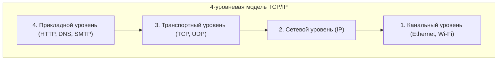

## 1. За пределами Вавилонской башни: общение между компьютерами

В 1970-х годах в компьютерном мире доминировали гигантские мейнфреймы. Такие производители, как IBM, DEC и Fujitsu, разрабатывали свои собственные коммуникационные правила (протоколы) для подключения своих компьютеров.

Однако ситуация была такой, что «компьютеры IBM могли говорить только по-английски, а компьютеры DEC — только по-французски». Технически было крайне сложно соединить компьютеры разных производителей для обмена данными. Подобно «Вавилонской башне», которая рухнула из-за того, что люди не могли понять друг друга, компьютерные сети были разделены барьерами производителей.

**TCP/IP (Transmission Control Protocol / Internet Protocol)** был создан как «мировой стандарт перевода», чтобы разрушить эту стену и позволить всем компьютерам в мире общаться на общем языке.

## 2. ARPANET и философия эпохи холодной войны

Истоки TCP/IP восходят к «**ARPANET**», созданной Агентством перспективных исследовательских проектов Министерства обороны США (ARPA).
Это был разгар холодной войны. В качестве военного требования возникла необходимость в «сети, которая могла бы продолжать связь, перенаправляя данные в обход, даже если часть сети была бы разрушена в результате ядерной атаки, без отключения всей системы».

Ответом на это стала «**коммутация пакетов**».
Вместо того чтобы занимать выделенную линию между точками A и B, как в традиционных телефонных сетях (коммутация каналов), данные разбиваются на небольшие фрагменты, называемые «пакетами», на каждом из которых пишется адрес назначения, и отправляются в сеть. Даже если промежуточный маршрутизатор выйдет из строя, пакеты автоматически найдут другой путь к месту назначения.

Винтон Серф и Роберт Кан разработали TCP и IP как программные правила для обеспечения надежной доставки данных в этой сети с коммутацией пакетов.

## 3. Иерархическая модель TCP/IP: разделение сложности

Замечательная особенность TCP/IP заключается в том, что он разделяет чрезвычайно сложный процесс связи на «**4 уровня (слоя)**», делая роль каждого из них полностью независимой. Это называется иерархической моделью TCP/IP.

Верхним уровням не нужно знать, «как именно выполняют свою работу» нижние уровни.

1. **Канальный уровень (Network Interface Layer)**: Отвечает за доставку «электрических сигналов 0 и 1» к соседнему устройству с использованием физических кабелей или радиоволн Wi-Fi.
2. **Сетевой уровень (Internet Layer / IP)**: Отвечает за поиск маршрута до конечного пункта назначения среди сетей по всему миру, используя IP-адрес, и за передачу пакетов.
3. **Транспортный уровень (TCP)**: Гарантирует «точность» данных путем сортировки прибывших пакетов по порядку и запроса повторной передачи потерянных пакетов.
4. **Прикладной уровень (Application Layer)**: Определяет конкретный формат данных для соответствующего применения, такого как веб-браузер (HTTP) или электронная почта (SMTP).

Благодаря этой многоуровневой структуре, даже если нижний уровень эволюционирует от «проводной локальной сети» к «оптическому волокну» или «смартфону 5G», программное обеспечение на верхних уровнях (браузеры и приложения) может работать без каких-либо изменений.

## 4. Почему эталонная модель OSI потерпела поражение?

На самом деле, в 1980-х годах официальная международная организация, Международная организация по стандартизации (ISO), на государственном уровне продвигала стандартизацию очень строгой и красивой коммуникационной модели, называемой «**эталонной моделью OSI (7-уровневой моделью)**», отдельно от TCP/IP.

Однако, в конечном итоге, протокол OSI не получил распространения на рынке, и TCP/IP одержал победу.
Причина была ясна. OSI представляла собой «чрезвычайно сложную и тяжелую спецификацию, созданную учеными в конференц-залах и ставшую такой из-за своего совершенства», в то время как TCP/IP был «**простой и легкой спецификацией, которую инженеры уже использовали на практике и чья эффективность была доказана**».

TCP/IP был встроен по умолчанию в ОС UNIX (BSD UNIX), разработанную в Калифорнийском университете в Беркли, и бесплатно распространялся по университетам и исследовательским институтам всего мира. Это позволило ему быстро закрепить за собой статус стандарта де-факто, так как «если нужно было просто подключиться, TCP/IP работал проще всего».

## 5. Сквозной принцип (End-to-End): Сеть — это просто «труба»

В основе философии проектирования TCP/IP лежит мощный принцип — «**сквозной принцип (End-to-End Principle)**».

Эта идея заключается в том, что «такие устройства, как маршрутизаторы на сетевом пути, должны выполнять только простую работу по пересылке пакетов, а вся сложная обработка, такая как исправление ошибок и шифрование, должна быть оставлена компьютерам (узлам) на концах сети».

Старые телефонные сети в Японии (например, NTT) были «умными сетями», где коммутаторы на центральных телефонных станциях обладали всеми функциями (биллинг, управление, обработка ошибок).
С другой стороны, интернет — это просто «труба» для передачи данных, а «умными» являются наши компьютеры и смартфоны, подключенные к её концам.

Именно благодаря этому простому дизайну, где «сеть — это просто труба», интернет смог вырасти в «инфраструктуру инноваций». Не будучи привязанным к конкретным администраторам, любой желающий мог создавать новые приложения (Web, потоковое видео, P2P, [блокчейн](/ru/p/blockchain-technology-smart-contract-distributed-ledger/) и т. д.) на своих конечных устройствах и развертывать их по всему миру.

## 6. Заключение

TCP/IP, начавшийся как экспериментальный проект для объединения компьютеров разных производителей, сегодня стал фундаментальным правилом цифровой нервной системы, охватывающей человеческое общество.

Причина его успеха заключается не в чем ином, как в победе прекрасной архитектурной концепции предшественников, которые отдали приоритет принципу «простота и работоспособность» вместо совершенства, оставив сложную обработку конечным устройствам и сохранив саму сеть легкой и маневренной.
Свободный и открытый интернет, которым мы наслаждаемся каждый день, построен на этой философии TCP/IP.
